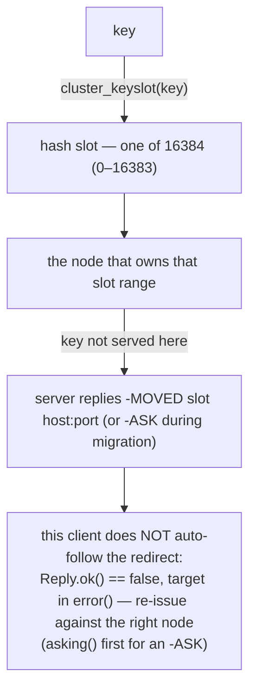

# Cluster commands

> **Audience:** Adopter · **Status:** stable · **Verified-against:** qbm-redis @ qb 3.0.0 (C++20 default, C++23
> supported)

Reference for the Redis Cluster command group — topology inspection (`CLUSTER INFO/NODES/SLOTS/SHARDS`), node
membership (`MEET/FORGET/RESET/FAILOVER/REPLICATE`), slot administration (`ADDSLOTS/DELSLOTS/SETSLOT/...`), and the
per-connection redirect verbs (`ASKING/READONLY/READWRITE`) — each with its exact signature, reply type, and a minimal
`co_await` and callback snippet.

**Prerequisites:** [Command API model](./commands_overview.md) · [Connecting to Redis](./connection.md) — **See also:
** [Server commands](./server_commands.md) · [Error handling](./error_handling.md) · [Key commands](./key_commands.md)

## Summary

The cluster commands are defined by the `qb::redis::cluster_commands<Derived>` CRTP mixin (`cluster_commands.h:35`),
which `qb::redis::tcp::client` inherits along with every other command group. You call these methods directly on a
connected client. Each command exists in two forms that share one method name: a **coroutine** form you `co_await` to
get a `qb::redis::Reply<T>`, and a **callback** form that takes the handler as its first argument and returns the
client (`Derived&`) for chaining. The dispatch model and the `Reply<T>` decoding contract are covered
in [Command API model](./commands_overview.md); this page lists the methods.

There is **no** blocking, value-returning form. A method such as `cluster_bumpepoch()` returns an awaiter, not a
`status` — you `co_await` it (or pump the loop with `qb::io::async::run_sync(...)` from non-coroutine code, as shown
in [Command API model](./commands_overview.md#synchronous-use-in-tests-and-scripts)). The callback overload is
SFINAE-gated on the handler accepting `Reply<T>&&` for that command's `T` (`cluster_commands.h:64-67`).

These are thin RESP wrappers around the server-side `CLUSTER` subcommands. They carry no client-side validation of
subcommand strings or slot ranges and no extra guard rails: `cluster_reset`, `cluster_failover`, and `cluster_setslot`
mutate live cluster topology, and an invalid `cluster_setslot` subcommand or `cluster_reset` mode is passed straight to
the server and only fails there (`cluster_commands.h:212,841,843`). Against a standalone (non-cluster) server most of
these return an error reply rather than throwing; the snippets below check `reply.ok()` accordingly.

No command in this group takes a time argument, so the EXPIRE-seconds / PEXPIRE-milliseconds unit boundary documented
for the key group does not apply here, and neither does `qb::duration`. (The retired tokens `qb::Timestamp`,
`qb::Duration`, `qb::TimePoint`, `to_timestamp(...)`, and `to_time_point(...)` were removed from the framework and
appear nowhere in this API.)

## Concepts

### Reply types you will see in this group

| Reply `T`                  | Meaning                                                            | Commands                                                                                                                                                                                                                                                                                                                                |
|----------------------------|--------------------------------------------------------------------|-----------------------------------------------------------------------------------------------------------------------------------------------------------------------------------------------------------------------------------------------------------------------------------------------------------------------------------------|
| `qb::redis::status`        | a `+OK` status reply                                               | `cluster_meet`, `cluster_forget`, `cluster_reset`, `cluster_failover`, `cluster_replicate`, `cluster_saveconfig`, `cluster_set_config_epoch`, `cluster_bumpepoch`, `cluster_addslots`, `cluster_addslotsrange`, `cluster_delslots`, `cluster_delslotsrange`, `cluster_flushslots`, `cluster_setslot`, `asking`, `readonly`, `readwrite` |
| `qb::json`                 | a structured topology reply, decoded into the framework JSON value | `cluster_info`, `cluster_nodes`, `cluster_slots`, `cluster_shards`, `cluster_links`, `cluster_replicas`, `cluster_slaves`                                                                                                                                                                                                               |
| `std::string`              | a single string value                                              | `cluster_myid`, `cluster_myshardid`                                                                                                                                                                                                                                                                                                     |
| `long long`                | an integer count or slot number                                    | `cluster_keyslot`, `cluster_countkeysinslot`, `cluster_count_failure_reports`                                                                                                                                                                                                                                                           |
| `std::vector<std::string>` | a list of keys                                                     | `cluster_getkeysinslot`                                                                                                                                                                                                                                                                                                                 |

`qb::redis::Reply<T>` (`reply.h`) exposes `ok()`, `result()` (alias `value()`), `value_or(default)`, `error()`, and an
explicit `operator bool()`. See [Command API model](./commands_overview.md#the-reply-type-qbredisreplyt) for the full
reply surface.

### `qb::redis::status`

`status` (`types.h:475`) wraps a status string. It converts to `bool` (true when the string is `"OK"`), to
`std::string`, and compares against string literals — so `if (reply.result())` reads as "the server said OK". The status
commands here are routinely tested with `reply.ok()` (the reply arrived without a protocol/transport error) rather than
the value, because a standalone server answers them with a cluster-disabled error.

### `qb::json` topology replies

`CLUSTER INFO`, `NODES`, `SLOTS`, `SHARDS`, `LINKS`, `REPLICAS`, and `SLAVES` decode into `qb::json` (the framework JSON
value type; see the qb framework docs). The concrete JSON shape depends on the server version and protocol:
`CLUSTER INFO` may arrive as a JSON object or as the raw INFO string, and `CLUSTER NODES`/`SLOTS` may arrive as an
array, an object, or a string. Inspect with `is_object()` / `is_array()` / `is_string()` before reading, as the snippets
below do.

### Hash slots

A Redis Cluster partitions the key space into **16384 hash slots** (0–16383). The slot commands (`cluster_addslots`,
`cluster_delslots`, `cluster_setslot`, `cluster_keyslot`, `cluster_countkeysinslot`, `cluster_getkeysinslot`) operate on
slot integers. `cluster_keyslot(key)` returns the slot a given key maps to.



Redirect handling is manual — see [Error handling](./error_handling.md) and the redirect verbs below.

### Per-connection redirect verbs

`asking()`, `readonly()`, and `readwrite()` are top-level Redis commands, not `CLUSTER` subcommands (
`cluster_commands.h:482,507,532`). They mark connection-level state: `asking()` tells the connection to accept the next
command against a slot that is `MIGRATING` (the ASK-redirection protocol during slot migration); `readonly()` /
`readwrite()` toggle whether a replica connection serves reads.

## Setup for the examples

```cpp
#include <qbm/redis/redis.h>                 // namespace qb::redis
#include <qb/io/async.h>
#include <qb/io/async/coroutine.h>

// Inside a coroutine:
qb::redis::tcp::client redis{qb::io::uri{"tcp://localhost:6379"}};
if (!co_await redis.connect())
    co_return;
```

<!-- src: qbm/redis/tests/integration/admin/cluster-commands.cpp; qbm/redis/readme/connection.md -->

Each command shows its coroutine signature, its callback overload, and a snippet. The callback form always returns
`Derived&` (the client) for chaining and is SFINAE-gated on the callback accepting `Reply<T>&&` (
`cluster_commands.h:64-67`).

## Topology inspection

### `cluster_info`

`CLUSTER INFO` — cluster state, size, and inter-node statistics, decoded into `qb::json`.

```cpp
// Coroutine
auto cluster_info();                                            // -> Reply<qb::json>
// Callback
template <typename Func> Derived &cluster_info(Func &&);
```

```cpp
auto reply = co_await redis.cluster_info();
if (reply.ok()) {
    auto info = reply.result();
    if (info.is_string())
        std::string raw = info.get<std::string>();   // older servers: raw INFO text
    else if (info.is_object())
        ; // structured fields, e.g. cluster_state
}
```

<!-- src: qbm/redis/tests/integration/admin/cluster-commands.cpp:153-156 -->

### `cluster_nodes`

`CLUSTER NODES` — the cluster configuration from the connected node's view, as `qb::json`.

```cpp
auto cluster_nodes();                                          // -> Reply<qb::json>
template <typename Func> Derived &cluster_nodes(Func &&);
```

```cpp
auto reply = co_await redis.cluster_nodes();
if (reply.ok()) {
    auto nodes = reply.result();
    bool present = nodes.is_object() || nodes.is_string() || nodes.is_array();
}
```

<!-- src: qbm/redis/tests/integration/admin/cluster-commands.cpp:171-174 -->

### `cluster_slots`

`CLUSTER SLOTS` — the mapping of hash-slot ranges to master nodes, as `qb::json`.

```cpp
auto cluster_slots();                                          // -> Reply<qb::json>
template <typename Func> Derived &cluster_slots(Func &&);
```

```cpp
auto reply = co_await redis.cluster_slots();
if (reply.ok()) {
    auto slots = reply.result();   // is_array() in cluster mode
}
```

<!-- src: qbm/redis/tests/integration/admin/cluster-commands.cpp:167-169 -->

### `cluster_shards`

`CLUSTER SHARDS` — per-shard slot ranges and node details (Redis 7+), as `qb::json`.

```cpp
auto cluster_shards();                                         // -> Reply<qb::json>
template <typename Func> Derived &cluster_shards(Func &&);
```

```cpp
auto reply = co_await redis.cluster_shards();
```

<!-- src: qbm/redis/tests/integration/admin/cluster-commands.cpp:67 -->

### `cluster_links`

`CLUSTER LINKS` — the node-to-node TCP links the connected node maintains (Redis 7+), as `qb::json`.

```cpp
auto cluster_links();                                          // -> Reply<qb::json>
template <typename Func> Derived &cluster_links(Func &&);
```

```cpp
auto reply = co_await redis.cluster_links();
```

<!-- src: qbm/redis/tests/integration/admin/cluster-commands.cpp:72 -->

### `cluster_myid`

`CLUSTER MYID` — the 40-character node ID of the connected node.

```cpp
auto cluster_myid();                                           // -> Reply<std::string>
template <typename Func> Derived &cluster_myid(Func &&);
```

```cpp
auto reply = co_await redis.cluster_myid();
if (reply.ok() && !reply.result().empty())
    ; // reply.result() is a 40-char node ID
```

<!-- src: qbm/redis/tests/integration/admin/cluster-commands.cpp:158-160 -->

### `cluster_myshardid`

`CLUSTER MYSHARDID` — the shard ID of the connected node (Redis 7.2+), as a string.

```cpp
auto cluster_myshardid();                                      // -> Reply<std::string>
template <typename Func> Derived &cluster_myshardid(Func &&);
```

```cpp
auto reply = co_await redis.cluster_myshardid();
```

<!-- src: qbm/redis/tests/integration/admin/cluster-commands.cpp:73 -->

### `cluster_replicas`

`CLUSTER REPLICAS node-id` — the replica nodes of the given master, as `qb::json`.

```cpp
auto cluster_replicas(const std::string &node_id);            // -> Reply<qb::json>
template <typename Func> Derived &cluster_replicas(Func &&, const std::string &node_id);
```

```cpp
auto reply = co_await redis.cluster_replicas(master_node_id);
```

<!-- src: qbm/redis/tests/integration/admin/cluster-commands.cpp:107 -->

### `cluster_slaves`

`CLUSTER SLAVES node-id` — the deprecated alias of `cluster_replicas`; prefer `cluster_replicas` (
`cluster_commands.h:879`). Same signature and `qb::json` reply.

```cpp
auto cluster_slaves(const std::string &node_id);              // -> Reply<qb::json>
template <typename Func> Derived &cluster_slaves(Func &&, const std::string &node_id);
```

```cpp
auto reply = co_await redis.cluster_slaves(master_node_id);
```

<!-- src: qbm/redis/tests/integration/admin/cluster-commands.cpp:109 -->

### `cluster_count_failure_reports`

`CLUSTER COUNT-FAILURE-REPORTS node-id` — the number of failure reports the connected node holds for the given node.

```cpp
auto cluster_count_failure_reports(const std::string &node_id);   // -> Reply<long long>
template <typename Func>
Derived &cluster_count_failure_reports(Func &&, const std::string &node_id);
```

```cpp
auto reply = co_await redis.cluster_count_failure_reports(node_id);
if (reply.ok())
    long long reports = reply.result();
```

<!-- src: qbm/redis/tests/integration/admin/cluster-commands.cpp:106 -->

## Slot inspection

### `cluster_keyslot`

`CLUSTER KEYSLOT key` — the hash slot (0–16383) the given key maps to.

```cpp
auto cluster_keyslot(const std::string &key);                 // -> Reply<long long>
template <typename Func> Derived &cluster_keyslot(Func &&, const std::string &key);
```

```cpp
auto reply = co_await redis.cluster_keyslot("user:1000");
if (reply.ok()) {
    long long slot = reply.result();   // 0 <= slot <= 16383
}
```

<!-- src: qbm/redis/tests/integration/admin/cluster-commands.cpp:162-165 -->

### `cluster_countkeysinslot`

`CLUSTER COUNTKEYSINSLOT slot` — the number of keys the connected node holds in the given slot.

```cpp
auto cluster_countkeysinslot(int slot);                       // -> Reply<long long>
template <typename Func> Derived &cluster_countkeysinslot(Func &&, int slot);
```

```cpp
auto reply = co_await redis.cluster_countkeysinslot(0);
if (reply.ok())
    long long count = reply.result();
```

<!-- src: qbm/redis/tests/integration/admin/cluster-commands.cpp:176-178 -->

### `cluster_getkeysinslot`

`CLUSTER GETKEYSINSLOT slot count` — up to `count` keys from the given slot.

```cpp
auto cluster_getkeysinslot(int slot, int count);              // -> Reply<std::vector<std::string>>
template <typename Func> Derived &cluster_getkeysinslot(Func &&, int slot, int count);
```

```cpp
auto reply = co_await redis.cluster_getkeysinslot(0, 10);
if (reply.ok()) {
    std::vector<std::string> keys = reply.result();
}
```

<!-- src: qbm/redis/tests/integration/admin/cluster-commands.cpp:71 -->

## Node membership

These mutate cluster topology and are normally issued by cluster-management tooling. Each returns `Reply<status>`.

### `cluster_meet`

`CLUSTER MEET ip port` — make the connected node handshake with another node so it joins the cluster.

```cpp
auto cluster_meet(const std::string &ip, int port);          // -> Reply<status>
template <typename Func> Derived &cluster_meet(Func &&, const std::string &ip, int port);
```

```cpp
auto reply = co_await redis.cluster_meet("127.0.0.1", 7000);
if (!reply.ok())
    ; // e.g. cluster support disabled on a standalone server
```

<!-- src: qbm/redis/tests/integration/admin/cluster-commands.cpp:93 -->

### `cluster_forget`

`CLUSTER FORGET node-id` — remove a node from the connected node's nodes table.

```cpp
auto cluster_forget(const std::string &node_id);             // -> Reply<status>
template <typename Func> Derived &cluster_forget(Func &&, const std::string &node_id);
```

```cpp
auto reply = co_await redis.cluster_forget(node_id);
```

<!-- src: qbm/redis/tests/integration/admin/cluster-commands.cpp:94 -->

### `cluster_replicate`

`CLUSTER REPLICATE node-id` — reconfigure the connected node as a replica of the given master.

```cpp
auto cluster_replicate(const std::string &node_id);          // -> Reply<status>
template <typename Func> Derived &cluster_replicate(Func &&, const std::string &node_id);
```

```cpp
auto reply = co_await redis.cluster_replicate(master_node_id);
```

<!-- src: qbm/redis/tests/integration/admin/cluster-commands.cpp:97 -->

### `cluster_failover`

`CLUSTER FAILOVER [FORCE|TAKEOVER]` — have a replica perform a manual failover of its master. The `option` argument
defaults to empty (coordinated failover); pass `"FORCE"` or `"TAKEOVER"` for the unconditional variants. When `option`
is empty the wrapper omits it from the wire command (`cluster_commands.h:242`).

```cpp
auto cluster_failover(const std::string &option = "");       // -> Reply<status>
template <typename Func> Derived &cluster_failover(Func &&, const std::string &option = "");
```

```cpp
auto reply = co_await redis.cluster_failover();          // coordinated
// auto reply = co_await redis.cluster_failover("FORCE");
```

<!-- src: qbm/redis/tests/integration/admin/cluster-commands.cpp:96 -->

### `cluster_reset`

`CLUSTER RESET [HARD|SOFT]` — reset a cluster node, dropping its known nodes and assigned slots. The `mode` argument
defaults to `"SOFT"`; the value is forwarded to the server without client-side validation (`cluster_commands.h:210`).

```cpp
auto cluster_reset(const std::string &mode = "SOFT");        // -> Reply<status>
template <typename Func> Derived &cluster_reset(Func &&, const std::string &mode = "SOFT");
```

```cpp
auto reply = co_await redis.cluster_reset();             // SOFT
// auto reply = co_await redis.cluster_reset("HARD");
```

<!-- src: qbm/redis/tests/integration/admin/cluster-commands.cpp:95 -->

### `cluster_saveconfig`

`CLUSTER SAVECONFIG` — force the node to write its cluster configuration to disk.

```cpp
auto cluster_saveconfig();                                   // -> Reply<status>
template <typename Func> Derived &cluster_saveconfig(Func &&);
```

```cpp
auto reply = co_await redis.cluster_saveconfig();
```

<!-- src: qbm/redis/tests/integration/admin/cluster-commands.cpp:98 -->

### `cluster_set_config_epoch`

`CLUSTER SET-CONFIG-EPOCH config-epoch` — set the configuration epoch for a fresh node.

```cpp
auto cluster_set_config_epoch(long long epoch);              // -> Reply<status>
template <typename Func> Derived &cluster_set_config_epoch(Func &&, long long epoch);
```

```cpp
auto reply = co_await redis.cluster_set_config_epoch(1);
```

<!-- src: qbm/redis/tests/integration/admin/cluster-commands.cpp:99 -->

### `cluster_bumpepoch`

`CLUSTER BUMPEPOCH` — advance the cluster configuration epoch.

```cpp
auto cluster_bumpepoch();                                    // -> Reply<status>
template <typename Func> Derived &cluster_bumpepoch(Func &&);
```

```cpp
auto reply = co_await redis.cluster_bumpepoch();
if (!reply.ok())
    ; // cluster support disabled / unknown command on a standalone server
```

<!-- src: qbm/redis/tests/integration/admin/cluster-commands.cpp:100 -->

## Slot administration

`cluster_addslots` and `cluster_delslots` are variadic over individual slot numbers; the `*range` variants take
`(start, end)` pairs.

### `cluster_addslots`

`CLUSTER ADDSLOTS slot [slot ...]` — assign the listed slots to the connected node.

```cpp
template <typename... Slots> auto cluster_addslots(Slots &&...slots);      // -> Reply<status>
template <typename Func, typename... Slots>
Derived &cluster_addslots(Func &&, Slots &&...slots);
```

```cpp
auto reply = co_await redis.cluster_addslots(0, 1, 2);
```

<!-- src: qbm/redis/tests/integration/admin/cluster-commands.cpp:101 -->

### `cluster_addslotsrange`

`CLUSTER ADDSLOTSRANGE start-slot end-slot [start-slot end-slot ...]` — assign one or more contiguous slot ranges,
passed as `(start, end)` pairs.

```cpp
auto cluster_addslotsrange(const std::vector<std::pair<int, int>> &ranges);  // -> Reply<status>
template <typename Func>
Derived &cluster_addslotsrange(Func &&, const std::vector<std::pair<int, int>> &ranges);
```

```cpp
auto reply = co_await redis.cluster_addslotsrange({{0, 5000}, {5001, 10000}});
```

<!-- src: qbm/redis/tests/integration/admin/cluster-commands.cpp:102 -->

### `cluster_delslots`

`CLUSTER DELSLOTS slot [slot ...]` — unassign the listed slots from the connected node.

```cpp
template <typename... Slots> auto cluster_delslots(Slots &&...slots);      // -> Reply<status>
template <typename Func, typename... Slots>
Derived &cluster_delslots(Func &&, Slots &&...slots);
```

```cpp
auto reply = co_await redis.cluster_delslots(0, 1, 2);
```

<!-- src: qbm/redis/tests/integration/admin/cluster-commands.cpp:103 -->

### `cluster_delslotsrange`

`CLUSTER DELSLOTSRANGE start-slot end-slot [start-slot end-slot ...]` — unassign one or more contiguous slot ranges,
passed as `(start, end)` pairs.

```cpp
auto cluster_delslotsrange(const std::vector<std::pair<int, int>> &ranges);  // -> Reply<status>
template <typename Func>
Derived &cluster_delslotsrange(Func &&, const std::vector<std::pair<int, int>> &ranges);
```

```cpp
auto reply = co_await redis.cluster_delslotsrange({{0, 5000}});
```

<!-- src: qbm/redis/tests/integration/admin/cluster-commands.cpp:104 -->

### `cluster_flushslots`

`CLUSTER FLUSHSLOTS` — drop every slot assignment from the connected node.

```cpp
auto cluster_flushslots();                                   // -> Reply<status>
template <typename Func> Derived &cluster_flushslots(Func &&);
```

```cpp
auto reply = co_await redis.cluster_flushslots();
```

<!-- src: qbm/redis/tests/integration/admin/cluster-commands.cpp:105 -->

### `cluster_setslot`

`CLUSTER SETSLOT slot MIGRATING|IMPORTING|STABLE|NODE [node-id]` — set the migration state of a single slot. `node_id`
defaults to empty and is omitted from the wire command when empty (`cluster_commands.h:840`); it is required for the
`NODE` and `MIGRATING`/`IMPORTING` subcommands. The subcommand string is forwarded without client-side validation.

```cpp
auto cluster_setslot(int slot, const std::string &subcommand,
                     const std::string &node_id = "");       // -> Reply<status>
template <typename Func>
Derived &cluster_setslot(Func &&, int slot, const std::string &subcommand,
                         const std::string &node_id = "");
```

```cpp
auto reply = co_await redis.cluster_setslot(0, "NODE", target_node_id);
```

<!-- src: qbm/redis/tests/integration/admin/cluster-commands.cpp:108 -->

## Per-connection redirect verbs

These are top-level commands (not `CLUSTER` subcommands) that set connection state. Each returns `Reply<status>`.

### `asking`

`ASKING` — accept the next command against a slot that is `MIGRATING` (the client side of ASK redirection during a slot
migration).

```cpp
auto asking();                                               // -> Reply<status>
template <typename Func> Derived &asking(Func &&);
```

```cpp
auto reply = co_await redis.asking();
```

<!-- src: qbm/redis/tests/integration/admin/cluster-commands.cpp:129 -->

### `readonly`

`READONLY` — allow the connection to serve reads from a replica.

```cpp
auto readonly();                                             // -> Reply<status>
template <typename Func> Derived &readonly(Func &&);
```

```cpp
auto reply = co_await redis.readonly();
```

<!-- src: qbm/redis/tests/integration/admin/cluster-commands.cpp:130 -->

### `readwrite`

`READWRITE` — clear the `READONLY` flag, routing the connection's reads back to masters.

```cpp
auto readwrite();                                            // -> Reply<status>
template <typename Func> Derived &readwrite(Func &&);
```

```cpp
auto reply = co_await redis.readwrite();
```

<!-- src: qbm/redis/tests/integration/admin/cluster-commands.cpp:131 -->

## Callback form

Every method has a callback overload whose first argument is the handler. The handler must accept exactly `Reply<T>&&`
for the command's `T`:

```cpp
redis.cluster_keyslot([](qb::redis::Reply<long long> &&r) {
    if (r.ok())
        qb::io::cout() << "slot " << r.result() << '\n';
}, "user:1000");
```

<!-- src: qbm/redis/src/qbm/redis/commands/cluster_commands.h:407-411 -->

The callback overload returns the client (`Derived&`), so calls chain. Drain enqueued handlers with `redis.await()` or
your own event loop — see [Pipelining and `await()`](./pipeline_and_await.md) via
the [Command API model](./commands_overview.md).

## Pitfalls

- **No value-returning sync form.** `cluster_bumpepoch()` and friends return an awaiter, not a `status`/`qb::json`/
  `long long`. You `co_await` the result or pump the loop with `qb::io::async::run_sync(...)`; reading the awaiter as if
  it were the value will not compile.
- **Standalone servers reject most of these.** Against a non-cluster server the `CLUSTER` subcommands typically return
  a "cluster support disabled" or "unknown command" error. Check `reply.ok()` before reading `reply.result()`; the error
  text is in `reply.error()`.
- **No client-side validation.** Subcommand strings (`cluster_setslot`, `cluster_reset` mode) and slot integers are
  forwarded verbatim. A typo or an out-of-range slot fails only at the server, surfacing as an error reply.
- **`cluster_setslot` argument order.** The signature is `(slot, subcommand, node_id = "")`; `node_id` is only sent when
  non-empty. For `STABLE` you omit it; for `NODE`/`MIGRATING`/`IMPORTING` it is required.
- **`cluster_slaves` is deprecated.** It is the legacy alias of `cluster_replicas`; use `cluster_replicas` in new code.
- **Topology JSON shape varies.** `cluster_info`/`nodes`/`slots` may decode to an object, an array, or a string
  depending on server version and protocol. Branch on `is_object()` / `is_array()` / `is_string()` before reading.

## See also

- [Command API model](./commands_overview.md) — the coroutine/callback dispatch model and the `Reply<T>` decoding
  contract.
- [Connecting to Redis](./connection.md) — client construction, `connect()`, timeouts as `qb::duration`.
- [Server commands](./server_commands.md) — the sibling administrative group (`INFO`, `CONFIG`, `CLIENT`, replication).
- [Key commands](./key_commands.md) — key routing and the `EXPIRE`-seconds / `PEXPIRE`-milliseconds unit boundary.
- [Error handling](./error_handling.md) — interpreting `reply.error()` and the redis exception types.
