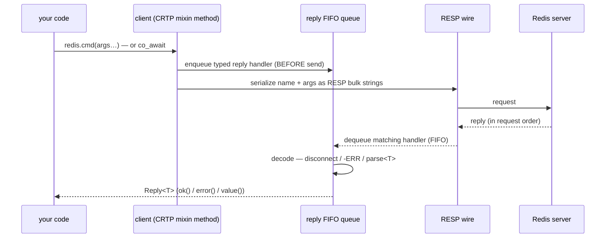

# Command API model

> **Audience:** Adopter · **Status:** stable · **Verified-against:** qbm-redis @ qb 3.0.0 (C++20 default, C++23
> supported)

How `qbm-redis` command methods map to RESP, how replies are typed and decoded into `qb::redis::Reply<T>`, and how to
choose between the coroutine (`co_await`) and callback forms that every command exposes.

**Prerequisites:** [Connection](./connection.md) — **See also:** [Pipelining and
`await()`](./pipeline_and_await.md) · [Error handling](./error_handling.md) · [String commands](./string_commands.md)

## Summary

You issue Redis commands by calling methods on a connected client (`qb::redis::tcp::client`). Each method serializes its
arguments into a RESP request, registers a typed reply handler, and gives back the decoded result as a
`qb::redis::Reply<T>`. Every command exists in two forms that share a single method name: a **coroutine** form you
`co_await`, and a **callback** form that takes the handler as its first argument. There is no `_async` suffix — the
presence of a callback selects the overload. This page explains the dispatch, the reply type, the decoding contract, and
how the command surface is organized.

## Concepts

### Where the methods come from

The client class composes a stack of CRTP mixins, one per Redis command group. `qb::redis::tcp::client` is an alias for
`qb::redis::detail::Redis<qb::io::transport::tcp>` (`redis.h:1695`), and that class inherits — in this order — from
`connection_commands`, `server_commands`, `key_commands`, `string_commands`, `list_commands`, `hash_commands`,
`set_commands`, `sorted_set_commands`, `hyperloglog_commands`, `geo_commands`, `scripting_commands`, `publish_commands`,
`stream_commands`, `bitmap_commands`, `transaction_commands`, `cluster_commands`, `acl_commands`, `module_commands`, and
`function_commands` (`redis.h:763-783`). Each mixin is a `template <typename Derived>` that injects its command methods
and routes I/O through `static_cast<Derived&>(*this)` — they are never instantiated standalone. The practical
consequence: every Redis command appears as a flat method on the client, regardless of which group header defines it.

<!-- src: qbm/redis/src/qbm/redis/redis.h:763-783 (Redis<QB_IO_> base list) -->

For commands that are not yet wrapped (or that you want to issue by name), the client exposes a generic dispatcher:

```cpp
// Generic command: pick the result type yourself, in RESP-decode terms.
auto r   = co_await redis.command<qb::redis::status>("SET", "k", "v");   // +OK
auto out = co_await redis.command<long long>("EVAL", "return 1", "0");   // integer reply
```

### How a method maps to RESP

Both forms end in the same place. The callback form pushes one reply handler onto a FIFO queue, then serializes the
command name and arguments onto the outbound pipe:

```cpp
// redis.h:935 — the callback dispatcher, simplified
template <typename Ret, typename Func, typename... Args>
    requires std::invocable<Func, Reply<Ret> &&>
Redis &command(Func &&func, std::string const &name, Args &&...args);
```

Arguments are converted to RESP bulk strings in order; the reply handler is enqueued **before** the bytes are sent, so a
fast (even synchronous) reply cannot run ahead of its handler. Redis answers requests in the order it received them, so
the FIFO queue and the wire stay in lockstep. This ordering guarantee is what makes pipelining work —
see [Pipelining and `await()`](./pipeline_and_await.md).



The coroutine form is a thin wrapper over the callback form. It calls `make_coro_command<Ret>(...)`, which returns a
`redis_awaiter<Ret>` whose `await_suspend` invokes the same `command<Ret>(callback, name, args...)` internally and
resumes your coroutine when the reply lands (`redis.h:958`, `redis.h:633`).

### The reply type: `qb::redis::Reply<T>`

Every command resolves to a `qb::redis::Reply<T>` (`reply.h:1102`), where `T` is the **expected successful result type**
for that command — fixed per command, never chosen by you for the wrapped methods. Examples:

| Command                 | Result type `T`                           |
|-------------------------|-------------------------------------------|
| `GET`                   | `std::optional<std::string>`              |
| `SET`                   | `qb::redis::status`                       |
| `INCR`, `DEL`, `STRLEN` | `long long`                               |
| `INCRBYFLOAT`           | `double`                                  |
| `SETNX`, `HEXISTS`      | `bool`                                    |
| `MGET`                  | `std::vector<std::optional<std::string>>` |
| `HGETALL`               | a key/value map                           |
| `SCAN`                  | `qb::redis::scan<Out>`                    |

`Reply<T>` carries four things: a success flag, the parsed result, the raw owning `parser::Value`, and an owned error
string (`reply.h:1102`). Its surface:

- `reply.ok()` / `if (reply)` — `true` when the command was sent, a reply arrived, and it was **not** a Redis error.
- `reply.result()` / `reply.value()` — the decoded `T` (aliases; `value()` is preferred in new code).
- `reply.value_or(default)` — returns the value when `ok()` (and, for `std::optional<T>`, when it holds a value);
  otherwise `default`. This collapses the common `if (ok && has_value)` dance into one call.
- `reply.error()` — the owned error message (empty on success). Never a dangling view.
- `reply.raw()` — the original `parser::Value`, needed for move-only payloads such as `pipeline_result` whose
  sub-replies are only reachable through the owning array.

```cpp
#include <qbm/redis/redis.h>

// GET → Reply<std::optional<std::string>>
auto r = co_await redis.get("session:42");
if (auto v = r.value_or(""); !v.empty()) {
    qb::io::cout() << "value: " << v << '\n';
} else if (r) {
    qb::io::cout() << "key absent (nil)\n";   // ok() but no value
} else {
    qb::io::cout() << "error: " << r.error() << '\n';
}
```

<!-- src: qbm/redis/src/qbm/redis/reply.h:1102-1177 (Reply<T>) -->

#### `qb::redis::status` — the "OK" reply

Commands that return a RESP simple string (such as `SET`, `MULTI`, `SELECT`) decode to `qb::redis::status` (
`types.h:475`). A `status` is truthy **only** when the server string equals exactly `"OK"`; use `.ok()` or the `bool`
conversion rather than comparing strings yourself. So for `Reply<status>`, `reply.ok()` confirms the command did not
fail at the protocol level, and `reply.value().ok()` confirms the server replied `+OK`.

### How replies are decoded

Decoding lives in `reply.h` and runs inside the reply handler (`TReply<Func, T>`), which takes ownership of the parsed
RESP node and produces the `Reply<T>` (`reply.h:1212`). The handler distinguishes three cases:

1. **Disconnect / failure** — a null reply yields `Reply{ ok = false, error = "disconnected" }` (or the explicit
   `fail()` reason, e.g. `"command timed out"`).
2. **Redis error reply** — a `-ERR …` frame yields `Reply{ ok = false }` with the server message copied into `error()`.
   **No exception is thrown** for Redis-level errors; you check `ok()`.
3. **Success** — the RESP node is decoded by `parse<T>(*raw)` and wrapped as `Reply{ ok = true, result = … }`. If the
   *parse itself* fails, the handler catches `qb::redis::Error` subclasses and converts them to `ok = false` rather than
   letting them escape into the libev callback.

`parse<T>` dispatches through `ParseTag<T>`: `parse<T>(reply)` forwards to an overload selected by the tag type, so each
target type supplies its own decoder (`reply.h`). The parsers handle both wire shapes transparently — key/value data may
arrive as a flat `[k, v, k, v]` array (RESP2) or a native map (RESP3), and the map/pair parsers normalize both.
See [Error handling](./error_handling.md) for the full error taxonomy and the few command-specific exceptions to the
no-throw rule.

<!-- src: qbm/redis/src/qbm/redis/reply.h:1227-1259 (TReply::operator() decode path) -->

### Coroutine vs callback

The two forms are selected by overload resolution, not by a name suffix:

```cpp
#include <qb/io/async/coroutine.h>   // qb::io::async::task<>
#include <qbm/redis/redis.h>

// Coroutine form — no callback argument; returns an awaiter.
qb::io::async::task<void> coro_example(qb::redis::tcp::client &redis) {
    qb::redis::Reply<qb::redis::status> r = co_await redis.set("greeting", "hello");
    if (!r) co_return;                       // Redis error or disconnect
    auto v = (co_await redis.get("greeting")).value_or("");
    qb::io::cout() << "got: " << v << '\n';
}

// Callback form — handler is the FIRST argument; returns the client for chaining.
void cb_example(qb::redis::tcp::client &redis) {
    redis.set([](qb::redis::Reply<qb::redis::status> &&r) {
        if (!r) qb::io::cerr() << "SET failed: " << r.error() << '\n';
    }, "greeting", "hello");
    redis.get([](qb::redis::Reply<std::optional<std::string>> &&r) {
        qb::io::cout() << "got: " << r.value_or("") << '\n';
    }, "greeting");
    redis.await();   // drain both handlers on this loop (not co_await)
}
```

The callback overload is SFINAE-gated on `std::is_invocable_v<Func, Reply<T>&&>`: the handler must accept **exactly**
`Reply<T>&&` for that command's `T`. A handler with the wrong `Reply<U>` signature does not mismatch at the call site —
it simply fails to select the overload, so a misspelled reply type surfaces as "no matching call" rather than a parse
error.

|              | Coroutine form                                                   | Callback form                              |
|--------------|------------------------------------------------------------------|--------------------------------------------|
| Call shape   | `co_await redis.cmd(args...)`                                    | `redis.cmd(cb, args...)`                   |
| Returns      | `redis_awaiter<T>` → `Reply<T>`                                  | `Derived&` (the client, for chaining)      |
| Where usable | inside a coroutine (a `qb::io::async::task`, an actor coroutine) | anywhere                                   |
| Suspension   | suspends the coroutine, never blocks the loop                    | none; handler fires when the reply arrives |
| Draining     | implicit at `co_await`                                           | explicit via `await()` / your event loop   |

Prefer the coroutine form for new code: it reads top-to-bottom and never blocks the event loop. The callback form is the
right tool for fire-and-forget pipelining and for code that cannot be a coroutine. Both run on the same single-threaded
I/O model — the client is **not** thread-safe; drive it from one I/O thread or strand at a time.

### Synchronous use in tests and scripts

There is no blocking command API. To run a single command to completion outside a coroutine — typically in a test or a
startup script — pump the loop with `qb::io::async::run_sync`, which drives the event loop until the awaited operation
resolves:

```cpp
#include <qb/io/async.h>
#include <qbm/redis/redis.h>

int main() {
    qb::io::async::init();
    qb::redis::tcp::client redis{qb::io::uri{"tcp://localhost:6379"}};
    if (!qb::io::async::run_sync(redis.connect())) return 1;

    qb::io::async::run_sync(redis.set("k", "v"));
    auto r = qb::io::async::run_sync(redis.get("k"));   // Reply<std::optional<std::string>>
    return r.value_or("") == "v" ? 0 : 1;
}
```

For the callback API, `redis.await()` polls the loop (`EVRUN_NOWAIT`) until every enqueued handler has run —
see [Pipelining and `await()`](./pipeline_and_await.md). Neither path blocks in the kernel; both turn the loop until the
work is done.

### Command-argument units: a documented boundary

Most arguments are plain keys and values passed as `const std::string&`. Time-valued arguments keep their **native Redis
units by design** — `EXPIRE` is seconds, `PEXPIRE` is milliseconds — and the client exposes this through `std::chrono`
-typed overloads rather than normalizing everything to `qb::duration`:

```cpp
#include <chrono>
// key_commands.h:224 — EXPIRE takes seconds
co_await redis.expire("k", std::chrono::seconds{60});
// key_commands.h:380 — PEXPIRE takes milliseconds
co_await redis.pexpire("k", std::chrono::milliseconds{1500});
// raw integer overloads also exist, in the command's native unit
co_await redis.expire("k", 60);          // seconds
co_await redis.pexpire("k", 1500);       // milliseconds
```

This unit split is intentional and matches the Redis command semantics; do **not** treat it as a bug to "fix" by
funneling these onto `qb::duration`. Reply-side TTL values (from `TTL`/`PTTL`) arrive as RESP integers and are surfaced
as value types, not durations. The framework `qb::duration` type *is* used elsewhere in the client — for `connect()` and
command timeouts and the `RetryPolicy` delays (`redis.h:209-214`) — but those are transport-level deadlines, not Redis
command arguments. See [Connection](./connection.md).

<!-- src: qbm/redis/src/qbm/redis/commands/key_commands.h:215-251,357-392 (expire/pexpire native-unit overloads) -->

## Command groups

The command surface is organized into groups, each backed by one mixin header. Every group's commands are flat methods
on the client; the table links the per-group reference pages.

| Group             | Header                    | Reference                                              |
|-------------------|---------------------------|--------------------------------------------------------|
| Connection        | `connection_commands.h`   | [connection.md](./connection.md)                       |
| String            | `string_commands.h`       | [string_commands.md](./string_commands.md)             |
| Key               | `key_commands.h`          | [key_commands.md](./key_commands.md)                   |
| List              | `list_commands.h`         | [list_commands.md](./list_commands.md)                 |
| Hash              | `hash_commands.h`         | [hash_commands.md](./hash_commands.md)                 |
| Set               | `set_commands.h`          | [set_commands.md](./set_commands.md)                   |
| Sorted set        | `sorted_set_commands.h`   | [sorted_set_commands.md](./sorted_set_commands.md)     |
| Bitmap            | `bitmap_commands.h`       | [bitmap_commands.md](./bitmap_commands.md)             |
| HyperLogLog       | `hyperloglog_commands.h`  | [hyperloglog_commands.md](./hyperloglog_commands.md)   |
| Geo               | `geo_commands.h`          | [geo_commands.md](./geo_commands.md)                   |
| Stream            | `stream_commands.h`       | [stream_commands.md](./stream_commands.md)             |
| Pub/Sub (publish) | `publish_commands.h`      | [publish_commands.md](./publish_commands.md)           |
| Subscription      | `subscription_commands.h` | [subscription_commands.md](./subscription_commands.md) |
| Transaction       | `transaction_commands.h`  | [transaction_commands.md](./transaction_commands.md)   |
| Scripting         | `scripting_commands.h`    | [scripting_commands.md](./scripting_commands.md)       |
| Function          | `function_commands.h`     | [function_commands.md](./function_commands.md)         |
| Server            | `server_commands.h`       | [server_commands.md](./server_commands.md)             |
| ACL               | `acl_commands.h`          | [acl_commands.md](./acl_commands.md)                   |
| Cluster           | `cluster_commands.h`      | [cluster_commands.md](./cluster_commands.md)           |
| Module            | `module_commands.h`       | [module_commands.md](./module_commands.md)             |

## Pitfalls

- **Redis errors are not exceptions.** A `WRONGTYPE` or `-ERR` reply yields `ok() == false`, not a thrown exception.
  Always check `if (reply)` or `reply.ok()` before reading `result()`. A handful of commands do throw synchronously for
  argument-shape mistakes (for example, multi-stream `XREAD` with mismatched key/id counts, and the JSON parsers on an
  error reply) — those are documented on their group pages, not here.
- **Callback signature must match `Reply<T>&&` exactly.** Because the overload is SFINAE-gated, a callback declared with
  the wrong reply type silently fails to bind. If the compiler says there is no matching `cmd(...)` call, check that
  your lambda parameter is `Reply<T>&&` with the command's exact `T`.
- **`status` truthiness is "OK"-only.** `reply.value().ok()` is `true` only when the server returned exactly `+OK`. Do
  not compare against arbitrary status strings.
- **Move-only sub-replies.** `Reply<pipeline_result>` (and similar aggregate results) cannot clone their per-command
  values; reach them through `reply.raw()`, not `reply.value()`.
- **One accessor at a time.** The reply queue and outbound pipe are unsynchronized. Sharing a client across threads
  corrupts the FIFO ordering. Drive each client from a single I/O thread or strand.
- **Coroutine form needs a coroutine context.** `co_await redis.get(...)` only compiles inside a coroutine. Outside
  one (tests, `main`), use `qb::io::async::run_sync(...)` or the callback form with `await()`.
- **Don't force command time units onto `qb::duration`.** `EXPIRE`/`SETEX`/`EXPIREAT` are seconds; `PEXPIRE`/`PSETEX`/
  `PEXPIREAT` are milliseconds. Use the `std::chrono::seconds` / `std::chrono::milliseconds` overloads (or the raw
  integer in the native unit). This boundary is deliberate.

## See also

- [Connection](./connection.md) — opening a client, URIs, RESP3 via `hello(3)`, timeouts, auto-reconnect
- [Pipelining and `await()`](./pipeline_and_await.md) — batching callback commands and draining the loop
- [Error handling](./error_handling.md) — the `ok()`/`error()` contract and the error type taxonomy
- [String commands](./string_commands.md) — a worked group showing both overload forms per command
- [Subscription commands](./subscription_commands.md) — pub/sub uses `cb_consumer` / `co_consumer`, not the positional
  reply queue
