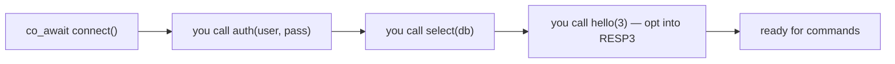
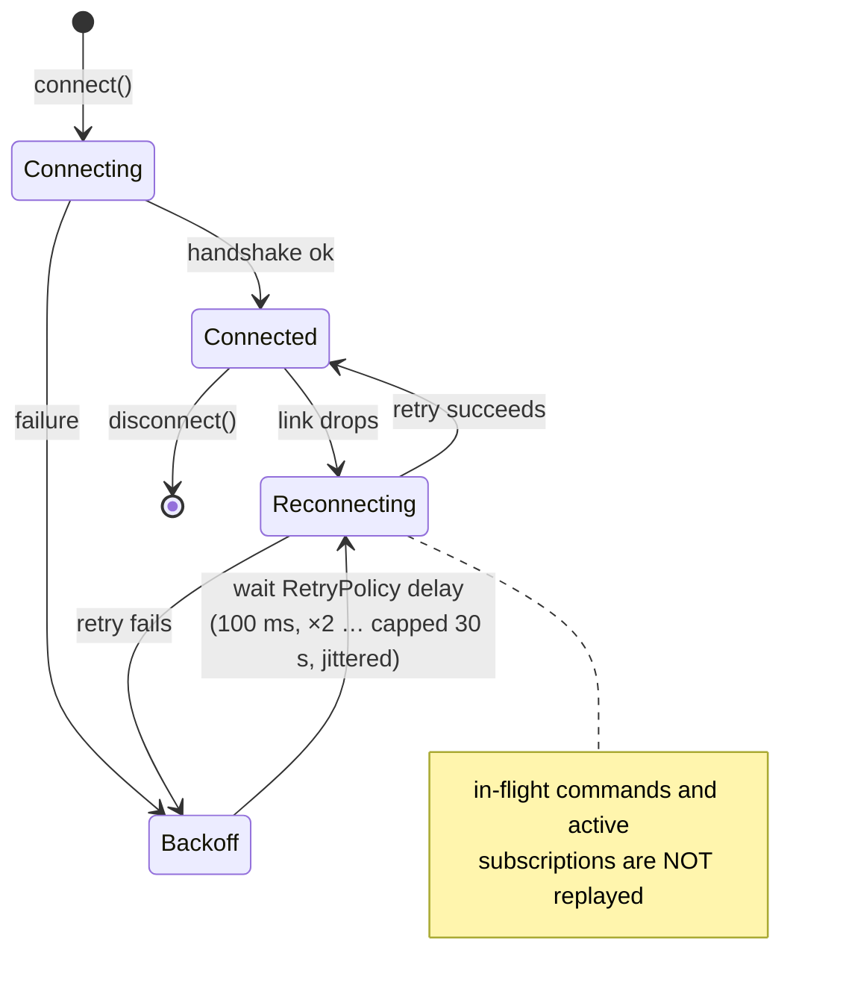

# Connecting to Redis

> **Audience:** Adopter · **Status:** stable · **Verified-against:** qbm-redis @ qb 2.6.0 (C++20 default, C++23
> supported)

How `qb::redis::tcp::client` (and, under `QB_HAS_SSL`, `qb::redis::tcp::ssl::client`) parses a connection URI, opens an
asynchronous socket, optionally authenticates and upgrades to TLS, enforces connect and command deadlines as
`qb::duration`, and what happens to in-flight work when the link drops.

**Prerequisites:** [../README.md](../README.md) (install, `qb_load_modules`, `qbm::redis`) — **See also:
** [error_handling.md](./error_handling.md), [commands_overview.md](./commands_overview.md), [pipeline_and_await.md](./pipeline_and_await.md), [subscription_commands.md](./subscription_commands.md)

---

## Summary

A Redis client is a single object. Construct it (optionally with a URI), then start the handshake with `connect()`,
which returns an **awaiter** — there is no blocking `bool connect()`. Drive the awaiter with `co_await` inside a
coroutine, or with `qb::io::async::run_sync(...)` from synchronous code; `connect(callback, ...)` overloads exist for
callback-style code. The awaiter resolves to `true` once the socket is open and the RESP protocol is attached, `false`
on failure or timeout.

The client opens the connection but does **not** authenticate, select a database, or switch to RESP3 for you. Those are
ordinary commands you issue after `connect()` resolves: `auth(...)`, `select(...)`, `hello(3)`.



None of these are automatic, and **none are replayed across an auto-reconnect** — re-run them in your own post-reconnect flow. Connect timeouts, the
`RetryPolicy` backoff delays, and the optional command-deadline watchdog are all expressed in **`qb::duration`** (
`std::chrono`-backed). Redis command *arguments* that carry time (for example `EXPIRE` seconds) keep their native
units — that boundary is covered in [commands_overview.md](./commands_overview.md), not here.

```cpp
#include <redis/redis.h>
#include <qb/io/async.h>
#include <qb/io/async/coroutine.h>

qb::io::async::task<void> example() {
    qb::redis::tcp::client redis{qb::io::uri{"tcp://localhost:6379"}};

    if (!co_await redis.connect()) {
        qb::io::cerr() << "connection failed" << std::endl;
        co_return;
    }

    auto pong = co_await redis.ping();
    if (pong)                                  // Reply<T> is contextually bool
        qb::io::cout() << pong.result() << std::endl; // "PONG"
}
```

<!-- src: qbm/redis/tests/integration/connection/connection-commands.cpp:106-117 -->

> The client is **not thread-safe.** Use one client from a single I/O thread / strand (one concurrent accessor). The
> reply queue and outbound pipe are unsynchronized.

---

## Concepts

### Client types and transports

The client is a compiled library (`qbm::redis`), not header-only. Link it with the standard module integration, then
include the umbrella header:

```cmake
add_subdirectory(qb)
qb_load_modules("${CMAKE_CURRENT_SOURCE_DIR}/qbm")
target_link_libraries(your_app PRIVATE qbm::redis)
```

```cpp
#include <redis/redis.h>   // namespace qb::redis
```

Everything lives in `namespace qb::redis`. The transport-bound aliases you instantiate are:

| Alias                                         | Transport     | Notes                                                                          |
|-----------------------------------------------|---------------|--------------------------------------------------------------------------------|
| `qb::redis::tcp::client`                      | plaintext TCP | the common case                                                                |
| `qb::redis::tcp::ssl::client`                 | TLS (`stcp`)  | compiled only when `QB_HAS_SSL` is defined                                     |
| `qb::redis::tcp::pipeline`                    | plaintext TCP | named callback-pipelining wrapper                                              |
| `qb::redis::tcp::cb_consumer` / `co_consumer` | plaintext TCP | pub/sub consumers (see [subscription_commands.md](./subscription_commands.md)) |

<!-- src: qbm/redis/redis.h:1611-1640 -->

`qb::redis::tcp::client` is the alias for `qb::redis::detail::Redis<qb::io::transport::tcp>`; `database<QB_IO_>` is the
generic template behind it. All the command mixins (`connection_commands`, `string_commands`, …) are inherited by this
one class, so a connected client exposes the entire command surface directly.

### Connection URIs

You construct a client from a `qb::io::uri`, or pass one to `connect()` / `set_uri()` later. The scheme selects the
transport behavior:

| Scheme                       | Meaning                                      |
|------------------------------|----------------------------------------------|
| `tcp://host:port`            | plaintext TCP (e.g. `tcp://127.0.0.1:6379`)  |
| `redis://host:port`          | alias for plaintext TCP                      |
| `rediss://host:port`         | TLS — use with `qb::redis::tcp::ssl::client` |
| `unix:///path/to/redis.sock` | Unix domain socket                           |

The URI carries only the endpoint. Credentials and database selection are **not** taken from the URI; issue `auth(...)`
and `select(...)` explicitly after connecting (see below).

### `connect()` is an awaiter, not a blocking call

`connect()` returns a `connect_awaiter`. It does nothing until you `co_await` it (or hand it to a runner). There are
four coroutine overloads and two callback overloads:

```cpp
// Coroutine form — qbm/redis/redis.h:438-455
connect_awaiter connect();                                   // use the stored URI, 3s default timeout
connect_awaiter connect(qb::io::uri uri);                    // set + use this URI
connect_awaiter connect(qb::duration timeout);              // stored URI, custom timeout
connect_awaiter connect(qb::io::uri uri, qb::duration timeout);

// Callback form — qbm/redis/redis.h:529-548
template <std::invocable<bool> Func>
void connect(Func &&func, qb::io::uri uri, qb::duration timeout = std::chrono::seconds(3));
template <std::invocable<bool> Func>
void connect(Func &&func, qb::duration timeout = std::chrono::seconds(3));
```

<!-- src: qbm/redis/redis.h:438-548 -->

The default connect timeout is **3 seconds** (`qb::duration`). The awaiter resolves to `true` only when the socket
opened *and* `setup_connection` adopted the transport; a failed handshake or an elapsed timeout resolves to `false`.
There is no exception on a failed connect — check the boolean.

### Time units: everything on this page is `qb::duration`

The framework's canonical time type is `qb::duration` (a `std::chrono::nanoseconds` span). Every timing knob involved in
*connecting* takes a `qb::duration`, which any `std::chrono` literal converts to implicitly:

- the `connect()` timeout (default `3s`);
- every delay in `RetryPolicy` — `initial_delay` (default `100ms`), `max_delay` (default `30s`), `connect_timeout` (
  default `3s`), and the `next_delay` passed to the `on_retry` callback;
- the optional `set_command_timeout(...)` deadline (default `qb::duration::zero()` = disabled).

> The retired aliases `qb::Duration`, `qb::Timestamp`, and `qb::TimePoint` (and the helpers `to_timestamp(...)` /
`to_time_point(...)`) are **removed** — never pass them here. Use `qb::duration` and `std::chrono` literals.

Note the boundary: this is distinct from Redis *command arguments* that carry time. `EXPIRE` takes seconds and `PEXPIRE`
takes milliseconds, exposed through native-unit `std::chrono` overloads on the command APIs; those are intentionally *
*not** `qb::duration`. See [commands_overview.md](./commands_overview.md). Reply TTL values come back as plain integers.

The connection lifecycle, including how `RetryPolicy` drives auto-reconnect:



---

## Connecting

### Coroutine connect (the idiomatic form)

```cpp
#include <redis/redis.h>
#include <qb/io/async.h>
#include <qb/io/async/coroutine.h>

using namespace std::chrono_literals;

qb::io::async::task<void> open_and_use() {
    qb::redis::tcp::client redis{qb::io::uri{"tcp://localhost:6379"}};

    if (!co_await redis.connect(2s))           // 2-second connect deadline
        co_return;

    // Optional: opt into RESP3 (server replies in RESP2 until you ask).
    co_await redis.hello(3);

    auto r = co_await redis.command<std::string>("GET", "key");
    if (r)
        qb::io::cout() << r.value() << std::endl;
}
```

<!-- src: qbm/redis/tests/integration/connection/connection-commands.cpp -->

### Synchronous connect (tests, bootstrap code)

From non-coroutine code, drive the awaiter with `qb::io::async::run_sync`, which pumps the event loop until the awaiter
resolves:

```cpp
#include <redis/redis.h>
#include <qb/io/async.h>

qb::io::async::init();

auto client = std::make_unique<qb::redis::tcp::client>(qb::io::uri{"tcp://localhost:6379"});
if (!qb::io::async::run_sync(client->connect()))
    throw std::runtime_error("connection failed");
```

<!-- src: qbm/redis/tests/system/connection/reconnect-lifetime-uaf.cpp:118-119 -->

### Callback connect

```cpp
qb::io::async::init();

qb::redis::tcp::client redis{qb::io::uri{"tcp://localhost:6379"}};
redis.connect([&redis](bool connected) {
    if (!connected) return;
    redis.ping([](qb::redis::Reply<std::string> &&reply) {
        if (reply) { /* "PONG" */ }
    });
});
```

<!-- src: qbm/redis/redis.h:529-548 -->

`set_uri(uri)` updates the stored endpoint without connecting; a later argument-less `connect()` uses it. `uri()`
returns the current endpoint. `is_connected()` reports the live socket state.

---

## Authentication

Authentication is a command, not a connect parameter. Issue `auth(...)` as the first command after `connect()` resolves,
before any data command. Both ACL (`user` + `password`) and legacy (`password`-only, the `default` user) forms exist:

```cpp
if (!co_await redis.connect())
    co_return;

// ACL user (Redis 6+)
auto a = co_await redis.auth("app_user", "s3cr3t");
if (!a)                                       // Reply<status> is contextually bool
    co_return;                                // WRONGPASS / NOPERM rejected

// Legacy requirepass form:
// co_await redis.auth("s3cr3t");
```

<!-- src: qbm/redis/commands/connection_commands.h:83-138 -->

`auth(...)` yields `Reply<status>`. A rejected credential resolves with `ok() == false` and the server message in
`error()` (for example `WRONGPASS`); it does **not** throw and does **not** close the connection — you decide whether to
disconnect. The dedicated error type is `qb::redis::AuthError` (see [error_handling.md](./error_handling.md)).

Because credentials are not stored on the client, **auto-reconnect does not re-authenticate.** If you arm
auto-reconnect (below) on an authenticated server, wire the re-auth into your own post-reconnect flow.

`select(index)` and `swapdb(a, b)` choose / swap logical databases the same way — each is a command returning
`Reply<status>`, issued after connect, and likewise not replayed across a reconnect.

---

## TLS

For an encrypted link, use the SSL alias and a `rediss://` URI. The SSL types are compiled only when the framework is
built with `QB_HAS_SSL`:

```cpp
#ifdef QB_HAS_SSL
qb::redis::tcp::ssl::client redis{qb::io::uri{"rediss://redis.example.com:6379"}};

// Server certificate + hostname verification is ON by default. Disable it
// ONLY for a trusted/self-signed endpoint, and ONLY before connect().
// redis.set_verify_peer(false);

if (!co_await redis.connect())
    co_return;
#endif
```

<!-- src: qbm/redis/redis.h:602-629 -->

`set_verify_peer(bool)` toggles TLS chain + hostname verification; it **defaults to `true`** and must be set before
`connect()`. `verify_peer()` reads the current setting. For a **private CA**, call `set_ssl_root_cert(path)` (a PEM
file or directory trusted in addition to the system store, so `verify_peer(true)` validates an internally-issued
certificate); for **mutual TLS**, call `set_ssl_client_certificate(cert, key)` to present a client certificate. All
apply to the `stcp` (TLS) transport used by `rediss://`, must be set before `connect()`, and have no effect on
plaintext clients; a bad CA/cert/key path fails the connect **closed**.

---

## Connect retry and auto-reconnect

There are two related but distinct mechanisms, both driven by `RetryPolicy`.

### `RetryPolicy` — backoff configuration

```cpp
struct RetryPolicy {
    int          max_attempts   = -1;        // -1 = unlimited
    qb::duration initial_delay  {100ms};
    qb::duration max_delay      {30s};
    double       multiplier     = 2.0;
    bool         jitter         = true;
    qb::duration connect_timeout{3s};        // per-attempt connect deadline
    std::function<void(int attempt, qb::duration next_delay)> on_retry;
};
```

<!-- src: qbm/redis/redis.h:207-252 -->

Every field has a fluent setter that returns `*this`, so you build a policy inline. **All three time fields
are `qb::duration`,** and the `on_retry` callback receives the next delay as a `qb::duration`:

```cpp
auto policy = qb::redis::RetryPolicy{}
    .with_max_attempts(5)
    .with_initial_delay(50ms)
    .with_max_delay(2s)
    .with_multiplier(2.0)
    .with_jitter(true)
    .with_connect_timeout(2s)
    .with_on_retry([](int attempt, qb::duration next_delay) {
        qb::io::cout() << "retry " << attempt << " in "
                       << std::chrono::duration_cast<std::chrono::milliseconds>(next_delay).count()
                       << "ms" << std::endl;
    });
```

<!-- src: qbm/redis/tests/integration/connection/connection-commands.cpp:281-295 -->

The backoff is exponential: the delay starts at `initial_delay`, multiplies by `multiplier` after each failed attempt,
and is capped at `max_delay`. With `jitter` on, each delay is randomized by ±25% to avoid thundering herds. The math
runs in integer milliseconds and is assigned back into `qb::duration`. `max_attempts < 0` means retry forever; with
`max_attempts == n`, retries stop after `n` failed attempts.

### `connect_with_retry` — one-shot retried connect

`connect_with_retry(...)` is a coroutine that drives the policy yourself. It returns `qb::io::async::task<bool>` and
resolves once a connect succeeds or the attempts are exhausted:

```cpp
qb::redis::tcp::client client{qb::io::uri{"tcp://localhost:6379"}};

bool connected = co_await client.connect_with_retry(
    qb::redis::RetryPolicy{}
        .with_max_attempts(5)
        .with_initial_delay(10ms)
        .with_connect_timeout(2s));

// URI overload also exists:
// co_await client.connect_with_retry(qb::io::uri{"tcp://..."}, policy);
```

<!-- src: qbm/redis/tests/integration/connection/connection-commands.cpp:246-310 -->

### `enable_auto_reconnect` — re-dial on drop

`enable_auto_reconnect(policy)` arms a policy that fires automatically the next time the connection is lost. On
disconnect, the connector spawns a **detached** coroutine running `connect_with_retry(policy)`;
`disable_auto_reconnect()` disarms it.

```cpp
qb::redis::tcp::client client{qb::io::uri{"tcp://localhost:6379"}};
co_await client.connect();

client.enable_auto_reconnect(qb::redis::RetryPolicy{}
    .with_max_attempts(3)
    .with_initial_delay(50ms)
    .with_connect_timeout(2s)
    .with_jitter(false));

// Some time later the link drops (server restart, network blip)…
// is_reconnecting() is true while the detached retry loop runs;
// is_connected() returns true again once a retry succeeds.
```

<!-- src: qbm/redis/tests/integration/connection/reconnect-resilience.cpp:103-150 -->

`is_reconnecting()` is `true` for the lifetime of the retry loop; `is_connected()` flips back to `true` when an attempt
lands. The retry runs on the same I/O loop — there is no extra thread.

> **Auto-reconnect re-dials, it does not restore session state.** A reconnected socket is a *fresh* connection. It
> defaults to RESP2 (call `hello(3)` again if you need RESP3), it is unauthenticated (re-issue `auth(...)`), it is back
> on
> database 0 (re-issue `select(...)`), and any prior subscriptions are gone (re-`subscribe(...)`). In-flight commands
> are
**not** replayed — they were already failed at disconnect (next section). Treat reconnection as a re-handshake you must
> complete yourself.

---

## What happens to in-flight work when the link drops (fail-queued)

The client pipelines: it sends a command's bytes and queues its reply handler in FIFO order. When the connection drops —
a peer close, an explicit `disconnect()`, or a tripped command deadline — every queued handler is **failed immediately
**, in order, before any reconnect begins:

- The pending-reply queue is swapped out and drained. Each handler is invoked with the disconnect signal (a null reply),
  surfacing as `Reply{ ok = false, error = "disconnected" }`. A `co_await`-ing caller therefore *resumes* on disconnect
  with a failed `Reply<T>` — it does not hang.
- If the drop was caused by the command-deadline watchdog (below), the reason is `"command timed out"` instead, so
  callers can distinguish a dead peer from an ordinary close.
- Any open transaction / `MULTI` state is reset.

```cpp
auto r = co_await redis.command<std::string>("GET", "key");
if (!r) {
    // On a mid-flight disconnect this branch runs with
    // r.error() == "disconnected" (or "command timed out").
    qb::io::cerr() << "command failed: " << r.error() << std::endl;
}
```

<!-- src: qbm/redis/redis.h:882-913 -->

The queue is swapped *before* the drain loop so that a failing handler may legitimately re-issue a command (for example
to kick off a reconnect-and-retry) without that brand-new command being failed by the same loop.

### `disconnect()`, `quit()`, and destruction

- **`disconnect()`** clears the connected flag and defers the actual transport teardown to the I/O watcher callback (the
  deferred-dispose path). If auto-reconnect is armed, calling `disconnect()` is what triggers the reconnect loop.
- **`quit()`** is the Redis `QUIT` command (a coroutine yielding `Reply<status>`): it asks the server to close the
  connection cleanly after replying.
- **Destruction** is RAII — when the client object is destroyed the connection is torn down. The connector holds a
  shared liveness token so a detached reconnect or timer that fires after destruction safely no-ops instead of touching
  freed memory.

---

## Command-deadline watchdog (optional)

`set_command_timeout(qb::duration)` arms an opt-in **connection-health watchdog** — disabled by default (
`qb::duration::zero()`). If no reply arrives within the window for a non-blocking in-flight command, the client drops
the whole connection; pending commands then fail with `"command timed out"`, and auto-reconnect resumes if armed.

```cpp
redis.set_command_timeout(500ms);   // arm
// redis.command_timeout();         // current value; zero() == disabled
// redis.set_command_timeout(qb::duration::zero());  // disarm
```

<!-- src: qbm/redis/redis.h:1012-1025 -->

This is **not a per-command timer.** A FIFO-pipelined protocol cannot fail one mid-queue command without desynchronizing
every later reply, so the only safe action on a stall is to drop the connection. Blocking commands (`BLPOP`, `WAIT`,
`XREAD`, …) suspend the deadline so their own server-side timeout governs instead — the watchdog never spuriously drops
a legitimately parked command.

---

## Pitfalls

- **`connect()` does nothing on its own.** It returns an awaiter. Forgetting to `co_await` it (or pass it to `run_sync`)
  leaves you disconnected with no error. There is no blocking `bool connect()`.
- **No exception on failed connect or rejected auth.** `connect()` resolves to `false`; `auth()` resolves with
  `ok() == false`. Always check the boolean / `Reply` before issuing further commands.
- **Reconnect is a fresh socket.** After auto-reconnect you must re-`hello(3)`, re-`auth`, re-`select`, and re-
  `subscribe`. None of these carry over, and credentials are never stored on the client.
- **In-flight commands are dropped, not replayed.** On disconnect, every queued command fails with `"disconnected"` (or
  `"command timed out"`). A `co_await` resumes with a failed reply rather than hanging, but the work is gone — re-issue
  idempotent commands yourself.
- **`set_verify_peer` only matters before `connect()`** and only on the `rediss://` / `ssl::client` path. Setting it
  after the handshake has no effect; disabling it on a plaintext client is meaningless.
- **The client is single-threaded.** Sharing one client across threads corrupts the reply queue. Use one client per I/O
  thread / strand.
- **Don't reach for `qb::Duration` / `qb::Timestamp`.** They are retired. All connect, retry, and command-deadline
  timings are `qb::duration`; pass `std::chrono` literals like `2s` or `500ms`.
- **Command-deadline is connection-wide.** `set_command_timeout` drops the whole connection on a stall — it is a
  watchdog, not a way to bound a single slow command.

---

## See also

- [error_handling.md](./error_handling.md) — `Reply<T>`, `ConnectionError`, `AuthError`, `TimeoutError`, the disconnect
  signal
- [commands_overview.md](./commands_overview.md) — the coroutine/callback dual API and the native time-unit boundary for
  command arguments
- [pipeline_and_await.md](./pipeline_and_await.md) — pipelining and `await()` draining for the callback API
- [subscription_commands.md](./subscription_commands.md) — pub/sub consumers and re-subscription after reconnect
- [../README.md](../README.md) — install, `qb_load_modules`, `qbm::redis`, quick start
