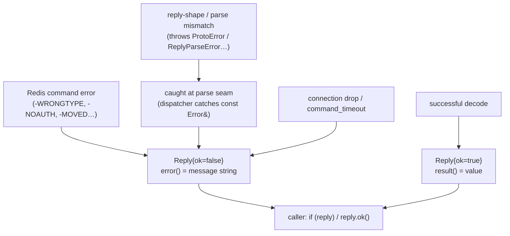

# Error handling

> **Audience:** Adopter · **Status:** stable · **Verified-against:** qbm-redis @ qb 3.0.0 (C++20 default, C++23
> supported)

How `qbm-redis` reports failures: the RESP reply model, the `Reply<T>` error result you check instead of catching, where
the few exceptions live (the parse seam), and the two protocol-level containment mechanisms — the `noexcept` `onMessage`
boundary and the sticky parser fault on a corrupt frame — that keep a hostile or misconfigured server from terminating
your actor.

**Prerequisites:** [connection.md](./connection.md) (you need a connected
client), [commands_overview.md](./commands_overview.md) (how commands run) — **See also:
** [pipeline_and_await.md](./pipeline_and_await.md), [subscription_commands.md](./subscription_commands.md), [transaction_commands.md](./transaction_commands.md)

**Include:** `#include <qbm/redis/redis.h>` — every type below lives in namespace `qb::redis` (the parser types in
`qb::redis::parser`).

`qbm-redis` is a compiled qb module (`qbm::redis`); pull it in with `add_subdirectory(qb)` →
`qb_load_modules("<path>/qbm")` → `target_link_libraries(app PRIVATE qbm::redis)`. Almost all of the surface is template
code in `<qbm/redis/redis.h>`; only `redis.cpp`, `reply.cpp`, and `server_reply.cpp` compile into the archive. Do not add the
include directory by hand — link the target.

---

## Summary

`qbm-redis` does not throw for ordinary Redis failures. Every command — coroutine or callback — delivers its outcome
through a `qb::redis::Reply<T>`. You test `reply.ok()` (or `if (reply)`) and read `reply.error()` on failure; you never
wrap a `co_await` in `try`/`catch` to handle a `WRONGTYPE` or a dropped connection.

There are three places a failure can originate, and all three converge on the same `Reply<T>`:

- **Redis command errors** — the server answers a command with a RESP error frame (`-WRONGTYPE`, `-NOAUTH`,
  `-ERR syntax error`, a cluster `-MOVED`/`-ASK` redirect). The client translates this into `Reply{ok=false}` with the
  server's message in `reply.error()`. No exception is thrown.
- **Reply-shape and parse errors** — the reply arrives intact but does not match the C++ type you asked for (an
  `INTEGER` reply parsed as a `double`, a truncated array). The typed parsers throw `qb::redis::ProtoError` /
  `ReplyParseError` internally, but the dispatch layer catches them at the boundary and converts them to
  `Reply{ok=false}`. You still only check `ok()`.
- **Connection and timeout failures** — the socket drops, or a command exceeds `command_timeout`. Every pending reply is
  failed with `Reply{ok=false}` and an `error()` of `"disconnected"` or `"command timed out"`.

All three origins converge on the one `Reply<T>` channel — you only ever check `ok()`:



Underneath, two containment mechanisms guarantee a server can never crash your process: the protocol `onMessage`
dispatch is `noexcept` and catches everything, and a structurally corrupt frame faults the streaming parser into a
sticky error state that tears the connection down instead of looping forever on a byte it cannot advance past.

The per-command failure message is a `std::string` you read through `reply.error()`. The exception classes (`Error`,
`ProtoError`, `CommandError`, …) exist for the internal parse seam; in adopter code you read strings, not catch types.
Do not confuse that string with `qb::redis::error` — a distinct struct (`types.h:541-544`) that is the pub/sub consumer's
error *event* (`{std::string what; reply_ptr raw;}`), delivered to a consumer's `on_error` callback, not to a command
reply.

---

## Concepts

### The reply model: `Reply<T>`

<!-- src: qbm/redis/src/qbm/redis/reply.h:1102-1177 -->

Every command returns a `Reply<T>`, where `T` is the decoded result type (`long long` for `INCR`,
`std::optional<std::string>` for `GET`, `std::vector<std::string>` for `LRANGE`, and so on).

```cpp
template <typename T>
struct Reply {
    bool        _ok{};       // true if the command succeeded (no Redis error, no parse error)
    T           _result{};   // the decoded value, valid only when _ok
    reply_ptr   _raw{};      // the raw parser::Value, for advanced inspection
    std::string _error{};    // owned error message — never a dangling view
};
```

The accessors you use:

| Call                               | Returns                                 | Meaning                                                                      |
|------------------------------------|-----------------------------------------|------------------------------------------------------------------------------|
| `reply.ok()` / `if (reply)`        | `bool`                                  | `true` when the command produced a usable result                             |
| `reply.result()` / `reply.value()` | `T&`                                    | the decoded value; read only when `ok()` is `true`                           |
| `reply.value_or(fallback)`         | `T` (or element type for `optional<T>`) | the value, or `fallback` when `!ok()` or the optional is empty               |
| `reply.error()`                    | `std::string&`                          | the failure message; empty when `ok()`                                       |
| `reply.raw()`                      | `reply_ptr&`                            | the underlying `parser::Value`, for pipeline sub-replies and custom decoding |

`Reply<T>` is the *only* outcome channel. `reply.error()` is a `std::string` that the dispatch layer copies before any
internal buffer is moved or freed, so it is always safe to read and store — it is never a view into reclaimed storage (
`reply.h:1113`, `reply.h:1243`).

### Coroutine and callback paths return the same `Reply<T>`

<!-- src: qbm/redis/src/qbm/redis/redis.h:728-730 -->

The coroutine awaiter's `await_resume()` returns `Reply<T>` by value (`redis.h:728-730`). The callback overload invokes your
handler with `Reply<T>&&`. The check is identical on both paths:

```cpp
#include <qb/io/async.h>
#include <qb/io/async/coroutine.h>
#include <qbm/redis/redis.h>

// Coroutine path
qb::redis::tcp::client redis{qb::io::uri{"tcp://127.0.0.1:6379"}};
if (!co_await redis.connect())
    co_return; // connect() yields bool — check it before issuing commands

auto reply = co_await redis.incr("counter");
if (!reply) {
    LOG_WARN("[app] INCR failed: " << reply.error());
} else {
    long long n = reply.result();
}
```

```cpp
// Callback path — same Reply<T>, same checks
redis.incr([](qb::redis::Reply<long long> &&reply) {
    if (!reply.ok()) {
        LOG_WARN("[app] INCR failed: " << reply.error());
        return;
    }
    long long n = reply.result();
}, "counter");
```

### RESP error replies become `ok() == false`, not exceptions

<!-- src: qbm/redis/src/qbm/redis/reply.h:1233-1246 -->

When the server returns a RESP error frame, the reply dispatcher (`TReply::operator()`) recognizes it, copies the
message, and constructs `Reply{ok=false}` — it does *not* throw:

```cpp
// reply.h, TReply::operator()
if (raw->is_error()) {
    std::string err_msg{raw->get_error_message()};  // copy before raw is moved
    func(Reply<T>{false, {}, std::move(raw), std::move(err_msg)});
    return;
}
```

So a `WRONGTYPE` against a key, a `NOAUTH` before authentication, or a script syntax error all surface as
`reply.ok() == false` with the server's text in `reply.error()`. This is a documented, deliberate contract: callers
branch on `ok()`, never on a caught exception (`reply.h:1244`).

A RESP error frame carries a prefix that the parser classifies into `ReplyErrorType` — `ERR`, `MOVED`, or `ASK` (
`reply.h:56`). `MOVED` and `ASK` are Redis Cluster redirects; this client does not follow them automatically. If you run
against a cluster, inspect `reply.error()` for the redirect target and re-issue against the correct node.
See [cluster_commands.md](./cluster_commands.md).

### The parse seam: where exceptions live, and why you never see them

<!-- src: qbm/redis/src/qbm/redis/reply.h:1248-1265 -->

After a non-error reply arrives, the dispatcher calls `parse<T>(*raw)` to decode it into `T`. The typed parsers throw on
a shape or type mismatch — but the dispatcher catches every `qb::redis::Error` subclass at that exact seam and folds it
into `Reply{ok=false}`:

```cpp
// reply.h, TReply::operator()
try {
    auto value = parse<T>(*raw);
    func(Reply<T>{true, std::move(value), std::move(raw), {}});
} catch (const Error &e) {
    // ProtoError, ReplyParseError, CommandError, … all caught here
    func(Reply<T>{false, {}, std::move(raw), std::string(e.what())});
}
```

The exception hierarchy (all in `reply.h`, all deriving from `qb::redis::Error : std::exception`):

| Class                                          | Thrown by                                                                                  | Meaning                                                                                                                                                                                                    |
|------------------------------------------------|--------------------------------------------------------------------------------------------|------------------------------------------------------------------------------------------------------------------------------------------------------------------------------------------------------------|
| `ProtoError`                                   | `parse<double>` (`reply.h:344-368`), `parse_scan_reply` (`reply.h:586-610`), container parsers | reply shape is wrong (e.g. "not a double reply", odd-length flat array)                                                                                                                                    |
| `ReplyParseError` (: `ProtoError`)             | the typed `parse()` overloads (`reply.h:317,339,449,…`)                                    | reply type does not match the expected type; the message names both                                                                                                                                        |
| `CommandError`                                 | the JSON parsers, `parse<json_value>` / `parse<qb::json>` (`reply.cpp:471,549`)            | a JSON command's reply was a server error                                                                                                                                                                  |
| `SecurityError`                                | `to_redis_string` (`reply.h:817,827`)                                                      | an outbound argument exceeds `REDIS_MAX_STRING_SIZE` (512 MB)                                                                                                                                              |
| `ConnectionError`, `AuthError`, `TimeoutError` | nothing (declared, currently unthrown)                                                     | reserved lifecycle types; connect/auth/deadline failures reach you as `reply.error()` strings (`"disconnected"`, `"command timed out"`), never as these exceptions — do not write `catch` clauses for them |

Because the dispatcher catches `const Error&` — and, as a backstop, any other `std::exception` (e.g. a `std::bad_alloc`
while materializing a large reply) or even a non-standard throw — these names matter for *reading the message text*, not
for `catch` blocks in your code: nothing thrown while decoding a reply escapes to your call site, it always becomes a
failed `Reply`. In practice the parsers avoid throwing standard exceptions at all anyway (e.g. stream-id decoding parses
each half with `qb::to_number<long long>`, which returns `std::nullopt` rather than throwing on an out-of-range or
malformed value, and the parser folds that `nullopt` into a `ProtoError`) (`reply.h:1248-1265`, `reply.cpp:182-183`
stream-id path).

### Numeric-parse strictness

<!-- src: qbm/redis/src/qbm/redis/reply.h:344-368,586-610; qbm/redis/src/qbm/redis/parser/parser.h:800-867 -->

Numeric decoding is strict on purpose, at two layers. The RESP parser validates integers and doubles as it reads the
wire, and the typed `parse()` overloads re-validate when converting a string reply to a number.

- **Integers** are parsed with a hand-rolled, overflow-checked routine that rejects any non-digit and any value outside
  `int64_t`, with an explicit special case for `INT64_MIN` (`src/qbm/redis/parser/parser.h:800-841`). An overflowing or malformed `:`
  -line is `INVALID_INTEGER`, a fatal protocol error.
- **Doubles** use `std::from_chars` and require the *whole* string to be consumed. A reply like `"1.5junk"` is rejected,
  not silently read as `1.5`. The literals `inf`, `+inf`, `-inf`, and `nan` are accepted (`src/qbm/redis/parser/parser.h:845-867`).
  The reply-side `parse<double>` applies the same full-consume rule (`reply.h:360-366`) and falls back to
  `ProtoError("not a double reply")`.
- **SCAN cursors** are unsigned 64-bit reverse-binary bucket indices that can legitimately set the high bit. The scan
  parser uses `std::from_chars` over the full unsigned range — a cursor above `INT64_MAX` is valid, not an error — and
  rejects any non-numeric cursor with `ProtoError("Invalid cursor")` (`reply.h:597-610`).

The practical consequence: a reply that is *almost* a number is treated as corrupt, not coerced. You get a clear
`Reply{ok=false}` rather than a plausible-looking wrong value.

### Containment 1 — the `noexcept` `onMessage` boundary

<!-- src: qbm/redis/src/qbm/redis/redis.h:168-195 -->

The protocol's `onMessage(std::size_t)` runs under the libev C callback and is declared `noexcept final` (
`redis.h:169`). An exception escaping it would call `std::terminate`. The framework provides defense in depth:

1. Each pending reply is dispatched to the owning IO handler inside a `try { … } catch (...) { … }`. The per-handler
   path already catches `std::exception` gracefully; this outer `catch (...)` is a backstop for anything it misses — for
   example, a user callback that throws a non-`std` type. A single bad reply or a throwing callback is logged and
   dropped; the remaining pending replies still dispatch (`redis.h:186-190`).
2. The command-reply dispatch in the client (`on(message&&)`) wraps the handler call in
   `try { … } catch (const std::exception&) { … }` for the same reason — it also runs under the libev read dispatch (
   `redis.h:938-942`).
3. The disconnect drain (`on(disconnected&&)`) catches both `const std::exception&` and `...`, because a failing
   callback may legitimately re-issue a command and that nested call could throw (`redis.h:954-973`).

The contract for *your* callbacks: a throw will not crash the process, but it will cause that reply to be dropped with
only a log line. Handle your own errors inside the callback; do not rely on the backstop as control flow.

### Containment 2 — the sticky parser fault on a corrupt terminator

<!-- src: qbm/redis/src/qbm/redis/parser/parser.h:130-244,326-338; qbm/redis/src/qbm/redis/redis.h:124-195 -->

The streaming `RespParser` separates two failure modes precisely, because conflating them stalls the connection:

- **`INCOMPLETE_DATA`** is the only retryable code. On it, `parse()`/`parse_all()` consume **zero** bytes: the
  non-destructive `ViewBuffer` position is not committed, so the exact same bytes are re-parsed once more data is fed. A
  half-arrived bulk string or a simple line missing its CRLF simply waits (`src/qbm/redis/parser/parser.h:309-312`,
  `src/qbm/redis/parser/parser.h:227-239`). Keep feeding; this is not an error.
- **Any other code** is a fatal protocol error. `parse_all()` sets `_state = State::FAULT`, after which `feed()` returns
  `false` and `parse()` returns `PROTOCOL_ERROR "Parser in error state"`. The fault is **sticky**: only `reset()` clears
  it (`src/qbm/redis/parser/parser.h:153-154,191-193,232-234`, `src/qbm/redis/parser/parser.h:112-117`).

The corrupt-terminator fault is the canonical trigger. RESP requires a fixed-length payload (`$`, `!`, `=`) and the
single-byte types (`_`, `#`) to be followed by exactly `\r\n`. `expect_crlf()` distinguishes "fewer than two bytes
available" (→ `INCOMPLETE_DATA`, retry) from "two bytes present that are not `\r\n`" (→ `PROTOCOL_ERROR`, fatal).
Treating a wrong terminator as incomplete would wait forever for bytes that can never make the terminator valid (
`src/qbm/redis/parser/parser.h:326-338`). The same strictness rejects a negative aggregate length other than the `-1` null marker —
corrupt input like `%-7\r\n` faults rather than being swallowed as a valid reply (`src/qbm/redis/parser/parser.h:536-545`).

The protocol layer acts on the fault. After `parse_all()`, `getMessageSize()` checks `_parser.has_error()`; if set, it
calls `not_ok()`, clears the pending queue, and returns `0`, which tears the connection down instead of looping forever
on a byte the parser cannot advance past (`redis.h:154-158`). A feed failure (buffer overflow) takes the same
`not_ok()` + reset path (`redis.h:131-137`).

When the connection is torn down, `on(disconnected&&)` fails every pending command. Auto-reconnect (if enabled)
re-establishes the socket, but does **not** replay in-flight commands or re-issue subscriptions — those callers already
saw `Reply{ok=false}`, and your application must re-send (see [connection.md](./connection.md)).

### Resource limits that produce a fault

<!-- src: qbm/redis/src/qbm/redis/parser/parser.h:44-48,343-344,574,586,672-673,693-694,714-715,735-736,766-767 -->

The parser enforces hard caps to bound memory against a hostile or buggy peer. Exceeding any of them yields a fatal
`ParseErrorCode`, which faults the parser and drops the connection:

| Limit                            | Default                                | Error code         |
|----------------------------------|----------------------------------------|--------------------|
| Aggregate nesting depth          | 64 (`ParserConfig::max_nesting_depth`) | `NESTING_TOO_DEEP` |
| Bulk / verbatim / error payload  | 512 MB (`ParserConfig::max_bulk_size`) | `BUFFER_OVERFLOW`  |
| Array / set / push element count | 1,000,000 (`ParserConfig::max_array_size`)     | `BUFFER_OVERFLOW`  |
| Map / attribute pair count       | 500,000 (`max_array_size / 2`)                 | `BUFFER_OVERFLOW`  |

All four limits are honored from `ParserConfig` — none is a hardcoded literal. `max_array_size`
bounds the element count of an array, set or push directly, and the map/attribute cap is derived
from it as `max_array_size / 2`, because *N* pairs are 2*N* elements: the two rows are one knob, not
two. Lowering `max_array_size` therefore tightens all four aggregate caps together.

### Server-side reply types are a separate, non-throwing surface

<!-- src: qbm/redis/src/qbm/redis/server_reply.h:100-355 -->

`server_reply.h` defines a parallel, exception-free extraction surface used by server-side handlers and advanced
decoders. It does not interact with the client `Reply<T>` flow, but it shares the same philosophy:

- `ValueExtractor` wraps a `parser::Value` and returns `std::optional<…>` accessors (`as_string`, `as_integer`,
  `as_double`, `as_bool`, `as_array`, `as_map`, `as_set`) plus `is_null()` / `is_error()` / `get_error_message()`. A
  type mismatch is `std::nullopt`, never a throw (`server_reply.h:100-257`).
- The free `extract_*` helpers return `qb::expected<T, std::string>` — a value or an error message, with
  `unexpected("not a string")`-style diagnostics (`server_reply.h:269-414`).
- `AsyncResult<T>` is a coroutine-friendly `expected`-backed wrapper with `is_ok()` / `value()` / `error()` (
  `server_reply.h:304-355`).

Reach for these when you decode a `reply.raw()` by hand and want an optional/`expected` result instead of the typed
`parse<T>` path that throws-then-catches.

---

## Examples

### Distinguishing nil, error, and value on a `GET`

<!-- src: qbm/redis/src/qbm/redis/reply.h:437-442 (optional parser) -->

`GET` decodes to `std::optional<std::string>`: a missing key is a RESP nil that parses to `std::nullopt` with
`ok() == true`. Do not confuse "key absent" with "command failed":

```cpp
#include <qbm/redis/redis.h>

auto reply = co_await redis.get("session:42");
if (!reply) {
    // Command failed (connection lost, WRONGTYPE on a non-string key, …)
    LOG_WARN("[app] GET failed: " << reply.error());
} else if (!reply.result().has_value()) {
    // Command succeeded; key does not exist
} else {
    const std::string &value = reply.result().value();
}

// Equivalent one-liner: empty string on absent key OR failure
std::string value = reply.value_or(std::string{});
```

### Forcing a `WRONGTYPE`, then reading the server message

```cpp
co_await redis.set("k", "not-a-number");   // k holds a string
auto r = co_await redis.lpush("k", "x");   // list op on a string key
if (!r)
    LOG_WARN("[app] " << r.error());       // "WRONGTYPE Operation against a key holding the wrong kind of value"
```

### A command timeout surfaces as a failed reply

<!-- src: qbm/redis/src/qbm/redis/redis.h:839-844 (is_blocking_command), 945-976 (disconnect drain), 1075-1088 (set_command_timeout/getter) -->

`command_timeout` defaults to `qb::duration::zero()` (disabled). It is a connection-health watchdog, not a per-command
timer: when the deadline trips, the client drops the whole connection and fails **every** pending reply with
`"command timed out"` rather than the generic `"disconnected"` (a FIFO pipeline cannot fail one mid-queue command
without desyncing later replies). Blocking commands (`BLPOP`, `BRPOP`, `WAIT`, `XREAD`, …) suspend the deadline while in
flight, so their server-side timeout governs instead — do not rely on `command_timeout` to bound them.

```cpp
#include <chrono>
redis.set_command_timeout(std::chrono::milliseconds(500)); // qb::duration

auto r = co_await redis.get("session:42");
if (!r && r.error() == "command timed out") {
    // The local deadline tripped before the server answered.
}
```

The deadline and all retry/connect timings are `qb::duration` (the canonical `std::chrono`-based span). Redis *command
arguments* that carry time keep their native Redis units by design — `EXPIRE` takes seconds, `PEXPIRE` takes
milliseconds, exposed through `std::chrono`-unit overloads — and reply TTL values come back as plain integers. This
split is a documented boundary; see [key_commands.md](./key_commands.md).

---

## Pitfalls

- **Do not `try`/`catch` a `co_await` to handle Redis errors.** Command and parse failures arrive as `Reply{ok=false}`;
  a `catch` block will never fire for them. Check `reply.ok()` or `if (reply)`.
- **Read `result()` only after checking `ok()`.** On failure, `_result` is default-constructed (`reply.h:1111`); reading
  it is meaningless, not undefined, but still a bug.
- **`std::optional<T>` results have two falsy states.** `!reply.ok()` means the command failed;
  `reply.ok() && !reply.result().has_value()` means it succeeded with a nil (absent key). `value_or(fallback)` collapses
  both to `fallback` — use it only when you do not need to tell them apart.
- **A throwing callback is contained, not handled.** The `noexcept` boundary logs and drops the offending reply (
  `redis.h:186-190`); it is a process-safety backstop, not error handling. Catch your own exceptions inside the
  callback.
- **Auto-reconnect does not replay work.** On disconnect, every pending command is failed with `Reply{ok=false}`;
  subscriptions and in-flight commands are not re-issued. Re-send after you observe the failure (`redis.h:945-976`).
- **A faulted parser is dead until reset.** A corrupt frame faults the parser sticky and drops the connection; you
  cannot keep feeding the same socket. Reconnect (or rely on auto-reconnect) to get a fresh parser (
  `src/qbm/redis/parser/parser.h:153-154`, `redis.h:197-202`).
- **`reply.error()` is the per-command message; `qb::redis::error` is a different thing.** Command failures hand you a
  `std::string` through `reply.error()` — compare and log it as text. `qb::redis::error` (`types.h:541-544`) is the pub/sub
  consumer's error event struct (`.what` message + `.raw` reply), routed to a consumer `on_error` callback, not to a
  command `Reply<T>`. The exception classes (`Error`, `ProtoError`, …) live only at the internal parse seam.
- **Cluster redirects are not automatic.** `MOVED`/`ASK` arrive as `Reply{ok=false}` with the redirect in `error()`;
  this client does not follow them for you.

---

## See also

- [connection.md](./connection.md) — connect/retry lifecycle, `RetryPolicy`, auto-reconnect, the `disconnected` event
- [commands_overview.md](./commands_overview.md) — how commands map to `Reply<T>` across the coroutine and callback APIs
- [pipeline_and_await.md](./pipeline_and_await.md) — `pipeline_result`, sub-reply inspection via `reply.raw()`
- [subscription_commands.md](./subscription_commands.md) — pub/sub message delivery and the consumer channel
- [cluster_commands.md](./cluster_commands.md) — running against Redis Cluster and handling redirects
- [key_commands.md](./key_commands.md) — the native time-unit boundary (`EXPIRE` seconds vs `PEXPIRE` milliseconds)
