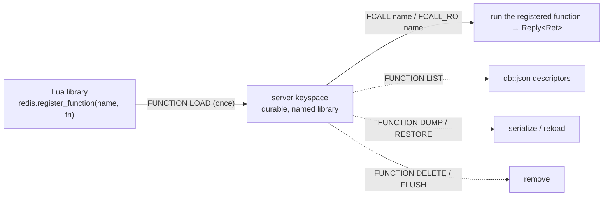

# Function commands

> **Audience:** Adopter · **Status:** stable · **Verified-against:** qbm-redis @ qb 2.6.0 (C++20 default, C++23
> supported)

Reference for the Redis Functions command group — `FUNCTION LOAD`/`LIST`/`DELETE`/`FLUSH`/`KILL`/`STATS`/`DUMP`/
`RESTORE`/`HELP` plus `FCALL` and `FCALL_RO` — which manage named, persistent server-side Lua libraries and invoke the
functions they register.

**Prerequisites:** [../README.md](../README.md) (install, `qb_load_modules`,
`qbm::redis`), [connection.md](./connection.md), [commands_overview.md](./commands_overview.md) (the `Reply<T>` model,
coroutine vs. callback forms) — **See also:** [scripting_commands.md](./scripting_commands.md) (the older `EVAL`/
`EVALSHA` API), [error_handling.md](./error_handling.md), [commands_overview.md](./commands_overview.md)

---

## Summary

Redis Functions (server-side, since Redis 7.0) are the durable successor to ad-hoc `EVAL` scripts. You write a Lua
*library* that calls `redis.register_function(...)` to register one or more named functions, `FUNCTION LOAD` it once,
and from then on invoke a registered function by name with `FCALL`. Unlike `EVAL`/`EVALSHA`, a loaded library survives
in the keyspace, is named rather than addressed by SHA1, and is enumerable (`FUNCTION LIST`) and serializable (
`FUNCTION DUMP`/`RESTORE`). The administrative subcommands manage the library set; `FCALL`/`FCALL_RO` run an individual
function.



The `function_commands<Derived>` mixin (header [`qbm/redis/commands/function_commands.h`](../commands/function_commands.h)) is one of the
command groups inherited by `qb::redis::tcp::client` (and `qb::redis::tcp::ssl::client`). Every command is exposed in
two forms, both fully asynchronous:

- a **coroutine** form (`auto`-returning) that yields a `Reply<T>` you `co_await`;
- a **callback** form that takes your handler first and returns `Derived&` for chaining.

There is **no blocking variant** — this module has never shipped "Sync" signatures, so any `T function_x(...)` that
returns the value directly is incorrect. Older drafts of this page listed such overloads; they do not exist.

None of these commands carry a `qb::duration`. A function takes no client-side timeout argument, and any time arithmetic
happens inside the Lua body in whatever unit you write. The `qb::duration` / native-unit boundary documented for
`EXPIRE` in [commands_overview.md](./commands_overview.md) does **not** apply here.

```cpp
#include <redis/redis.h>            // namespace qb::redis
#include <qb/io/async.h>
#include <qb/io/async/coroutine.h>

// <!-- src: qbm/redis/tests/integration/admin/function-commands.cpp:92-94 -->
qb::io::async::task<void> functions_demo(qb::redis::tcp::client &redis) {
    auto reply = co_await redis.function_list();   // Reply<qb::json>
    if (reply.ok()) {                              // Reply<T> is contextually bool (== ok())
        const qb::json &libs = reply.result();     // JSON array of library descriptors
        qb::io::cout() << "libraries loaded: " << libs.size() << std::endl;
    }
}
```

---

## Concepts

### Reply types: `qb::json`, `status`, and `std::vector<std::string>`

Function commands decode into three reply shapes:

- **`qb::json`** (`= nlohmann::json`, defined in `qb/json.h`) — the structured introspection commands: `function_list`,
  `function_stats`, and `function_dump`. `FUNCTION LIST` decodes to a JSON array of library objects; `FUNCTION STATS` to
  a JSON object; `FUNCTION DUMP` to a JSON value wrapping the serialized payload (a string or binary
  blob). <!-- src: qbm/redis/commands/function_commands.h:52,216,246 -->
- **`qb::redis::status`** — the mutating/administrative commands that reply with a simple line: `function_load` (returns
  the library name), `function_delete`, `function_flush`, `function_kill`, and `function_restore`. `status` is
  contextually `bool` (`true` iff the reply text is exactly `"OK"`) and converts to
  `std::string`. <!-- src: qbm/redis/types.h:334-352 -->
- **`std::vector<std::string>`** — `function_help` only. <!-- src: qbm/redis/commands/function_commands.h:309 -->
- **`Ret` (caller-chosen)** — `fcall<Ret>` / `fcallRo<Ret>` decode the function's return value into whatever type you
  name, exactly like `eval<Ret>` in [scripting_commands.md](./scripting_commands.md).

Every method yields a `Reply<T>` of the corresponding `T`. Inspect it with `reply.ok()`, `reply.result()`, and
`reply.error()` — see [commands_overview.md](./commands_overview.md) and [error_handling.md](./error_handling.md). On a
server that predates Redis 7.0, the whole group returns an `unknown command` error reply rather than throwing.

### `function_load` emits its options *before* the code

The wire form is `FUNCTION LOAD [REPLACE] <code>`. This module passes the variadic `options...` **ahead of** the `code`
payload, matching the protocol. Pass option flags (such as `"REPLACE"`) as the variadic arguments — do **not** embed
them inside the `code` string, and do **not** append them after the code. A client ported from another library that
appends flags after the body would build a malformed command here. <!-- src: qbm/redis/commands/function_commands.h:112-113 -->

### `fcall`/`fcallRo` compute `numkeys` for you — never pass it

The wire form of `FCALL` is `FCALL <name> <numkeys> <key...> <arg...>`. This module fills in `<numkeys>` automatically
from `keys.size()`. You pass the `keys` and `args` vectors separately and the library emits the count between them. If
you migrate code from a raw client and *also* pass a `numkeys` argument, the command is malformed. The same rule applies
to `fcallRo`. <!-- src: qbm/redis/commands/function_commands.h:347,384 -->

### `function_list` filters by library, not by `WITHCODE`

`function_list` accepts an optional `library` name and maps it to `FUNCTION LIST LIBRARYNAME <library>`; with no
argument it sends a bare `FUNCTION LIST`. The `WITHCODE` modifier is **not** exposed as a parameter. If you need it,
drop down to the generic typed command and build the subcommand yourself:

```cpp
// WITHCODE is not a parameter — build it explicitly
auto reply = co_await redis.template command<qb::json>("FUNCTION", "LIST", "WITHCODE");
// or, scoped to a library:
auto scoped = co_await redis.template command<qb::json>(
    "FUNCTION", "LIST", "LIBRARYNAME", "mylib", "WITHCODE");
```

<!-- src: qbm/redis/commands/function_commands.h:70-78 -->

### Subcommand strings are passed straight through

`function_flush` (`mode`), `function_restore` (`policy`), and the `function_load` options are forwarded to the server
verbatim with no client-side validation. A typo such as `function_flush("ASYNCH")` or
`function_restore(payload, "MERGE")` is not caught at the call site — it reaches Redis and fails there. Valid values:
flush mode `"SYNC"` (default) or `"ASYNC"`; restore policy `"APPEND"` (default), `"FLUSH"`, or
`"REPLACE"`. <!-- src: qbm/redis/commands/function_commands.h:156,278 -->

### This is server-side code execution

`function_load` and `fcall` run code inside the Redis process; `function_flush`/`function_delete` erase libraries;
`function_restore FLUSH` replaces the entire library set. These are thin RESP wrappers with no guard rails —
authorization is the caller's responsibility, enforced server-side through ACLs (
see [acl_commands.md](./acl_commands.md)), not by this module.

---

## Command reference

All signatures below are the public methods of `function_commands<Derived>` (header [
`qbm/redis/commands/function_commands.h`](../commands/function_commands.h)). The callback overloads are SFINAE-gated on
`std::is_invocable_v<Func, Reply<T>&&>` for that command's `T`; a handler with the wrong `Reply<T>` signature drops out
of overload resolution, so a mismatch fails to compile rather than misbehaving at runtime. The callback handler is
invoked with an rvalue `Reply<T>&&`.

### `function_load` — load a library

```cpp
// coroutine: yields Reply<status> (the library name on success)
template <typename... Args>
auto function_load(const std::string &code, Args &&...options);

// callback: returns Derived& for chaining
template <typename Func, typename... Args>
Derived &function_load(Func &&func, const std::string &code, Args &&...options);
```

<!-- src: qbm/redis/commands/function_commands.h:91-114 -->

Loads a Lua library `code` (which must call `redis.register_function(...)` at least once). `options` are forwarded *
*before** the code on the wire — pass `"REPLACE"` to overwrite an existing library of the same name. On success the
reply is the loaded library's name.

```cpp
// coroutine
const std::string lib =
    "#!lua name=mylib\n"
    "redis.register_function('myfunc',"
    "  function(keys, args) return redis.call('GET', keys[1]) end)";

auto reply = co_await redis.function_load(lib, "REPLACE");   // Reply<status>
if (reply.ok())
    qb::io::cout() << "loaded library: " << reply.result().str() << std::endl;
```

```cpp
// callback
redis.function_load(
    [](qb::redis::Reply<qb::redis::status> &&reply) {
        if (reply.ok())
            installed(reply.result());
        else
            log_error(reply.error());      // e.g. "ERR Error compiling function"
    },
    lib, "REPLACE");
```

Invalid code yields an error reply (it does not throw across the coroutine
boundary). <!-- src: qbm/redis/tests/integration/admin/function-commands.cpp:146-162 -->

### `function_list` — enumerate libraries and functions

```cpp
// coroutine: yields Reply<qb::json>
auto function_list(const std::optional<std::string> &library = std::nullopt);

// callback: returns Derived&
template <typename Func>
Derived &function_list(Func &&func, const std::optional<std::string> &library = std::nullopt);
```

<!-- src: qbm/redis/commands/function_commands.h:52-78 -->

Returns a JSON array of library descriptors; each describes the library name, the engine, and its registered functions.
Pass `library` to restrict the listing to one library name (`FUNCTION LIST LIBRARYNAME <library>`). `WITHCODE` is not a
parameter — see [the concept above](#function_list-filters-by-library-not-by-withcode).

```cpp
// coroutine — <!-- src: qbm/redis/tests/integration/admin/function-commands.cpp:92-94 -->
auto reply = co_await redis.function_list();           // Reply<qb::json>
if (reply.ok()) {
    const qb::json &functions = reply.result();
    EXPECT_TRUE(functions.is_array());
    for (const auto &fn : functions)
        if (fn.contains("name"))
            qb::io::cout() << fn["name"].get<std::string>() << std::endl;
}

// filtered to one library
auto scoped = co_await redis.function_list("mylib");   // Reply<qb::json>
```

### `function_delete` — remove one library

```cpp
// coroutine: yields Reply<status>
auto function_delete(const std::string &library);

// callback: returns Derived&
template <typename Func>
Derived &function_delete(Func &&func, const std::string &library);
```

<!-- src: qbm/redis/commands/function_commands.h:125-145 -->

Deletes the named library and every function it registered. Deleting a library that does not exist returns a
`Library not found` error reply.

```cpp
// coroutine — <!-- src: qbm/redis/tests/integration/admin/function-commands.cpp:164-176 -->
auto reply = co_await redis.function_delete("mylib");   // Reply<status>
if (!reply.ok())
    qb::io::cout() << "delete failed: " << reply.error() << std::endl;
```

### `function_flush` — remove all libraries

```cpp
// coroutine: yields Reply<status>
auto function_flush(const std::string &mode = "SYNC");

// callback: returns Derived&
template <typename Func>
Derived &function_flush(Func &&func, const std::string &mode = "SYNC");
```

<!-- src: qbm/redis/commands/function_commands.h:156-176 -->

Deletes **every** library. `mode` is `"SYNC"` (default, reclaim memory before replying) or `"ASYNC"` (reclaim in the
background); the string is not validated client-side.

```cpp
// coroutine — <!-- src: qbm/redis/tests/integration/admin/function-commands.cpp:118-142 -->
auto reply = co_await redis.function_flush();           // Reply<status>; "OK" on success
// or asynchronous reclamation:
auto async_flush = co_await redis.function_flush("ASYNC");
```

### `function_kill` — stop a running function

```cpp
// coroutine: yields Reply<status>
auto function_kill();

// callback: returns Derived&
template <typename Func>
Derived &function_kill(Func &&func);
```

<!-- src: qbm/redis/commands/function_commands.h:187-206 -->

Kills the function currently executing — **provided it has not yet performed a write**. With nothing running, the call
returns a `NOTBUSY` / `No scripts in execution` error reply, exactly like `script_kill` (
see [scripting_commands.md](./scripting_commands.md)).

```cpp
// coroutine — <!-- src: qbm/redis/tests/integration/admin/function-commands.cpp:178-190 -->
auto reply = co_await redis.function_kill();            // Reply<status>
// NOTBUSY error when no function is running
```

### `function_stats` — runtime statistics

```cpp
// coroutine: yields Reply<qb::json>
auto function_stats();

// callback: returns Derived&
template <typename Func>
Derived &function_stats(Func &&func);
```

<!-- src: qbm/redis/commands/function_commands.h:216-235 -->

Returns a JSON object describing the function runtime — the currently running script (if any) and the registered
engines.

```cpp
// coroutine — <!-- src: qbm/redis/tests/integration/admin/function-commands.cpp:97-101 -->
auto reply = co_await redis.function_stats();           // Reply<qb::json>
if (reply.ok()) {
    const qb::json &stats = reply.result();
    EXPECT_TRUE(stats.is_object());
    // stats contains "running_scripts" and "engines"
}
```

### `function_dump` — serialize all libraries

```cpp
// coroutine: yields Reply<qb::json>
auto function_dump();

// callback: returns Derived&
template <typename Func>
Derived &function_dump(Func &&func);
```

<!-- src: qbm/redis/commands/function_commands.h:246-265 -->

Returns a serialized payload representing every loaded library, suitable for `function_restore`. Redis replies with a
binary bulk string; this module wraps it in a `qb::json` value, so `result().is_string()` or `result().is_binary()`
holds. Treat the payload as opaque.

```cpp
// coroutine — <!-- src: qbm/redis/tests/integration/admin/function-commands.cpp:118-142 -->
auto reply = co_await redis.function_dump();            // Reply<qb::json>
if (reply.ok()) {
    const qb::json &dump = reply.result();
    EXPECT_TRUE(dump.is_string() || dump.is_binary());
    // persist `dump` for later function_restore(...)
}
```

### `function_restore` — restore from a dump

```cpp
// coroutine: yields Reply<status>
auto function_restore(const std::string &payload, const std::string &policy = "APPEND");

// callback: returns Derived&
template <typename Func>
Derived &function_restore(Func &&func, const std::string &payload,
                          const std::string &policy = "APPEND");
```

<!-- src: qbm/redis/commands/function_commands.h:278-299 -->

Restores libraries from a `payload` produced by `function_dump`. `policy` controls how the restore merges with what is
already loaded: `"APPEND"` (default — add, error on a name clash), `"FLUSH"` (clear first, then load), or `"REPLACE"` (
overwrite name clashes). The string is not validated client-side. A corrupt payload returns a
`payload version or checksum are wrong` error reply.

```cpp
// coroutine — <!-- src: qbm/redis/tests/integration/admin/function-commands.cpp:192-208 -->
auto reply = co_await redis.function_restore(saved_payload, "REPLACE");   // Reply<status>
if (!reply.ok())
    qb::io::cout() << "restore failed: " << reply.error() << std::endl;
```

### `function_help` — subcommand help text

```cpp
// coroutine: yields Reply<std::vector<std::string>>
auto function_help();

// callback: returns Derived&
template <typename Func>
Derived &function_help(Func &&func);
```

<!-- src: qbm/redis/commands/function_commands.h:309-328 -->

Returns the server's `FUNCTION HELP` lines, one `std::string` per line.

```cpp
// coroutine — <!-- src: qbm/redis/tests/integration/admin/function-commands.cpp:210-229 -->
auto reply = co_await redis.function_help();            // Reply<std::vector<std::string>>
if (reply.ok())
    for (const auto &line : reply.result())
        qb::io::cout() << line << std::endl;
```

### `fcall` — invoke a registered function

```cpp
// coroutine: yields Reply<Ret>
template <typename Ret>
auto fcall(const std::string &name,
           const std::vector<std::string> &keys = {},
           const std::vector<std::string> &args = {});

// callback: returns Derived&
template <typename Ret, typename Func>
Derived &fcall(Func &&func, const std::string &name,
               const std::vector<std::string> &keys = {},
               const std::vector<std::string> &args = {});
```

<!-- src: qbm/redis/commands/function_commands.h:342-371 -->

Calls the function registered under `name` (e.g. `"myfunc"`, registered by `function_load`). `keys` become the Lua
`keys` table (and supply `numkeys` automatically); `args` become the extra arguments. Decode type `Ret` is required,
exactly as for `eval<Ret>` — pick a type that matches what the function returns, or `qb::json` for a dynamic shape. A
parse mismatch surfaces as an error on the `Reply`, not a thrown exception.

```cpp
// coroutine — <!-- src: qbm/redis/tests/integration/admin/function-commands.cpp:82-84 -->
auto reply = co_await redis.fcall<qb::json>("myfunc", {"mykey"}, {"arg1"});  // Reply<qb::json>
if (reply.ok())
    EXPECT_TRUE(reply.result().is_object() || reply.result().is_array());

// a function returning a single value
auto v = co_await redis.fcall<std::string>("get_value", {"mykey"});         // Reply<std::string>
```

```cpp
// callback
redis.fcall<long long>(
    [](qb::redis::Reply<long long> &&reply) {
        if (reply.ok())
            use(reply.result());
    },
    "counter::incr", std::vector<std::string>{"hits"});
```

### `fcallRo` — read-only invoke

```cpp
// coroutine: yields Reply<Ret>
template <typename Ret>
auto fcallRo(const std::string &name,
             const std::vector<std::string> &keys = {},
             const std::vector<std::string> &args = {});

// callback: returns Derived&
template <typename Ret, typename Func>
Derived &fcallRo(Func &&func, const std::string &name,
                 const std::vector<std::string> &keys = {},
                 const std::vector<std::string> &args = {});
```

<!-- src: qbm/redis/commands/function_commands.h:350-385 -->

Same contract as `fcall`, mapped to `FCALL_RO`. The function must have been registered with the `no-writes` flag; the
server rejects any write it attempts, which makes the call safe to route to a read replica. Use it for read-only
functions both as a correctness guard and to let a cluster load-balance reads.

```cpp
// coroutine — <!-- src: qbm/redis/tests/integration/admin/function-commands.cpp:87-89 -->
auto reply = co_await redis.fcallRo<qb::json>("readonly_func", {"mykey"}, {});  // Reply<qb::json>
if (reply.ok())
    EXPECT_TRUE(reply.result().is_object() || reply.result().is_array());
```

---

## Pitfalls

- **There are no "Sync" methods.** Every command returns either a coroutine awaitable (`auto`) or `Derived&` (callback).
  A signature like `status function_load(const std::string&)` that returns the value directly does **not** exist;
  earlier versions of this page listed such overloads in error. Always `co_await` the result or pass a handler.
- **`function_load` options come *before* the code.** Pass `"REPLACE"` as a variadic option argument — the library emits
  `FUNCTION LOAD [options...] <code>`. Appending flags after the code (as some other clients do) builds a malformed
  command. <!-- src: qbm/redis/commands/function_commands.h:112-113 -->
- **Never pass `numkeys` to `fcall`/`fcallRo`.** The library derives it from `keys.size()`. Passing it yourself produces
  a malformed command. <!-- src: qbm/redis/commands/function_commands.h:347,384 -->
- **`Ret` is mandatory for `fcall`/`fcallRo` and must match.** These methods cannot deduce the return type; supply it as
  `fcall<Ret>(...)`. If the function returns a shape `Ret` cannot represent, you get a parse error on the `Reply`, not a
  thrown exception. For dynamic shapes decode into `qb::json`.
- **Subcommand strings are unvalidated.** `function_flush(mode)`, `function_restore(payload, policy)`, and the
  `function_load` options reach the server verbatim. A typo fails Redis-side, not at the call site. Valid: flush `SYNC`/
  `ASYNC`; restore `APPEND`/`FLUSH`/`REPLACE`. <!-- src: qbm/redis/commands/function_commands.h:156,278 -->
- **`WITHCODE` is not exposed.** `function_list` only filters by `LIBRARYNAME`. For `WITHCODE`, use the generic
  `command<qb::json>("FUNCTION", "LIST", "WITHCODE")`. <!-- src: qbm/redis/commands/function_commands.h:70-78 -->
- **`function_kill` cannot stop a writing function.** Like `script_kill`, it works only before the function's first
  write; past that point you must restart the node. With nothing running it returns a `NOTBUSY` error.
- **Pre-7.0 servers.** The entire group (including `FCALL`) returns an `unknown command` error reply on Redis older than
  7.0. Check `reply.ok()` and the error text before assuming the feature exists.
- **These commands run server-side code and can erase state.** `function_load`/`fcall` execute Lua in the Redis process;
  `function_flush` and `function_restore FLUSH` wipe the library set. Gate them with
  ACLs ([acl_commands.md](./acl_commands.md)); this module adds no authorization of its own.

---

## See also

- [scripting_commands.md](./scripting_commands.md) — `EVAL`/`EVALSHA`, the older ad-hoc scripting API that Functions
  supersede; `fcall<Ret>` mirrors `eval<Ret>`.
- [commands_overview.md](./commands_overview.md) — the `Reply<T>` model, `status`, the coroutine/callback duality, and
  the `qb::duration` vs. native-unit boundary.
- [error_handling.md](./error_handling.md) — how `NOTBUSY`, `Library not found`, parse failures, and `unknown command`
  surface on a `Reply`.
- [acl_commands.md](./acl_commands.md) — restricting who may load and invoke functions.
- [connection.md](./connection.md) — opening the client and connect/command deadlines (`qb::duration`).
- [Redis Functions reference](https://redis.io/docs/latest/develop/programmability/functions-intro/) and the [
  `FUNCTION`/`FCALL` command pages](https://redis.io/commands/?group=scripting).
