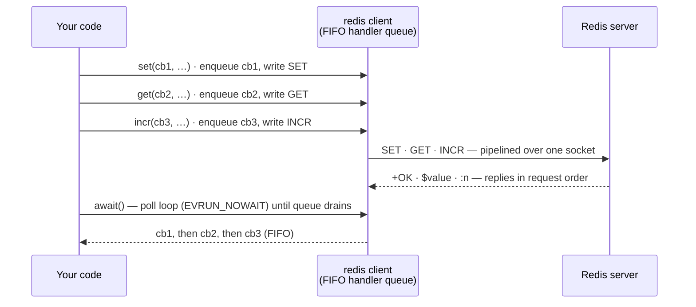

# Pipelining and `await()`

> **Audience:** Adopter · **Status:** stable · **Verified-against:** qbm-redis @ qb 2.6.0 (C++20 default, C++23
> supported)

How the client pipelines callback commands over a single connection, how `await()` drains pending replies without
blocking the kernel, and how the `qb::redis::tcp::pipeline` helper wraps the same mechanism.

**Prerequisites:** [connection.md](./connection.md) (you need a connected
client), [commands_overview.md](./commands_overview.md) (coroutine vs. callback forms) — **See also:
** [error_handling.md](./error_handling.md), [transaction_commands.md](./transaction_commands.md), [subscription_commands.md](./subscription_commands.md)

**Include:** `#include <redis/redis.h>` — every type below lives in namespace `qb::redis`.

`qbm-redis` is a compiled qb module (`qbm::redis`); pull it in with `add_subdirectory(qb)` →
`qb_load_modules("<path>/qbm")` → `target_link_libraries(app PRIVATE qbm::redis)`. The pipelining surface is template
code in `<redis/redis.h>`; link the target rather than adding the include directory by hand.

---

## Summary

Pipelining is a property of the client, not a separate object. Every callback command — `redis.set(cb, …)`,
`redis.get(cb, …)`, or the low-level `redis.command<Ret>(cb, "SET", …)` — pushes one reply handler onto a FIFO queue and
writes one RESP request to the outbound pipe, in call order (`redis.h:935-948`). Redis answers in request order, so the
queue stays positionally consistent. Issue several commands back-to-back without waiting, then call `await()` once to
run the loop until every handler has fired.

`await()` is a non-blocking drain: it spins `qb::io::async::listener::current.run(EVRUN_NOWAIT)` while the reply queue
is non-empty and returns the client by reference (`redis.h:987-991`). It does not block the thread in the kernel; each
iteration is a single poll. The calling stack runs synchronously until every enqueued callback has been invoked — with a
success, a Redis error, or a disconnect failure.

The coroutine forms (`co_await redis.get(...)`) enqueue one handler per command in the same way; each `co_await`
suspends the coroutine until that single reply arrives, and you do not call `await()` for them.

```cpp
#include <redis/redis.h>
#include <qb/io/async.h>

qb::redis::tcp::client redis{qb::io::uri{"tcp://localhost:6379"}};
// ... after connect() resolves ...

int done = 0;
redis.set([&](qb::redis::Reply<qb::redis::status> &&r) { if (r.ok()) ++done; }, "k1", "a");
redis.set([&](qb::redis::Reply<qb::redis::status> &&r) { if (r.ok()) ++done; }, "k2", "b");
redis.get([&](qb::redis::Reply<std::optional<std::string>> &&r) { if (r.ok()) ++done; }, "k1");

redis.await();  // polls the loop until all three callbacks have run; done == 3
```

<!-- src: qbm/redis/tests/integration/connection/pipeline.cpp:79-106 -->



> The client is **not thread-safe.** Use one client from a single I/O thread / strand (one concurrent accessor at a
> time). The reply queue and outbound pipe are unsynchronized (`redis.h:689-690`).

---

## Concepts

### The reply queue

The client holds an internal `std::queue<PendingReply>` (`redis.h:742`). Each callback command registers its handler *
*before** sending bytes, so a fast or synchronous delivery can never run ahead of the queued handler (
`redis.h:939-945`). Because Redis preserves request order on a single connection, the head of the queue always matches
the next reply on the wire.

`pending_reply_count()` returns the current queue depth (`redis.h:993-997`) — useful for tests and for confirming a
drain completed:

```cpp
redis.set(cb, "k", "v");
// pending_reply_count() == 1 here
redis.await();
// pending_reply_count() == 0 here
```

<!-- src: qbm/redis/tests/integration/connection/pipeline.cpp:79-106 -->

### Pipelining cuts round trips

Awaiting each command in sequence pays one network round trip per command. Pipelining sends the whole batch first and
reads the replies as a group, so the batch costs roughly one round trip regardless of size. Callbacks still fire in send
order (`redis.h:942, 864-865`):

```cpp
std::vector<int> order;
int step = 0;
redis.ping([&](qb::redis::Reply<std::string> &&) { order.push_back(++step); });
redis.ping([&](qb::redis::Reply<std::string> &&) { order.push_back(++step); });
redis.ping([&](qb::redis::Reply<std::string> &&) { order.push_back(++step); });
redis.await();
// order == {1, 2, 3}
```

<!-- src: qbm/redis/tests/integration/connection/pipeline.cpp:108-130 -->

### What `await()` does and does not do

- **Implements:** `while (!reply_queue.empty()) listener::current.run(EVRUN_NOWAIT);` (`redis.h:988-989`).
- **Not** a blocking `recv()`: it polls the libev loop. The thread is never parked in the kernel waiting on a single
  socket.
- It uses `listener::current.run(EVRUN_NOWAIT)`, **not** `qb::io::async::run()`. That distinction is deliberate:
  `async::run` rejects being called from inside a coroutine body, but a non-blocking drain is safe there, so a coroutine
  may still call `await()` on a second client (`redis.h:980-984`).
- On **disconnect**, the queue is failed: every pending handler runs with `ok() == false` and
  `error() == "disconnected"` (`reply.h:1280-1282`). If an opt-in command deadline tripped first, the failure reason is
  `"command timed out"` instead (`redis.h:889-901`). See [error_handling.md](./error_handling.md).

```cpp
redis.ping([](qb::redis::Reply<std::string> &&r) {
    // after a disconnect: r.ok() == false, r.error() == "disconnected"
});
redis.disconnect();
// drive the loop until the queue is failed:
while (redis.pending_reply_count() > 0)
    qb::io::async::run(EVRUN_NOWAIT);
```

<!-- src: qbm/redis/tests/integration/connection/pipeline.cpp:286-303 -->

### `qb::redis::tcp::pipeline`

`qb::redis::tcp::pipeline` is an alias for `qb::redis::detail::RedisPipeline<qb::io::transport::tcp>` (`redis.h:1620`);
the SSL transport exposes `qb::redis::tcp::ssl::pipeline` under `QB_HAS_SSL` (`redis.h:1631`). It is a thin, optional
wrapper that holds a reference to a `Redis` client and chains the low-level `command<Ret>(callback, name, args...)` (
`redis.h:935-948`). The reply queue and ordering belong to the client; the wrapper only gives the call site a name.

- Construct it with `pipeline pipe{redis}` over an existing client (`redis.h:1060-1061`).
- `pipe.command<Ret>(cb, "SET", k, v)` returns `*pipe` for fluent chaining (`redis.h:1081-1084`).
- For the typed mixin methods (`set`, `get`, …), reach the client with `pipe.client()` (`redis.h:1063-1070`); the wrapper
  itself only exposes `command<Ret>`.
- `pipe.flush()` drains by calling `client().await()` — it is **unrelated** to the Redis `FLUSHDB`/`FLUSHALL` commands (
  `redis.h:1086-1090`).
- `pipe.pending_reply_count()` forwards to the client's queue depth (`redis.h:1072-1076`).

```cpp
#include <redis/redis.h>

qb::redis::tcp::pipeline pipe{redis};

pipe
    .command<qb::redis::status>(
        [](qb::redis::Reply<qb::redis::status> &&r) { /* SET ok */ }, "SET", "k", "hello")
    .command<std::optional<std::string>>(
        [](qb::redis::Reply<std::optional<std::string>> &&r) { /* GET "hello" */ }, "GET", "k");

pipe.flush();  // == client().await(); NOT Redis FLUSHDB/FLUSHALL
```

<!-- src: qbm/redis/tests/integration/connection/pipeline.cpp:305-325 -->

Mixing the named wrapper with the client's mixin methods is fine — they share one queue:

```cpp
qb::redis::tcp::pipeline pipe{redis};
pipe.client().set([](qb::redis::Reply<qb::redis::status> &&r) { /* ... */ }, "k", "x");
pipe.client().get([](qb::redis::Reply<std::optional<std::string>> &&r) { /* ... */ }, "k");
pipe.flush();  // drains both
```

<!-- src: qbm/redis/tests/integration/connection/pipeline.cpp:327-352 -->

---

## Pitfalls

- **Do not call `await()` from another thread.** Drain from the same thread / loop that drives the client's I/O. The
  reply queue and outbound pipe are unsynchronized (`redis.h:689-690, 847-848`).
- **`flush()` is not a Redis command.** It runs the event loop until pending replies land; it never sends `FLUSHDB` or
  `FLUSHALL` (`redis.h:1051-1052, 1086-1090`).
- **`await()` on an empty queue returns immediately.** It is safe to call with nothing pending — the `while` loop body
  never runs (`redis.h:988`).
- **Coroutine commands do not need `await()`.** A `co_await redis.get(...)` suspends the coroutine until its reply
  arrives; calling `await()` for it is unnecessary. Use `await()` only for the callback form, or
  `qb::io::async::run_sync(...)` to drive a coroutine from synchronous code.
- **Time units belong to the command, not to `await()`.** `await()` and `flush()` take no timeout. The connect timeout,
  `RetryPolicy` delays, and the optional command deadline (`set_command_timeout`) are `qb::duration` and are covered
  in [connection.md](./connection.md). Redis command *arguments* that carry time (for example `EXPIRE` seconds,
  `PEXPIRE` milliseconds) keep their native units by design — see [commands_overview.md](./commands_overview.md). Do not
  conflate the two.

---

## See also

- [connection.md](./connection.md) — opening the client, connect/command deadlines as `qb::duration`.
- [commands_overview.md](./commands_overview.md) — coroutine vs. callback dispatch and the native-unit time boundary.
- [error_handling.md](./error_handling.md) — the `Reply<T>` error model and the `"disconnected"` / `"command timed out"`
  failure reasons.
- [transaction_commands.md](./transaction_commands.md) — `MULTI`/`EXEC`, which build on the same reply queue.
- Tests: `qbm/redis/tests/integration/connection/pipeline.cpp` (CTest: integration-tier `pipeline`, registered via `qredis_itest`).
