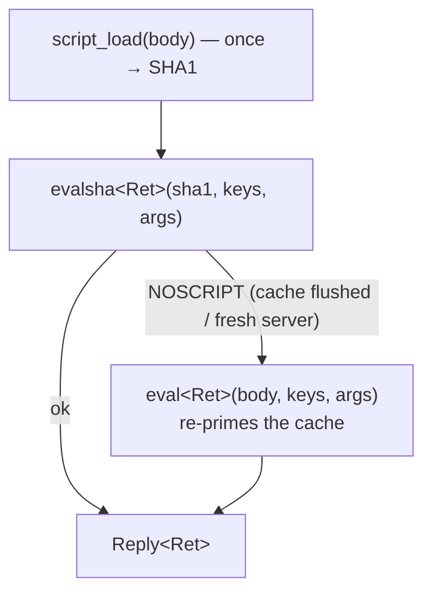

# Scripting commands

> **Audience:** Adopter · **Status:** stable · **Verified-against:** qbm-redis @ qb 3.0.0 (C++20 default, C++23
> supported)

Reference for the server-side Lua scripting command group — `EVAL`, `EVALSHA`, their read-only variants `EVAL_RO`/
`EVALSHA_RO`, and the `SCRIPT LOAD`/`EXISTS`/`FLUSH`/`KILL`/`DEBUG` cache-management subcommands — which run a Lua
program atomically inside the Redis server.

**Prerequisites:** [../README.md](../README.md) (install, `qb_load_modules`,
`qbm::redis`), [connection.md](./connection.md), [commands_overview.md](./commands_overview.md) (the `Reply<T>` model,
coroutine vs. callback forms) — **See also:** [function_commands.md](./function_commands.md) (the newer `FUNCTION`/
`FCALL` API), [transaction_commands.md](./transaction_commands.md) (`MULTI`/`EXEC` as the alternative atomic
primitive), [error_handling.md](./error_handling.md)

---

## Summary

A Lua script runs to completion on the server with no other command interleaved, so the whole script is one atomic
unit — the scripting equivalent of a `MULTI`/`EXEC` block, but with control flow. Inside the script you read the
`KEYS[]` and `ARGV[]` tables and call back into Redis with `redis.call(...)`. The client ships the script either by
value (`EVAL`) or by the SHA1 of a previously cached body (`EVALSHA`), and decodes whatever the script returns into a
`Reply<Ret>` of a type *you* choose.

The `scripting_commands<Derived>` mixin is one of the command groups inherited by `qb::redis::tcp::client` (and
`qb::redis::tcp::ssl::client`). Every command is exposed in two forms, both fully asynchronous:

- a **coroutine** form (`auto`-returning) that yields a `Reply<T>` you `co_await`;
- a **callback** form that takes your handler first and returns `Derived&` for chaining.

There is no blocking variant — this module has never shipped "Sync" signatures. None of these commands carry a
`qb::duration`: a Lua script takes no client-side timeout argument, and any time arithmetic happens inside the script in
whatever unit you write. The `qb::duration` / native-unit boundary documented for `EXPIRE`
in [commands_overview.md](./commands_overview.md) does **not** apply here.

```cpp
#include <redis/redis.h>
#include <qb/io/async.h>
#include <qb/io/async/coroutine.h>

// <!-- src: qbm/redis/tests/integration/scripting/scripting-commands.cpp:59-62 -->
qb::io::async::task<void> eval_demo(qb::redis::tcp::client &redis) {
    std::string              script = "return redis.call('SET', KEYS[1], ARGV[1])";
    std::vector<std::string> keys   = {"mykey"};
    std::vector<std::string> args   = {"test_value"};

    // You name the decode type. SET replies with the status "OK", decoded as std::string.
    auto reply = co_await redis.eval<std::string>(script, keys, args);   // Reply<std::string>
    if (reply)                                                           // Reply<T> is contextually bool (== ok())
        qb::io::cout() << "eval -> " << reply.result() << std::endl;     // "OK"
}
```

---

## Concepts

### You choose the decode type `Ret`

Unlike most commands in this module, `EVAL`/`EVALSHA` have no fixed reply shape — a script can return a status, an
integer, a boolean, a bulk string, or a (possibly nested) array. The four eval methods are therefore templated on a
return type `Ret` that **you must supply explicitly** as a template argument, and the library decodes the RESP reply
into `Reply<Ret>` with the same `parse<Ret>` machinery used elsewhere:

```cpp
// <!-- src: qbm/redis/tests/integration/scripting/scripting-commands.cpp:118-138 -->
auto n   = co_await redis.eval<long long>("return 42");                     // Reply<long long>      -> 42
auto b   = co_await redis.eval<bool>("return true");                        // Reply<bool>           -> true
auto arr = co_await redis.eval<std::vector<long long>>("return {1, 2, 3}"); // Reply<std::vector<long long>>
```

Pick a `Ret` that matches what the script actually returns. If the script returns a richer shape than `Ret` can hold,
the parse fails and the `Reply` carries an error (see [error_handling.md](./error_handling.md)); it does not throw
across the coroutine boundary. For genuinely dynamic, schema-less return values, decode into `qb::redis::json_value` (a
variant over string/number/boolean/array/map/null) and inspect it with `std::visit` or `std::holds_alternative`.

### `numkeys` is computed for you — never pass it

The wire form of `EVAL` is `EVAL <script> <numkeys> <key...> <arg...>`. This module fills in `<numkeys>` automatically
from `keys.size()`. You pass the `keys` and `args` vectors separately and the library emits the count between them. If
you migrate code from a raw client and *also* pass a `numkeys` argument, the command is malformed. The same auto-
`numkeys` rule applies to `evalsha`, `evalRo`, and `evalshaRo`.

<!-- src: qbm/redis/commands/scripting_commands.h:80-81 (keys.size()) -->

### `EVAL` versus `EVALSHA`, and the script cache

`EVAL` ships the full Lua body on every call. `EVALSHA` ships only the script's 40-character SHA1 — the server keeps a
cache of bodies it has seen, so resending the hash saves bandwidth on a hot script. The usual pattern is: `script_load`
once to prime the cache and get the SHA1, then `evalsha` from then on. If the cache was flushed (or you target a fresh
server) `EVALSHA` fails with a `NOSCRIPT` error, at which point you fall back to `EVAL` once to re-prime it.



### Read-only variants route to replicas

`evalRo`/`evalshaRo` map to `EVAL_RO`/`EVALSHA_RO`. The server guarantees these scripts perform no writes — any
`redis.call` to a writing command fails — which makes them safe to dispatch to a read replica. Use them whenever the
script only reads, both as a correctness guard and to let the cluster load-balance reads.

### Cache-management subcommands

`script_load`, `script_exists`, `script_flush`, and `script_kill` wrap the `SCRIPT` subcommands. `script_load` returns
the SHA1 as a `std::string`; `script_exists` returns one `bool` per SHA1 you ask about (in order); `script_flush` and
`script_kill` return a `qb::redis::status`. `script_kill` stops a long-running script, but only if that script has not
yet issued a write — once it has written, the server will not kill it (you would lose atomicity) and you must
`SHUTDOWN NOSAVE` instead.

---

## Command reference

All signatures below are the public methods of `scripting_commands<Derived>` (header `qbm/redis/commands/scripting_commands.h`).
The callback overloads are SFINAE-gated on `std::is_invocable_v<Func, Reply<T>&&>` for that command's `T`; a handler
with the wrong `Reply<T>` signature drops out of overload resolution, so a mismatch fails to compile rather than
misbehaving at runtime. The callback handler is invoked with an rvalue `Reply<T>&&`.

### `eval` — run a Lua script by body

```cpp
// coroutine: yields Reply<Ret>
template <typename Ret>
auto eval(const std::string &script,
          const std::vector<std::string> &keys = {},
          const std::vector<std::string> &args = {});

// callback: returns Derived& for chaining
template <typename Ret, typename Func>
Derived &eval(Func &&func, const std::string &script,
              const std::vector<std::string> &keys = {},
              const std::vector<std::string> &args = {});
```

<!-- src: qbm/redis/commands/scripting_commands.h:48-81 -->

Runs `script` server-side. `keys` become the Lua `KEYS[]` table (and supply `numkeys`); `args` become `ARGV[]`. Decode
type `Ret` is required.

```cpp
// coroutine — <!-- src: qbm/redis/tests/integration/scripting/scripting-commands.cpp:83-90 -->
std::string script =
    "redis.call('SET', KEYS[1], ARGV[1]);"
    "redis.call('SET', KEYS[2], ARGV[2]);"
    "return 'OK'";
std::vector<std::string> keys = {"key1", "key2"};
std::vector<std::string> args = {"value1", "value2"};

auto reply = co_await redis.eval<std::string>(script, keys, args);   // Reply<std::string> -> "OK"
```

```cpp
// callback
redis.eval<long long>(
    [](qb::redis::Reply<long long> &&reply) {
        if (reply)
            handle(reply.result());
    },
    "return #KEYS", std::vector<std::string>{"a", "b"});
```

### `evalsha` — run a cached script by SHA1

```cpp
// coroutine: yields Reply<Ret>
template <typename Ret>
auto evalsha(const std::string &script,
             const std::vector<std::string> &keys = {},
             const std::vector<std::string> &args = {});

// callback: returns Derived&
template <typename Ret, typename Func>
Derived &evalsha(Func &&func, const std::string &script,
                 const std::vector<std::string> &keys = {},
                 const std::vector<std::string> &args = {});
```

<!-- src: qbm/redis/commands/scripting_commands.h:83-116 -->

Identical to `eval` except the first argument is the script's SHA1 (the value returned by `script_load`), not the body.
Fails with `NOSCRIPT` if the hash is not cached.

```cpp
// coroutine — load once, then evalsha — <!-- src: qbm/redis/tests/integration/scripting/scripting-commands.cpp:153-165 -->
std::string script = "return redis.call('SET', KEYS[1], ARGV[1])";

auto load = co_await redis.script_load(script);   // Reply<std::string> (SHA1)
std::string sha = load.result();

auto reply = co_await redis.evalsha<std::string>(
    sha, {"mykey"}, {"test_value"});              // Reply<std::string> -> "OK"
```

### `evalRo` — read-only `EVAL`

```cpp
// coroutine: yields Reply<Ret>
template <typename Ret>
auto evalRo(const std::string &script,
            const std::vector<std::string> &keys = {},
            const std::vector<std::string> &args = {});

// callback: returns Derived&
template <typename Ret, typename Func>
Derived &evalRo(Func &&func, const std::string &script,
                const std::vector<std::string> &keys = {},
                const std::vector<std::string> &args = {});
```

<!-- src: qbm/redis/commands/scripting_commands.h:228-261 -->

Same contract as `eval`, mapped to `EVAL_RO`. The server rejects any write the script attempts, so this is safe to route
to a replica.

```cpp
// coroutine — <!-- src: qbm/redis/tests/integration/scripting/scripting-commands.cpp:303-305 -->
std::string script = "return redis.call('GET', KEYS[1])";

auto reply = co_await redis.evalRo<std::string>(script, {"mykey"});  // Reply<std::string>
```

### `evalshaRo` — read-only `EVALSHA`

```cpp
// coroutine: yields Reply<Ret>
template <typename Ret>
auto evalshaRo(const std::string &sha1,
               const std::vector<std::string> &keys = {},
               const std::vector<std::string> &args = {});

// callback: returns Derived&
template <typename Ret, typename Func>
Derived &evalshaRo(Func &&func, const std::string &sha1,
                   const std::vector<std::string> &keys = {},
                   const std::vector<std::string> &args = {});
```

<!-- src: qbm/redis/commands/scripting_commands.h:263-296 -->

`EVALSHA_RO`: the read-only variant addressed by SHA1.

```cpp
// coroutine — <!-- src: qbm/redis/tests/integration/scripting/scripting-commands.cpp:332-339 -->
auto load = co_await redis.script_load("return redis.call('GET', KEYS[1])");
auto reply = co_await redis.evalshaRo<std::string>(load.result(), {"mykey"}); // Reply<std::string>
```

### `script_load` — cache a script body, get its SHA1

```cpp
// coroutine: yields Reply<std::string> (the SHA1)
auto script_load(std::string const &script);

// callback: returns Derived&
template <typename Func>
Derived &script_load(Func &&func, std::string const &script);
```

<!-- src: qbm/redis/commands/scripting_commands.h:200-226 -->

Loads `script` into the cache **without** executing it and returns its SHA1, ready for `evalsha`/`evalshaRo`.

```cpp
auto load = co_await redis.script_load("return 1");   // Reply<std::string> -> 40-char hex SHA1
std::string sha = load.result();
```

### `script_exists` — test which SHA1s are cached

```cpp
// coroutine: yields Reply<std::vector<bool>>
template <typename... Keys>
auto script_exists(Keys &&...keys);

// callback: returns Derived&
template <typename Func, typename... Keys>
Derived &script_exists(Func &&func, Keys &&...keys);
```

<!-- src: qbm/redis/commands/scripting_commands.h:118-148 -->

Takes one or more SHA1 hashes (variadic) and returns a `bool` per hash, in the order asked, indicating whether each is
currently cached.

```cpp
// coroutine — <!-- src: qbm/redis/tests/integration/scripting/scripting-commands.cpp:213-227 -->
auto exists = co_await redis.script_exists(sha);          // Reply<std::vector<bool>>, size 1
bool cached = exists.result()[0];

auto miss = co_await redis.script_exists("invalid_sha");  // Reply<std::vector<bool>> -> {false}
```

### `script_flush` — empty the script cache

```cpp
// coroutine: yields Reply<status>
auto script_flush();

// callback: returns Derived&
template <typename Func>
Derived &script_flush(Func &&func);
```

<!-- src: qbm/redis/commands/scripting_commands.h:150-173 -->

Removes every cached script. After a flush, outstanding `EVALSHA` calls fail with `NOSCRIPT` until you reload. The
`ASYNC`/`SYNC` modifier is not exposed by this overload.

```cpp
// coroutine — <!-- src: qbm/redis/tests/integration/scripting/scripting-commands.cpp:256-257 -->
auto flush = co_await redis.script_flush();   // Reply<status>
```

### `script_kill` — stop a running script

```cpp
// coroutine: yields Reply<status>
auto script_kill();

// callback: returns Derived&
template <typename Func>
Derived &script_kill(Func &&func);
```

<!-- src: qbm/redis/commands/scripting_commands.h:175-198 -->

Kills the script currently executing, **provided it has not yet performed a write**. If it has, the server refuses (
atomicity would be broken) and you must restart the node. With no script running, the call returns a `NOTBUSY` error.

```cpp
// coroutine — <!-- src: qbm/redis/tests/integration/scripting/scripting-commands.cpp:279-283 -->
auto kill = co_await redis.script_kill();   // Reply<status>; NOTBUSY error when nothing is running
```

### `scriptDebug` — toggle the Lua debugger

```cpp
// coroutine: yields Reply<status>
auto scriptDebug(const std::string &mode);

// callback: returns Derived&
template <typename Func>
Derived &scriptDebug(Func &&func, const std::string &mode);
```

<!-- src: qbm/redis/commands/scripting_commands.h:298-323 -->

Sets the script-debugging mode on the connection. `mode` is a free-form `std::string`; the only meaningful values are
`"YES"` (enable asynchronous, non-blocking debugging — dataset changes made by the debugged script are rolled back),
`"SYNC"` (enable synchronous, blocking debugging — changes are committed to the dataset), and `"NO"` (disable the
debugger). The module does **not** validate the string — anything else is passed straight through and surfaces only as a
Redis-side error.

```cpp
// coroutine — <!-- src: qbm/redis/tests/integration/scripting/scripting-commands.cpp:371-378 -->
auto reply = co_await redis.scriptDebug("NO");   // Reply<status>
```

---

## Pitfalls

- **Do not pass `numkeys`.** The library derives it from `keys.size()` for `eval`, `evalsha`, `evalRo`, and `evalshaRo`.
  Passing it yourself produces a malformed command. <!-- src: qbm/redis/commands/scripting_commands.h:80 -->
- **`Ret` is mandatory and must match.** The eval methods cannot deduce the return type; supply it as `eval<Ret>(...)`.
  If the script returns a shape that `Ret` cannot represent, you get a parse error on the `Reply`, not a thrown
  exception. When the shape is dynamic, decode into `qb::redis::json_value`.
- **`EVALSHA` is not self-healing.** A flushed cache or a fresh server makes it fail with `NOSCRIPT`. Production code
  should catch that error and fall back to `eval` (which re-primes the cache) once.
- **`script_kill` cannot stop a writing script.** It works only before the script's first write. Past that point your
  only recovery is restarting the node, so keep scripts short and bounded.
- **`scriptDebug` mode is unvalidated.** Only `YES`/`SYNC`/`NO` are valid; a typo reaches the server verbatim and fails
  there, not at the call site. <!-- src: qbm/redis/commands/scripting_commands.h:322 -->
- **Key ownership in a cluster.** Every key a script touches must be declared in `keys` *and* hash to the same slot, or
  the cluster rejects the command. This is a Redis Cluster rule, not a client check.
- **No reconnect replay.** If the connection drops, in-flight scripts are not re-sent and the cache state on a
  replacement node may differ; treat `EVALSHA` after a reconnect as potentially `NOSCRIPT`.
  See [connection.md](./connection.md).

---

## See also

- [function_commands.md](./function_commands.md) — `FUNCTION LOAD`/`FCALL`, the newer, named, persistent alternative to
  ad-hoc `EVAL` scripts.
- [transaction_commands.md](./transaction_commands.md) — `MULTI`/`EXEC`, the other way to get atomic multi-command
  execution.
- [commands_overview.md](./commands_overview.md) — the `Reply<T>` model, `status`, the coroutine/callback duality, and
  the `qb::duration` vs. native-unit boundary.
- [error_handling.md](./error_handling.md) — how `NOSCRIPT`, `NOTBUSY`, and parse failures surface on a `Reply`.
- [Redis scripting command reference](https://redis.io/commands/?group=scripting).
