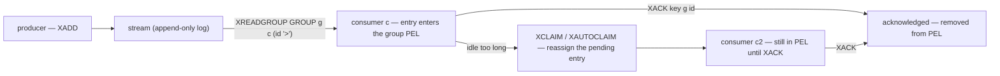

# Stream commands

> **Audience:** Adopter · **Status:** stable · **Verified-against:** qbm-redis @ qb 3.0.0 (C++20 default, C++23
> supported)

Reference for the Redis Streams command group — appending and trimming entries, range scans, blocking reads, consumer
groups, claiming pending messages, and stream introspection — each with its exact signature, reply type, and a minimal
`co_await` and callback snippet.

**Prerequisites:** [Command API model](./commands_overview.md) · [Connection](./connection.md) — **See also:
** [Publish commands](./publish_commands.md) · [Subscription commands](./subscription_commands.md) · [Error handling](./error_handling.md) · [Pipelining and
`await()`](./pipeline_and_await.md)

## Summary

A Redis stream is an append-only log keyed by a string. Each entry carries an ID of the form `timestamp-sequence` and a
set of field-value pairs. Streams support both plain fan-out reads (`XREAD`) and cooperative consumption through
consumer groups (`XREADGROUP`, `XACK`, `XCLAIM`), where delivered-but-unacknowledged entries are tracked in a per-group
Pending Entries List (PEL).



These commands are defined by the `qb::redis::stream_commands<Derived>` CRTP mixin (`stream_commands.h:34`), which
`qb::redis::tcp::client` inherits along with every other command group. You call the methods directly on a connected
client. Each command exists in two forms that share one method name: a **coroutine** form you `co_await` to get a
`qb::redis::Reply<T>`, and a **callback** form that takes the handler as its first argument and returns the client for
chaining. The callback overload is SFINAE-gated on `std::is_invocable_v<Func, Reply<T>&&>`, so the overload you pick is
what selects the calling style — there is no `_async` suffix and no separate sync/async class. The dispatch and the
`Reply<T>` decoding contract are covered in [Command API model](./commands_overview.md); this page lists the methods.

The result type `T` is fixed per command and is heterogeneous across this group: `XADD` yields `stream_id`; the range
commands (`XRANGE`/`XREVRANGE`/`XCLAIM`) yield a strongly typed `stream_entry_list`; counts yield `long long`; group
creation yields `status`; and the read/introspection commands (`XREAD`/`XREADGROUP`/`XINFO *`/`XPENDING`/`XAUTOCLAIM`)
yield an untyped `qb::json`. That asymmetry is intentional — the JSON-typed replies hand you loosely structured data you
navigate yourself.

## Concepts

### Reply types you will see in this group

| Reply `T`                      | Meaning                                          | Commands                                                                                                         |
|--------------------------------|--------------------------------------------------|------------------------------------------------------------------------------------------------------------------|
| `qb::redis::stream_id`         | the ID of an appended entry                      | `xadd`                                                                                                           |
| `long long`                    | a count of entries (added/deleted/trimmed/acked) | `xlen`, `xdel`, `xack`, `xtrim`, `xgroup_destroy`, `xgroup_delconsumer`                                          |
| `qb::redis::status`            | a `+OK` status reply                             | `xgroup_create`, `xgroupSetid`                                                                                   |
| `bool`                         | whether a consumer was newly created             | `xgroupCreateconsumer`                                                                                           |
| `qb::redis::stream_entry_list` | a list of entries with their fields              | `xrange`, `xrevrange`, `xclaim`                                                                                  |
| `qb::json`                     | loosely structured server data                   | `xread`, `xreadgroup`, `xpending`, `xautoclaim`, `xinfo_stream`, `xinfo_groups`, `xinfo_consumers`, `xinfo_help` |

`qb::redis::Reply<T>` (`reply.h:1102`) exposes `ok()`, `result()` (alias `value()`), `value_or(default)`, `error()`, and
an explicit `operator bool()`. You read a successful payload through `reply.result()` after checking `reply.ok()`.

### `qb::redis::stream_id`

`stream_id` (`types.h:306`) is `{ long long timestamp; long long sequence; }` with `to_string()` (renders
`"<timestamp>-<sequence>"`), full equality, and an ordering `operator<`. `XADD` returns one of these. To feed an ID back
into a later command (e.g. `xdel`, `xack`), pass `id.to_string()` or build the `"<ts>-<seq>"` string yourself.

### `qb::redis::stream_entry` and `stream_entry_list`

`stream_entry` (`types.h:327`) is `{ stream_id id; qb::unordered_map<std::string, std::string> fields; }`.
`stream_entry_list` (`types.h:332`) is `std::vector<stream_entry>` — the decoded reply of `XRANGE`, `XREVRANGE`, and
`XCLAIM`. You iterate it directly: `entry.id` is the entry ID and `entry.fields` is the field map.

### `qb::redis::status`

`status` (`types.h:475`) wraps a status string. It converts to `bool` (true when the string is `"OK"`), to
`std::string`, and compares against string literals — so `if (reply.result())` reads as "the server said OK".

### `qb::json` replies

`qb::json` resolves to `nlohmann::json`, brought into the `qb` namespace by `using namespace nlohmann;` (
`qb/json.h:283`). The read and introspection commands return their server reply as JSON with no further typing, so you
navigate it with the usual predicates — `result().is_array()`, `result().is_object()` — and indexing. Decoding shape
mirrors the RESP reply the server sends for that command.

### Wire ID tokens

Stream IDs are passed as strings, and several positions accept Redis sentinel tokens rather than a literal
`timestamp-sequence`:

| Token     | Meaning                                                                         |
|-----------|---------------------------------------------------------------------------------|
| `*`       | auto-generate the entry ID (used by `xadd` when `id` is omitted)                |
| `>`       | for `xreadgroup`: deliver entries never delivered to any consumer of this group |
| `$`       | for `xread`: only entries added after this call                                 |
| `0`       | from the start of the stream / the group's full history                         |
| `-` / `+` | minimum / maximum ID, the open bounds for range scans                           |

### Time-unit boundary

Two `long long` parameters in this group carry **milliseconds**, serialized verbatim to the wire via `std::to_string`:

- `block` on `xread` / `xreadgroup` — how long the server parks waiting for new data.
- `min_idle_time` on `xclaim` / `xautoclaim` — the minimum idle age an entry must have before it can be claimed.

These are Redis-native wire units, the same protocol-unit boundary as `EXPIRE` (seconds) versus `PEXPIRE` (milliseconds)
documented in [Key commands](./key_commands.md). Unlike the expiry commands, the stream commands provide **no**
`std::chrono`-unit overload here — you pass a raw integer count of milliseconds. Do **not** substitute a `qb::duration`;
convert to milliseconds yourself (e.g. `std::chrono::milliseconds{5000}.count()`).

### Blocking reads suspend the command deadline

`XREAD` and `XREADGROUP` are blocking commands. When `block` is set, the client suspends its own per-command deadline
while the call is in flight, so the server-side `block` timeout governs instead (`redis.h:733`). A blocking read with
`block > 0` parks the connection until data arrives or the timeout elapses.

### Multi-stream validation throws synchronously

The vector overloads of `xread` and `xreadgroup` validate that `keys` is non-empty and `keys.size() == ids.size()` *
*inside the callback overload body, before dispatch**, and throw `std::invalid_argument` (`stream_commands.h:515`,
`:428`). This is a thrown exception you must catch at the call site — it is **not** delivered as a `Reply` error. The
single-stream overloads perform no such validation.

### Naming inconsistency to respect at call sites

Most consumer-group helpers are snake_case (`xgroup_create`, `xgroup_destroy`, `xgroup_delconsumer`), but the two newest
are camelCase: `xgroupSetid` and `xgroupCreateconsumer` (`stream_commands.h:872`, `:911`). Spell them exactly as written
or the call will not compile.

## Setup for the examples

```cpp
#include <redis/redis.h>                 // namespace qb::redis
#include <qb/io/async.h>
#include <qb/io/async/coroutine.h>

// Inside a coroutine:
qb::redis::tcp::client redis{qb::io::uri{"tcp://localhost:6379"}};
if (!co_await redis.connect())
    co_return; // see Connection for error handling
```

Examples below assume `redis` is a connected client and run inside a coroutine. The callback form works identically
outside a coroutine.

## Commands

### `xadd`

`XADD key *|id field value [field value ...]` — append an entry and return its ID.
<!-- src: qbm/redis/commands/stream_commands.h:55,73 -->

```cpp
auto xadd(const std::string &key,
          const std::vector<std::pair<std::string, std::string>> &entries,
          const std::optional<std::string> &id = std::nullopt);          // -> Reply<stream_id>

template <typename Func>  // Func invocable with Reply<stream_id>&&
Derived &xadd(Func &&func, const std::string &key,
              const std::vector<std::pair<std::string, std::string>> &entries,
              const std::optional<std::string> &id = std::nullopt);
```

When `id` is `std::nullopt` (the default) the method sends `*`, so Redis auto-generates the ID. Pass an explicit
string (e.g. `"1700000000000-0"` or `"1700000000000-*"`) to control it. The stream is created if it does not exist.

```cpp
// Coroutine
std::vector<std::pair<std::string, std::string>> entries = {
    {"field1", "value1"}, {"field2", "value2"}};
auto add = co_await redis.xadd("mystream", entries);
if (add.ok())
    std::cout << "added " << add.result().to_string() << '\n';   // "1700000000000-0"

// Callback
redis.xadd([](qb::redis::Reply<qb::redis::stream_id> &&r) {
    if (r.ok())
        std::cout << r.result().timestamp << '-' << r.result().sequence << '\n';
}, "mystream", entries);
```

<!-- src: qbm/redis/tests/integration/stream/stream-commands.cpp:69 -->

### `xlen`

`XLEN key` — number of entries in the stream.
<!-- src: qbm/redis/commands/stream_commands.h:108,123 -->

```cpp
auto xlen(const std::string &key);                                       // -> Reply<long long>

template <typename Func>  // Func invocable with Reply<long long>&&
Derived &xlen(Func &&func, const std::string &key);
```

```cpp
auto len = co_await redis.xlen("mystream");
if (len.ok())
    std::cout << len.result() << " entries\n";
```

<!-- src: qbm/redis/tests/integration/stream/stream-commands.cpp:73 -->

### `xdel`

`XDEL key id [id ...]` — delete entries by ID; returns the count actually removed.
<!-- src: qbm/redis/commands/stream_commands.h:138,156 -->

```cpp
template <typename... Ids>
auto xdel(const std::string &key, Ids &&...ids);                         // -> Reply<long long>

template <typename Func, typename... Ids>  // Func invocable with Reply<long long>&&
Derived &xdel(Func &&func, const std::string &key, Ids &&...ids);
```

IDs are variadic strings. Pass `id.to_string()` for a `stream_id` you got back from `xadd`.

```cpp
auto del = co_await redis.xdel("mystream", "1700000000000-0", "1700000000001-0");
if (del.ok())
    std::cout << "deleted " << del.result() << '\n';
```

<!-- src: qbm/redis/tests/integration/stream/stream-commands.cpp:135 -->

### `xtrim`

`XTRIM key MAXLEN [=|~] threshold` — cap the stream to a maximum length, deleting older entries; returns the number
removed.
<!-- src: qbm/redis/commands/stream_commands.h:312,332 -->

```cpp
auto xtrim(const std::string &key, long long maxlen,
           bool approximate = false);                                    // -> Reply<long long>

template <typename Func>  // Func invocable with Reply<long long>&&
Derived &xtrim(Func &&func, const std::string &key, long long maxlen,
               bool approximate = false);
```

With `approximate = true` the method sends `MAXLEN ~`, letting Redis trim probabilistically for speed; the default sends
`MAXLEN =` for an exact cap. Only the `MAXLEN` strategy is exposed (no `MINID`, no `LIMIT`).

```cpp
auto trimmed = co_await redis.xtrim("mystream", 1000);          // exact cap at 1000 entries
auto fast    = co_await redis.xtrim("mystream", 1000, true);    // approximate, faster
```

<!-- src: qbm/redis/tests/integration/stream/stream-commands.cpp:189 -->

### `xrange`

`XRANGE key start end [COUNT count]` — entries within an ID range, oldest first.
<!-- src: qbm/redis/commands/stream_commands.h:695,714 -->

```cpp
auto xrange(const std::string &key, const std::string &start,
            const std::string &end,
            std::optional<long long> count = std::nullopt);              // -> Reply<stream_entry_list>

template <typename Func>  // Func invocable with Reply<stream_entry_list>&&
Derived &xrange(Func &&func, const std::string &key, const std::string &start,
                const std::string &end,
                std::optional<long long> count = std::nullopt);
```

Use `"-"` and `"+"` for the open lower/upper bounds. `count` caps the number of entries returned.

```cpp
auto range = co_await redis.xrange("mystream", "-", "+");
if (range.ok())
    for (const auto &entry : range.result())
        std::cout << entry.id.to_string() << " has "
                  << entry.fields.size() << " fields\n";

auto first_two = co_await redis.xrange("mystream", "-", "+", 2);   // COUNT 2
```

<!-- src: qbm/redis/tests/integration/stream/stream-commands.cpp:311 -->

### `xrevrange`

`XREVRANGE key end start [COUNT count]` — entries within an ID range, newest first.
<!-- src: qbm/redis/commands/stream_commands.h:735,754 -->

```cpp
auto xrevrange(const std::string &key, const std::string &end,
               const std::string &start,
               std::optional<long long> count = std::nullopt);           // -> Reply<stream_entry_list>

template <typename Func>  // Func invocable with Reply<stream_entry_list>&&
Derived &xrevrange(Func &&func, const std::string &key, const std::string &end,
                   const std::string &start,
                   std::optional<long long> count = std::nullopt);
```

Mind the argument order: **`end` (the higher bound) precedes `start` (the lower bound)**, matching the Redis `XREVRANGE`
wire order and the opposite of `xrange`. Swapping them silently returns an empty range.

```cpp
auto rev = co_await redis.xrevrange("mystream", "+", "-");   // newest entry first
if (rev.ok() && !rev.result().empty())
    std::cout << "latest: " << rev.result().front().id.to_string() << '\n';
```

<!-- src: qbm/redis/tests/integration/stream/stream-commands.cpp:325 -->

### `xread`

`XREAD [COUNT count] [BLOCK ms] STREAMS key [key ...] id [id ...]` — read entries with IDs greater than the supplied
ones. Two overloads: single-stream and multi-stream.
<!-- src: qbm/redis/commands/stream_commands.h:451,471,492,512 -->

```cpp
// Single stream
auto xread(const std::string &key, const std::string &id,
           std::optional<long long> count = std::nullopt,
           std::optional<long long> block = std::nullopt);               // -> Reply<qb::json>

// Multiple streams (keys and ids must be non-empty and equal-sized)
auto xread(const std::vector<std::string> &keys,
           const std::vector<std::string> &ids,
           std::optional<long long> count = std::nullopt,
           std::optional<long long> block = std::nullopt);               // -> Reply<qb::json>

template <typename Func>  // Func invocable with Reply<qb::json>&& — both overloads
Derived &xread(Func &&func, const std::string &key, const std::string &id,
               std::optional<long long> count = std::nullopt,
               std::optional<long long> block = std::nullopt);
template <typename Func>
Derived &xread(Func &&func, const std::vector<std::string> &keys,
               const std::vector<std::string> &ids,
               std::optional<long long> count = std::nullopt,
               std::optional<long long> block = std::nullopt);
```

`block` is **milliseconds** (see the time-unit boundary above); when set, the call parks until data arrives or the
timeout elapses. The multi-stream overload throws `std::invalid_argument` synchronously if `keys` is empty or
`keys.size() != ids.size()`.

```cpp
// Read everything in the stream since the start
auto read = co_await redis.xread("mystream", "0", 10);
if (read.ok() && read.result().is_array())
    /* navigate the JSON reply */;

// Block up to 5 seconds for entries newer than "$"
auto live = co_await redis.xread("mystream", "$", std::nullopt, 5000);
```

<!-- src: qbm/redis/tests/integration/stream/stream-commands.cpp:211,222 -->

### `xgroup_create`

`XGROUP CREATE key group id [MKSTREAM]` — create a consumer group.
<!-- src: qbm/redis/commands/stream_commands.h:173,191 -->

```cpp
auto xgroup_create(const std::string &key, const std::string &group,
                   const std::string &id, bool mkstream = false);        // -> Reply<status>

template <typename Func>  // Func invocable with Reply<status>&&
Derived &xgroup_create(Func &&func, const std::string &key, const std::string &group,
                       const std::string &id, bool mkstream = false);
```

`id` is the group's starting position — `"0"` to consume the whole history, `"$"` to consume only entries added after
the group is created. `mkstream = true` adds `MKSTREAM`, creating the stream if it does not exist.

```cpp
auto created = co_await redis.xgroup_create("mystream", "mygroup", "0", true);
if (created.ok() && created.result())   // status converts to bool ("OK")
    std::cout << "group ready\n";
```

<!-- src: qbm/redis/tests/integration/stream/stream-commands.cpp:162 -->

### `xgroup_destroy`

`XGROUP DESTROY key group` — delete a consumer group and its PEL; returns the number of groups destroyed (`0` or `1`).
<!-- src: qbm/redis/commands/stream_commands.h:214,230 -->

```cpp
auto xgroup_destroy(const std::string &key, const std::string &group);   // -> Reply<long long>

template <typename Func>  // Func invocable with Reply<long long>&&
Derived &xgroup_destroy(Func &&func, const std::string &key,
                        const std::string &group);
```

```cpp
auto destroyed = co_await redis.xgroup_destroy("mystream", "mygroup");
```

<!-- src: qbm/redis/tests/integration/stream/stream-commands.cpp:166 -->

### `xgroup_delconsumer`

`XGROUP DELCONSUMER key group consumer` — remove a consumer from a group; returns the number of pending messages the
consumer owned.
<!-- src: qbm/redis/commands/stream_commands.h:244,262 -->

```cpp
auto xgroup_delconsumer(const std::string &key, const std::string &group,
                        const std::string &consumer);                    // -> Reply<long long>

template <typename Func>  // Func invocable with Reply<long long>&&
Derived &xgroup_delconsumer(Func &&func, const std::string &key,
                            const std::string &group, const std::string &consumer);
```

```cpp
auto pending = co_await redis.xgroup_delconsumer("mystream", "mygroup", "consumer-1");
```

### `xgroupSetid`

`XGROUP SETID key group id [ENTRIESREAD n]` — set the group's last-delivered ID. Note the camelCase name.
<!-- src: qbm/redis/commands/stream_commands.h:872,891 -->

```cpp
auto xgroupSetid(const std::string &key, const std::string &group,
                 const std::string &id,
                 std::optional<long long> entries_read = std::nullopt);  // -> Reply<status>

template <typename Func>  // Func invocable with Reply<status>&&
Derived &xgroupSetid(Func &&func, const std::string &key, const std::string &group,
                     const std::string &id,
                     std::optional<long long> entries_read = std::nullopt);
```

When `entries_read` is set, the method appends `ENTRIESREAD n`. Use `"0"` to rewind the group to the start, `"$"` to
skip to the tail, or a specific entry ID.

```cpp
auto setid = co_await redis.xgroupSetid("mystream", "mygroup", "0");
```

<!-- src: qbm/redis/tests/integration/stream/stream-commands.cpp:353 -->

### `xgroupCreateconsumer`

`XGROUP CREATECONSUMER key group consumer` — create a consumer explicitly; returns `true` if a new consumer was created,
`false` if it already existed. Note the camelCase name and the `bool` reply (the snake_case group helpers return
`status` or `long long`).
<!-- src: qbm/redis/commands/stream_commands.h:911,929 -->

```cpp
auto xgroupCreateconsumer(const std::string &key, const std::string &group,
                          const std::string &consumer);                  // -> Reply<bool>

template <typename Func>  // Func invocable with Reply<bool>&&
Derived &xgroupCreateconsumer(Func &&func, const std::string &key,
                              const std::string &group, const std::string &consumer);
```

```cpp
auto created = co_await redis.xgroupCreateconsumer("mystream", "mygroup", "consumer-1");
if (created.ok() && created.result())
    std::cout << "new consumer registered\n";
```

<!-- src: qbm/redis/tests/integration/stream/stream-commands.cpp:356 -->

### `xreadgroup`

`XREADGROUP GROUP group consumer [COUNT count] [BLOCK ms] STREAMS key [key ...] id [id ...]` — read through a consumer
group, moving delivered entries into the group's PEL. Two overloads: single-stream and multi-stream.
<!-- src: qbm/redis/commands/stream_commands.h:358,380,402,424 -->

```cpp
// Single stream
auto xreadgroup(const std::string &key, const std::string &group,
                const std::string &consumer, const std::string &id,
                std::optional<long long> count = std::nullopt,
                std::optional<long long> block = std::nullopt);          // -> Reply<qb::json>

// Multiple streams (keys and ids must be non-empty and equal-sized)
auto xreadgroup(const std::vector<std::string> &keys, const std::string &group,
                const std::string &consumer, const std::vector<std::string> &ids,
                std::optional<long long> count = std::nullopt,
                std::optional<long long> block = std::nullopt);          // -> Reply<qb::json>

template <typename Func>  // Func invocable with Reply<qb::json>&& — both overloads
Derived &xreadgroup(Func &&func, const std::string &key, const std::string &group,
                    const std::string &consumer, const std::string &id,
                    std::optional<long long> count = std::nullopt,
                    std::optional<long long> block = std::nullopt);
template <typename Func>
Derived &xreadgroup(Func &&func, const std::vector<std::string> &keys,
                    const std::string &group, const std::string &consumer,
                    const std::vector<std::string> &ids,
                    std::optional<long long> count = std::nullopt,
                    std::optional<long long> block = std::nullopt);
```

For the single-stream overload, `key` comes first, then `group`, `consumer`, and `id`. Use `id == ">"` to fetch entries
never delivered to any consumer of the group, or a concrete ID to re-read this consumer's pending history. `block` is *
*milliseconds**. The multi-stream overload throws `std::invalid_argument` synchronously if `keys` is empty or
`keys.size() != ids.size()`. The `NOACK` option is not exposed.

```cpp
// Claim the next 10 undelivered entries for this consumer
auto read = co_await redis.xreadgroup("mystream", "mygroup", "consumer-1", ">", 10);
if (read.ok())
    /* navigate read.result() (qb::json) */;
```

<!-- src: qbm/redis/tests/integration/stream/stream-commands.cpp:245 -->

### `xack`

`XACK key group id [id ...]` — acknowledge processing of one or more delivered entries, removing them from the group's
PEL; returns the count acknowledged.
<!-- src: qbm/redis/commands/stream_commands.h:278,298 -->

```cpp
template <typename... Ids>
auto xack(const std::string &key, const std::string &group, Ids &&...ids);   // -> Reply<long long>

template <typename Func, typename... Ids>  // Func invocable with Reply<long long>&&
Derived &xack(Func &&func, const std::string &key, const std::string &group,
              Ids &&...ids);
```

```cpp
auto acked = co_await redis.xack("mystream", "mygroup", "1700000000000-0");
if (acked.ok())
    std::cout << "acknowledged " << acked.result() << '\n';
```

<!-- src: qbm/redis/tests/integration/stream/stream-commands.cpp:280 -->

### `xclaim`

`XCLAIM key group consumer min-idle-time id [id ...] [options...]` — transfer ownership of pending entries to
`consumer`; returns the claimed entries.
<!-- src: qbm/redis/commands/stream_commands.h:777,801 -->

```cpp
auto xclaim(const std::string &key, const std::string &group,
            const std::string &consumer, long long min_idle_time,
            const std::vector<std::string> &ids,
            const std::vector<std::string> &options = {});               // -> Reply<stream_entry_list>

template <typename Func>  // Func invocable with Reply<stream_entry_list>&&
Derived &xclaim(Func &&func, const std::string &key, const std::string &group,
                const std::string &consumer, long long min_idle_time,
                const std::vector<std::string> &ids,
                const std::vector<std::string> &options = {});
```

`min_idle_time` is **milliseconds**: an entry is claimed only if it has been idle at least this long. The `options`
vector is appended verbatim, so you supply raw modifiers (`"IDLE"`, `"TIME"`, `"RETRYCOUNT"`, `"FORCE"`, `"JUSTID"`) and
their arguments yourself.

```cpp
// Reassign a message that has been idle for at least 60 seconds
auto claimed = co_await redis.xclaim("mystream", "mygroup", "consumer-2",
                                     60000, {"1700000000000-0"});
if (claimed.ok())
    std::cout << "claimed " << claimed.result().size() << " entries\n";
```

<!-- src: qbm/redis/tests/integration/stream/stream-commands.cpp:389 -->

### `xautoclaim`

`XAUTOCLAIM key group consumer min-idle-time start [COUNT count] [JUSTID]` — scan the PEL from `start` and claim idle
entries in one round-trip.
<!-- src: qbm/redis/commands/stream_commands.h:823,848 -->

```cpp
auto xautoclaim(const std::string &key, const std::string &group,
                const std::string &consumer, long long min_idle_time,
                const std::string &start,
                std::optional<long long> count = std::nullopt,
                bool justid = false);                                    // -> Reply<qb::json>

template <typename Func>  // Func invocable with Reply<qb::json>&&
Derived &xautoclaim(Func &&func, const std::string &key, const std::string &group,
                    const std::string &consumer, long long min_idle_time,
                    const std::string &start,
                    std::optional<long long> count = std::nullopt,
                    bool justid = false);
```

`min_idle_time` is **milliseconds**. `start` is the cursor ID to scan from (`"0"` to start at the beginning); the JSON
reply carries the next cursor to resume with. `justid = true` appends `JUSTID`, asking Redis to return only IDs.

```cpp
auto claimed = co_await redis.xautoclaim("mystream", "mygroup", "consumer-2",
                                         60000, "0", 10);
if (claimed.ok())
    /* navigate claimed.result() (qb::json): [next-cursor, entries, deleted-ids] */;
```

<!-- src: qbm/redis/tests/integration/stream/stream-commands.cpp:399 -->

### `xpending`

`XPENDING key group [start end count] [consumer]` — inspect the group's pending entries.
<!-- src: qbm/redis/commands/stream_commands.h:648,670 -->

```cpp
auto xpending(const std::string &key, const std::string &group,
              const std::string &start = "-", const std::string &end = "+",
              long long count = 10,
              const std::optional<std::string> &consumer = std::nullopt); // -> Reply<qb::json>

template <typename Func>  // Func invocable with Reply<qb::json>&&
Derived &xpending(Func &&func, const std::string &key, const std::string &group,
                  const std::string &start = "-", const std::string &end = "+",
                  long long count = 10,
                  const std::optional<std::string> &consumer = std::nullopt);
```

This method always sends the extended (range) form — `start`, `end`, and `count` default to `"-"`, `"+"`, and `10`. Pass
`consumer` to restrict the listing to one consumer. The JSON reply is an array of per-entry records (ID, consumer, idle
time, delivery count).

```cpp
auto pending = co_await redis.xpending("mystream", "mygroup", "-", "+", 10);
if (pending.ok() && pending.result().is_array())
    std::cout << pending.result().size() << " pending entries\n";
```

<!-- src: qbm/redis/tests/integration/stream/stream-commands.cpp:473 -->

### `xinfo_stream`

`XINFO STREAM key` — general metadata about the stream.
<!-- src: qbm/redis/commands/stream_commands.h:535,549 -->

```cpp
auto xinfo_stream(const std::string &key);                               // -> Reply<qb::json>

template <typename Func>  // Func invocable with Reply<qb::json>&&
Derived &xinfo_stream(Func &&func, const std::string &key);
```

```cpp
auto info = co_await redis.xinfo_stream("mystream");
if (info.ok())
    /* navigate info.result() (qb::json): length, first/last entry, groups, ... */;
```

<!-- src: qbm/redis/tests/integration/stream/stream-commands.cpp:422 -->

### `xinfo_groups`

`XINFO GROUPS key` — one record per consumer group; the JSON reply is an array.
<!-- src: qbm/redis/commands/stream_commands.h:561,575 -->

```cpp
auto xinfo_groups(const std::string &key);                               // -> Reply<qb::json>

template <typename Func>  // Func invocable with Reply<qb::json>&&
Derived &xinfo_groups(Func &&func, const std::string &key);
```

```cpp
auto groups = co_await redis.xinfo_groups("mystream");
if (groups.ok() && groups.result().is_array())
    /* iterate the group records */;
```

<!-- src: qbm/redis/tests/integration/stream/stream-commands.cpp:431 -->

### `xinfo_consumers`

`XINFO CONSUMERS key group` — one record per consumer in the group; the JSON reply is an array.
<!-- src: qbm/redis/commands/stream_commands.h:588,604 -->

```cpp
auto xinfo_consumers(const std::string &key, const std::string &group);  // -> Reply<qb::json>

template <typename Func>  // Func invocable with Reply<qb::json>&&
Derived &xinfo_consumers(Func &&func, const std::string &key,
                         const std::string &group);
```

```cpp
auto consumers = co_await redis.xinfo_consumers("mystream", "mygroup");
if (consumers.ok() && consumers.result().is_array())
    /* iterate the consumer records */;
```

<!-- src: qbm/redis/tests/integration/stream/stream-commands.cpp:440 -->

### `xinfo_help`

`XINFO HELP` — the server's help text for the `XINFO` subcommands; the JSON reply is an array of strings.
<!-- src: qbm/redis/commands/stream_commands.h:615,628 -->

```cpp
auto xinfo_help();                                                       // -> Reply<qb::json>

template <typename Func>  // Func invocable with Reply<qb::json>&&
Derived &xinfo_help(Func &&func);
```

```cpp
auto help = co_await redis.xinfo_help();
```

<!-- src: qbm/redis/tests/integration/stream/stream-commands.cpp:444 -->

### `parse_stream_id` (static helper)

A static utility that parses a `"timestamp-sequence"` string into a `stream_id`.
<!-- src: qbm/redis/commands/stream_commands.h:85 -->

```cpp
static qb::redis::stream_id
parse_stream_id(const std::string &id_str);
```

**Pitfall:** parse failures are swallowed. If `id_str` has no `-` or non-numeric halves, the method returns the default
`stream_id{0, 0}` with no error signaled, so a caller cannot tell a genuine `0-0` ID from a parse failure (
`stream_commands.h:85`). Prefer reading `stream_id` straight out of a typed reply (`xadd`, `xrange`) over re-parsing
strings.

## Pitfalls

- **`block` and `min_idle_time` are raw milliseconds with no chrono overload.** Unlike `EXPIRE`/`PEXPIRE`, the stream
  commands take no `std::chrono`-unit overload — convert to an integer count of milliseconds yourself, e.g.
  `std::chrono::seconds{5}` becomes `5000`. Passing a `qb::duration` will not compile.
- **`xrevrange` reverses the bound order.** It is `xrevrange(key, end, start, count)` — higher bound first. This is
  opposite to `xrange(key, start, end, count)`. Swapped bounds return an empty list with no error.
- **Multi-stream `xread`/`xreadgroup` throw, they do not return a `Reply` error.** Empty `keys` or a `keys`/`ids` size
  mismatch throws `std::invalid_argument` synchronously at the call site. Wrap those calls in `try`/`catch`, or validate
  the vectors before calling.
- **JSON replies are untyped.** `xread`, `xreadgroup`, `xpending`, `xautoclaim`, and the `xinfo_*` commands hand you a
  `qb::json` whose shape mirrors the raw RESP reply. There is no decoded struct — check `is_array()`/`is_object()` and
  navigate the value yourself. The range commands (`xrange`/`xrevrange`/`xclaim`) are the only reads that decode to a
  typed `stream_entry_list`.
- **Mixed naming.** `xgroupSetid` and `xgroupCreateconsumer` are camelCase; the other group helpers are snake_case.
  Spell each exactly.
- **`parse_stream_id` hides parse errors.** A malformed string yields `{0, 0}` silently. Read IDs from typed replies
  where you can.
- **Trim is `MAXLEN`-only.** `xtrim` does not expose `MINID` or `LIMIT`, and `xadd` does not expose inline trimming or
  `NOMKSTREAM`. Build the command manually (see [Command API model](./commands_overview.md)) if you need those
  modifiers.

## See also

- [Command API model](./commands_overview.md) — how `co_await` and callback dispatch and `Reply<T>` decoding work.
- [Publish commands](./publish_commands.md) and [Subscription commands](./subscription_commands.md) — the
  fire-and-forget Pub/Sub alternative to streams.
- [Key commands](./key_commands.md) — `DEL`/`EXPIRE` over stream keys, and the seconds-vs-milliseconds expiry boundary.
- [Error handling](./error_handling.md) — interpreting `Reply::error()` and the error hierarchy.
- [Pipelining and `await()`](./pipeline_and_await.md) — batching several stream commands per round-trip.
