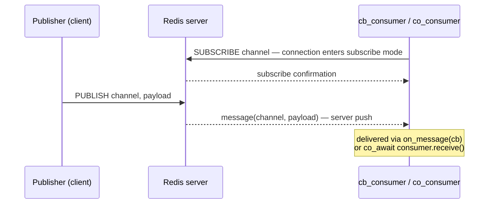

# Pub/Sub subscriptions

> **Audience:** Adopter · **Status:** stable · **Verified-against:** qbm-redis @ qb 2.6.0 (C++20 default, C++23
> supported)

How to subscribe to Redis channels and patterns with the dedicated consumers — `qb::redis::tcp::cb_consumer` (callback
delivery) and `qb::redis::tcp::co_consumer` (coroutine `receive()` delivery) — and how the `subscribe` / `unsubscribe` /
`psubscribe` / `punsubscribe` commands resolve.

**Prerequisites:** [../README.md](../README.md) (install, `qb_load_modules`,
`qbm::redis`), [connection.md](./connection.md) — **See also:
** [publish_commands.md](./publish_commands.md), [error_handling.md](./error_handling.md), [commands_overview.md](./commands_overview.md)

---

## Summary

A normal `qb::redis::tcp::client` cannot be used as a subscriber: once a connection issues `SUBSCRIBE`/`PSUBSCRIBE` it
enters subscribe mode and may only run subscription commands. `qbm-redis` therefore ships two purpose-built consumer
types, both transport aliases in `namespace qb::redis`:

- **`qb::redis::tcp::cb_consumer`** — incoming messages are pushed to a `void(qb::redis::message&&)` callback you
  register with `on_message(...)`.
- **`qb::redis::tcp::co_consumer`** — incoming messages are buffered and pulled one at a time with
  `co_await consumer.receive()`, which yields `std::optional<qb::redis::message>`.

Both inherit the same `subscribe` / `unsubscribe` / `psubscribe` / `punsubscribe` commands, and both connect exactly
like a client: `connect()` returns an awaiter, not a blocking `bool`. Under `QB_HAS_SSL` the `rediss://` variants are
`qb::redis::tcp::ssl::cb_consumer` and `qb::redis::tcp::ssl::co_consumer`.

| Aspect | `cb_consumer` | `co_consumer` |
|---|---|---|
| Delivery | push to `on_message(void(message&&))` | pull via `co_await receive()` → `optional<message>` |
| Backpressure | none — callback fires per message | internal queue (default 8192 = `DEFAULT_MSG_CAPACITY`); overflow drops + `on_message_dropped` |
| Closed signal | `on_disconnected` callback | `receive()` yields `std::nullopt` |
| Error hook | `on_error(void(error&&))` | via `Reply` / disconnect |
| Subscription commands | `subscribe`/`unsubscribe`/`psubscribe`/`punsubscribe` | same (shared base) |
| SSL alias | `tcp::ssl::cb_consumer` | `tcp::ssl::co_consumer` |



```cpp
#include <redis/redis.h>            // namespace qb::redis
#include <qb/io/async.h>
#include <qb/io/async/coroutine.h>

qb::io::async::task<void> example() {
    qb::redis::tcp::cb_consumer consumer{
        qb::io::uri{"tcp://localhost:6379"},
        [](qb::redis::message &&msg) {
            // channel message; for pattern matches msg.pattern is non-empty
            qb::io::cout() << "[" << msg.channel << "] " << msg.payload << std::endl;
        }};

    if (!co_await consumer.connect())
        co_return;

    auto reply = co_await consumer.subscribe("news");   // Reply<qb::redis::subscription>
    if (reply)                                           // Reply<T> is contextually bool
        qb::io::cout() << "active subscriptions: " << reply.result().num << std::endl;
}
```

<!-- src: qbm/redis/tests/integration/pubsub/pubsub-subscribe.cpp -->

> A consumer is **not thread-safe.** Drive it from a single I/O thread, like any other `qb::redis` object.

---

## Concepts

### Build and integration

The consumers are part of the compiled `qbm::redis` library (not header-only). Link it with the standard module
integration, then include the umbrella header:

```cmake
add_subdirectory(qb)
qb_load_modules("${CMAKE_CURRENT_SOURCE_DIR}/qbm")
target_link_libraries(your_app PRIVATE qbm::redis)
```

```cpp
#include <redis/redis.h>   // brings in qb::redis::tcp::cb_consumer / co_consumer
```

### Pub/Sub vocabulary

- **Channel** — a named conduit. `SUBSCRIBE` listens to exact channel names.
- **Pattern** — a glob (`news.*`, `h[ae]llo`) that `PSUBSCRIBE` matches against channel names: `h?llo` matches `hello`/
  `hallo`; `h*llo` matches `hllo`/`heeeello`; `h[ae]llo` matches `hello` and `hallo` but not `hillo`.
- **Subscribe mode** — after the first subscription, the connection accepts only `SUBSCRIBE`, `UNSUBSCRIBE`,
  `PSUBSCRIBE`, `PUNSUBSCRIBE`, `PING`, and `QUIT`. The dedicated consumers keep that connection separate from your
  command client.

### Message and confirmation types

Defined in [`types.h`](../types.h):

```cpp
namespace qb::redis {

// Pub/Sub message delivered to on_message / returned by receive().
struct message {
    std::string pattern;   // empty for channel (SUBSCRIBE) messages; set for pattern matches
    std::string channel;   // the concrete channel the message was published to
    std::string payload;   // the message body
    reply_ptr   raw;       // the underlying RESP reply
};

// pmessage adds no fields; pattern lives in the base. co_consumer flattens
// pattern matches into `message` (the pattern field carries the matched glob).
struct pmessage : public message {};

// Confirmation returned by subscribe/unsubscribe/psubscribe/punsubscribe.
struct subscription {
    std::optional<std::string> channel;  // channel or pattern; nullopt on unsubscribe-all frames
    long long                  num{};    // number of subscriptions still active on this connection
};

}
```

There is no `channel_or_pattern` field and no `num_subscriptions` field — the confirmation fields are `channel` (an
`std::optional<std::string>`) and `num`. A pattern match is reported through the same `message`/`on_message` path with
`pattern` set; there is **no** `pmessage` callback to register.

### How a subscription command resolves

`subscribe`, `unsubscribe`, `psubscribe`, and `punsubscribe` come from `qb::redis::subscription_commands` ([
`subscription_commands.h`](../commands/subscription_commands.h)) and are inherited by both consumers. Each has two forms:

- **Coroutine:** `co_await consumer.subscribe(channel)` yields `Reply<qb::redis::subscription>`.
- **Callback:** `consumer.subscribe(func, channel)` registers `func` and returns the consumer reference for chaining;
  `func` is invoked with `Reply<qb::redis::subscription>&&`.

A multi-channel `SUBSCRIBE` makes Redis emit one confirmation frame per channel, but you registered exactly one handler.
The consumer absorbs the intermediate confirmations and resolves your handler once, on the final frame — so
`reply.result().num` reflects the count after the whole command applied, and pipelined commands never cross-resolve.

---

## Subscribing with a callback consumer

`cb_consumer` delivers every published message to the callback you set. Register `on_message`, `on_error`, and
`on_disconnected` before (or at) construction; subscribe after `connect()` resolves.

```cpp
#include <redis/redis.h>
#include <qb/io/async.h>
#include <qb/io/async/coroutine.h>

// Construct with the message callback inline, or set callbacks afterwards.
qb::redis::tcp::cb_consumer consumer{qb::io::uri{"tcp://localhost:6379"}};

consumer
    .on_message([](qb::redis::message &&msg) {
        if (msg.pattern.empty())
            qb::io::cout() << "channel " << msg.channel << ": " << msg.payload << std::endl;
        else
            qb::io::cout() << "pattern " << msg.pattern
                           << " (" << msg.channel << "): " << msg.payload << std::endl;
    })
    .on_error([](qb::redis::error &&err) {
        qb::io::cerr() << "redis error: " << err.what << std::endl;   // `what` is a field
    })
    .on_disconnected([](qb::io::async::event::disconnected &&) {
        qb::io::cerr() << "consumer disconnected" << std::endl;
    });

qb::io::async::task<void> run(qb::redis::tcp::cb_consumer &consumer) {
    if (!co_await consumer.connect())
        co_return;

    auto sub = co_await consumer.subscribe("news");
    if (sub)
        qb::io::cout() << "subscribed; active=" << sub.result().num << std::endl;
}
```

<!-- src: qbm/redis/redis.h (RedisCallbackConsumer), qbm/redis/tests/integration/pubsub/pubsub-subscribe.cpp:96-154 -->

The callback signatures are fixed by the consumer:

| Method                | Callback signature                           |
|-----------------------|----------------------------------------------|
| `on_message(cb)`      | `void(qb::redis::message&&)`                 |
| `on_error(cb)`        | `void(qb::redis::error&&)`                   |
| `on_disconnected(cb)` | `void(qb::io::async::event::disconnected&&)` |

There is no `on_pmessage`, `on_subscribe`, or `on_unsubscribe`. Pattern matches reach `on_message` (with `pattern` set);
subscribe and unsubscribe confirmations are the `Reply<qb::redis::subscription>` returned by the command itself.

## Subscribing with a coroutine consumer

`co_consumer` buffers incoming messages in an internal queue and lets you pull them sequentially with
`co_await consumer.receive()`. `receive()` yields `std::optional<qb::redis::message>`: a value when a message arrives,
`std::nullopt` when the channel is closed (for example on disconnect).

```cpp
#include <redis/redis.h>
#include <qb/io/async.h>
#include <qb/io/async/coroutine.h>

qb::io::async::task<void> consume() {
    qb::redis::tcp::co_consumer consumer{qb::io::uri{"tcp://localhost:6379"}};
    if (!co_await consumer.connect())
        co_return;

    auto sub = co_await consumer.subscribe("news");
    if (!sub)
        co_return;

    while (auto msg = co_await consumer.receive()) {
        qb::io::cout() << "[" << msg->channel << "] " << msg->payload << std::endl;
    }
    // receive() returned nullopt: the channel was closed (disconnected).
}
```

<!-- src: qbm/redis/redis.h (RedisCoroConsumer::receive), qbm/redis/tests/integration/pubsub/pubsub-coconsumer-receive.cpp:73-113 -->

The queue holds `DEFAULT_MSG_CAPACITY` (8192) messages by default. Pass a larger capacity to the URI constructor —
`co_consumer{uri, capacity}` — if bursty traffic can outpace your `receive()` loop, and register
`on_message_dropped(cb)` (a `void(qb::redis::message&&)` callback) to observe drops when the queue is full; otherwise a
full queue logs a warning and discards.

---

## Subscription commands

These methods are inherited by `cb_consumer` and `co_consumer`. Every command returns (or yields)
`Reply<qb::redis::subscription>`.

### `SUBSCRIBE channel [channel ...]`

Subscribe to one or more exact channels. An empty channel name (or empty vector) resolves to a failed `Reply` without
touching the wire.

- **Coroutine, single:** `auto subscribe(const std::string &channel)`
- **Coroutine, multiple:** `auto subscribe(const std::vector<std::string> &channels)`
- **Callback, single:** `Derived &subscribe(Func &&func, const std::string &channel)`
- **Callback, multiple:** `Derived &subscribe(Func &&func, const std::vector<std::string> &channels)`

```cpp
// Coroutine form
auto reply = co_await consumer.subscribe(std::vector<std::string>{"news", "alerts"});
EXPECT_TRUE(reply.ok());
EXPECT_GE(reply.result().num, 1);   // active subscriptions after this command

// Callback form (returns the consumer for chaining)
consumer.subscribe(
    [](qb::redis::Reply<qb::redis::subscription> &&r) {
        if (r.ok() && r.result().channel)
            qb::io::cout() << "subscribed to " << *r.result().channel << std::endl;
    },
    "news");
```

<!-- src: qbm/redis/tests/integration/pubsub/pubsub-subscribe.cpp:96-154 -->

### `UNSUBSCRIBE [channel [channel ...]]`

Unsubscribe from the named channels, or — with an empty string or empty vector — from **all** channels on this
connection. After an unsubscribe-all, the final confirmation reports `num == 0`.

- **Coroutine, single/all:** `auto unsubscribe(const std::string &channel = "")`
- **Coroutine, multiple:** `auto unsubscribe(const std::vector<std::string> &channels)`
- **Callback, single/all:** `Derived &unsubscribe(Func &&func, const std::string &channel = "")`
- **Callback, multiple:** `Derived &unsubscribe(Func &&func, const std::vector<std::string> &channels)`

```cpp
auto reply = co_await consumer.unsubscribe("news");          // one channel
EXPECT_TRUE(reply.ok());

auto all = co_await consumer.unsubscribe("");                // every channel
EXPECT_EQ(all.result().num, 0);
```

<!-- src: qbm/redis/tests/integration/pubsub/pubsub-subscribe.cpp:307-331 -->

### `PSUBSCRIBE pattern [pattern ...]`

Subscribe to channels matching one or more glob patterns. An empty pattern (or empty vector) resolves to a failed
`Reply` without touching the wire.

- **Coroutine, single:** `auto psubscribe(const std::string &pattern)`
- **Coroutine, multiple:** `auto psubscribe(const std::vector<std::string> &patterns)`
- **Callback, single:** `Derived &psubscribe(Func &&func, const std::string &pattern)`
- **Callback, multiple:** `Derived &psubscribe(Func &&func, const std::vector<std::string> &patterns)`

```cpp
auto reply = co_await consumer.psubscribe("news.*");
EXPECT_TRUE(reply.ok());
EXPECT_TRUE(reply.result().channel.has_value());
EXPECT_EQ(*reply.result().channel, "news.*");   // confirmation echoes the pattern
```

<!-- src: qbm/redis/tests/integration/pubsub/pubsub-subscribe.cpp:158-207 -->

### `PUNSUBSCRIBE [pattern [pattern ...]]`

Unsubscribe from the named patterns, or — with an empty string or empty vector — from **all** patterns on this
connection.

- **Coroutine, single/all:** `auto punsubscribe(const std::string &pattern = "")`
- **Coroutine, multiple:** `auto punsubscribe(const std::vector<std::string> &patterns)`
- **Callback, single/all:** `Derived &punsubscribe(Func &&func, const std::string &pattern = "")`
- **Callback, multiple:** `Derived &punsubscribe(Func &&func, const std::vector<std::string> &patterns)`

```cpp
auto reply = co_await consumer.punsubscribe("news.*");
EXPECT_TRUE(reply.ok());

auto all = co_await consumer.punsubscribe("");   // every pattern
EXPECT_EQ(all.result().num, 0);
```

<!-- src: qbm/redis/tests/integration/pubsub/pubsub-subscribe.cpp:333-357 -->

---

## Driving the event loop

Like every `qb::redis` object, a consumer only makes progress while its `qb-io` event loop runs. Inside an actor, the
actor's core drives it automatically. Standalone (tests, a simple `main`), drive it yourself:

- **Coroutine code** — `co_await consumer.connect()` / `co_await consumer.subscribe(...)` /
  `co_await consumer.receive()` suspend until they complete; spawn the coroutine on
  `qb::io::async::coro_scheduler().spawn(task())` and pump the loop with `qb::io::async::run(EVRUN_NOWAIT)` until done,
  or block on a single awaiter with `qb::io::async::run_sync(...)`.
- **Callback code** — after `connect()` and `subscribe(...)`, pump `qb::io::async::run(EVRUN_NOWAIT)` so `on_message`
  fires; call `consumer.await()` to drain every pending subscription confirmation before inspecting state.

```cpp
// Publish from a separate client, then let the consumer's callback fire.
auto pub = co_await publisher.publish("news", "Hello World");
EXPECT_TRUE(pub.ok());                       // Reply<long long>: subscriber count
co_await qb::io::async::sleep(std::chrono::milliseconds(100));   // let on_message run
```

<!-- src: qbm/redis/tests/integration/pubsub/pubsub-coconsumer-receive.cpp:161-195 -->

`qb::io::async::sleep(...)` takes a `std::chrono` duration. Connect and command timeouts elsewhere in the client are
`qb::duration`; Redis command *arguments* that carry time (such as `EXPIRE` seconds versus `PEXPIRE` milliseconds) keep
their native units — see [commands_overview.md](./commands_overview.md). Pub/Sub commands carry no time arguments.

---

## Pitfalls

- **There is no `on_pmessage` / `on_subscribe` / `on_unsubscribe`.** `cb_consumer` exposes exactly `on_message`,
  `on_error`, and `on_disconnected`. Pattern matches arrive through `on_message` (with `message::pattern` set);
  subscribe/unsubscribe results come from the command's own `Reply<qb::redis::subscription>`.
- **`error::what` is a field, not a method.** Write `err.what`, not `err.what()`. The struct is
  `{ std::string what; reply_ptr raw; }`.
- **`subscription` fields are `channel` and `num`.** `channel` is an `std::optional<std::string>` — check
  `channel.has_value()` before dereferencing. There is no `channel_or_pattern` or `num_subscriptions`.
- **A `co_consumer` queue can overflow.** The default capacity is 8192 messages. If `receive()` cannot keep up, messages
  are dropped (logged, or routed to `on_message_dropped`). Size the queue for your burst profile via the URI
  constructor.
- **`receive()` yielding `std::nullopt` means closed, not "no message yet."** It suspends until a message arrives;
  `std::nullopt` signals the channel was closed (disconnect). Treat it as the loop's exit condition.
- **A regular `client` is not a subscriber.** Issuing `SUBSCRIBE` on `qb::redis::tcp::client` puts that connection into
  subscribe mode where ordinary commands fail. Use `cb_consumer` or `co_consumer`.
- **`connect()` returns an awaiter, not a `bool`.** There is no `connect_sync()` or `consume()` on
  the consumer. Drive `connect()` with `co_await` or `qb::io::async::run_sync(...)`;
  see [connection.md](./connection.md). (`is_connected()` exists — it is inherited from the connection base —
  but prefer driving `connect()` to completion over polling it.)

---

## See also

- [publish_commands.md](./publish_commands.md) — `PUBLISH` and the publisher client.
- [connection.md](./connection.md) — connecting, TLS, timeouts, reconnect.
- [error_handling.md](./error_handling.md) — `Reply<T>`, `.ok()`, `.error()`.
- [commands_overview.md](./commands_overview.md) — the `qb::duration` vs native-units time boundary.
- [Redis Pub/Sub commands](https://redis.io/commands/?group=pubsub) — upstream reference.
