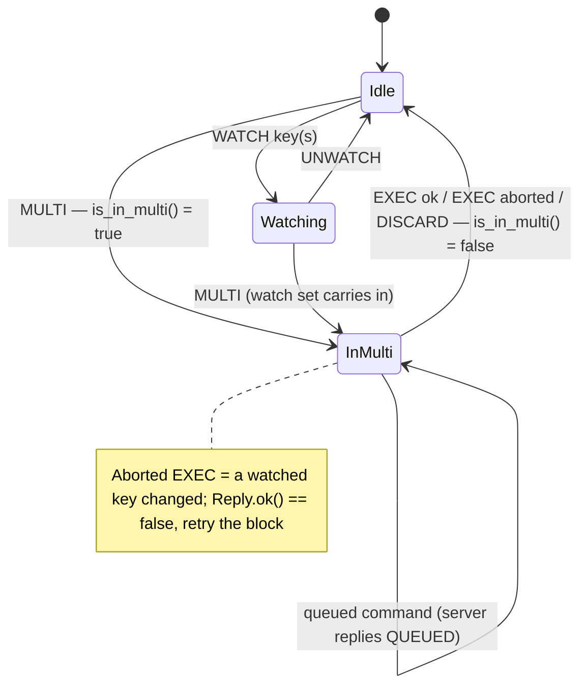

# Transaction commands (MULTI/EXEC)

> **Audience:** Adopter · **Status:** stable · **Verified-against:** qbm-redis @ qb 3.0.0 (C++20 default, C++23
> supported)

Reference for the transaction command group — `MULTI`, `EXEC`, `DISCARD`, `WATCH`, and `UNWATCH` — together with the
client-side `is_in_multi()` hint that tracks whether a transaction is open.

**Prerequisites:** [connection.md](./connection.md) (you need a connected
client), [commands_overview.md](./commands_overview.md) (coroutine vs. callback forms) — **See also:
** [pipeline_and_await.md](./pipeline_and_await.md), [scripting_commands.md](./scripting_commands.md), [error_handling.md](./error_handling.md)

**Include:** `#include <redis/redis.h>` — every type below lives in namespace `qb::redis`.

`qbm-redis` is a compiled qb module (`qbm::redis`); pull it in with `add_subdirectory(qb)` →
`qb_load_modules("<path>/qbm")` → `target_link_libraries(app PRIVATE qbm::redis)`. The transaction surface is template
code in `qb::redis::transaction_commands<Derived>`, mixed into the client through `<redis/redis.h>`; link the target
rather than adding the include directory by hand.

---

## Summary

A Redis transaction batches a set of commands so the server runs them sequentially and atomically: once `EXEC` starts,
no other client's command interleaves. You open a transaction with `multi()`, send the commands you want to queue, then
close it with `exec<Result>()` (run the batch) or `discard()` (drop the batch). `watch()`/`unwatch()` add optimistic
locking: if a watched key changes before `EXEC`, the whole transaction is aborted and `EXEC` reports failure.

Every method in this group exists in two forms, like the rest of the client:

- **Coroutine** — `co_await redis.multi()` yields a `Reply<status>`; `co_await redis.exec<Result>()` yields a
  `Reply<std::vector<Result>>`.
- **Callback** — `redis.multi(cb)` and `redis.exec<Result>(cb)` take an invocable receiving the same `Reply` by rvalue
  and return the client by reference (chainable, pipelined).

The client also exposes `is_in_multi()`, a **client-side** boolean it sets on a successful `MULTI` and clears on `EXEC`/
`DISCARD`. It is a local hint, not a server query — see [Client-side MULTI state](#client-side-multi-state).

<!-- src: qbm/redis/commands/transaction_commands.h:48-275 -->

---

## Concepts

### Transaction lifecycle

The client moves through three states; `is_in_multi()` is `true` only in the middle one:



### Atomicity and queuing

After a successful `MULTI`, the commands you send are **queued on the server** rather than executed. Redis answers each
queued command with a `+QUEUED` status; the real per-command results arrive as one array when `EXEC` runs. `EXEC`
executes every queued command in order, with no other client's command interleaved. `DISCARD` throws the queue away
without running anything.

This client pipelines over a single connection (see [pipeline_and_await.md](./pipeline_and_await.md)), so "send the
commands you want to queue" means: issue the ordinary command calls (`redis.set(...)`, `redis.lpush(...)`, …) between
`multi()` and `exec<Result>()`. Each enqueues its reply handler as usual; while the transaction is open those
intermediate replies are the `QUEUED` acknowledgements.

### Optimistic locking with WATCH

`watch()` marks keys for conditional execution. If any watched key is modified by **another** client between the `WATCH`
and the `EXEC`, the server aborts the transaction: `EXEC` returns a nil array and the resulting `Reply` has
`ok() == false`. This is check-and-set (CAS) without holding a lock — you retry the whole sequence on abort.
`unwatch()` (or any `EXEC`/`DISCARD`) clears the watched set for the connection.

<!-- src: qbm/redis/tests/integration/transaction/transaction-multi-exec.cpp:149-193 -->

### Reply types

| Command        | Coroutine yields             | Callback receives               |
|----------------|------------------------------|---------------------------------|
| `multi`        | `Reply<status>`              | `Reply<status> &&`              |
| `exec<Result>` | `Reply<std::vector<Result>>` | `Reply<std::vector<Result>> &&` |
| `discard`      | `Reply<status>`              | `Reply<status> &&`              |
| `watch`        | `Reply<status>`              | `Reply<status> &&`              |
| `unwatch`      | `Reply<status>`              | `Reply<status> &&`              |

`qb::redis::status` (defined in `types.h:475`) wraps a Redis simple-string reply such as `"OK"`. It converts to `bool` (
`true` when the string is `"OK"`), to `std::string`, and exposes `.str()` and `.ok()`. Read the outcome through the
surrounding `Reply`: `reply.ok()` for success, `reply.result()` (alias `reply.value()`) for the payload, `reply.error()`
for the message on failure.

For `exec<Result>`, you pick `Result` to match what your queued commands return. A transaction of `SET` commands returns
status strings, so `exec<std::string>()` yields a `std::vector<std::string>` of `"OK"` values — one element per queued
command, in order.

<!-- src: qbm/redis/types.h:475-526, qbm/redis/reply.h:1102-1227 -->

> **Time units:** No method in this group takes a time argument. Connect and command timeouts and the `RetryPolicy`
> delays are `qb::duration` and live on the client, not here. Redis command arguments that *do* carry time (for example
`EXPIRE` in seconds, `PEXPIRE` in milliseconds) keep their native units when queued inside a transaction, exactly as
> they do outside one — see [key_commands.md](./key_commands.md). That native-unit split is a documented boundary, not
> an
> inconsistency.

---

## Commands

### `MULTI`

Marks the start of a transaction block. Commands sent afterward are queued, not executed. O(1).

```cpp
// Coroutine
auto multi();                                  // -> Reply<status>

// Callback (Func invocable with Reply<status>&&); returns Derived&
template <typename Func> Derived &multi(Func &&func);
```

A successful `multi()` sets the client-side `is_in_multi()` flag. The callback overload sets the flag from `reply.ok()`
*before* invoking your callback.

<!-- src: qbm/redis/commands/transaction_commands.h:60-84 -->

### `EXEC`

Executes every command queued since `MULTI`, atomically, and clears the client-side transaction flag. Returns one reply
per queued command, in order. O(N) for N queued commands.

```cpp
// Coroutine
template <typename Result> auto exec();        // -> Reply<std::vector<Result>>

// Callback; returns Derived&
template <typename Result, typename Func> Derived &exec(Func &&func);
```

If `WATCH` detected a change, the server aborts and `EXEC` yields a `Reply` with `ok() == false`; inspect
`reply.error()` and retry the sequence.

```cpp
#include <redis/redis.h>
#include <qb/io/async.h>
#include <qb/io/async/coroutine.h>

qb::io::async::task<void> run_tx(qb::redis::tcp::client &redis) {
    // Open the transaction.
    auto multi_reply = co_await redis.multi();        // Reply<status>
    if (!multi_reply.ok()) {
        qb::io::cout() << "MULTI failed: " << multi_reply.error() << '\n';
        co_return;
    }
    // is_in_multi() is now true; these are queued server-side (QUEUED acks).
    (void)co_await redis.set("k1", "value1");
    (void)co_await redis.set("k2", "value2");

    // Run the batch. Two queued SETs -> two status replies.
    auto exec_reply = co_await redis.exec<std::string>();  // Reply<std::vector<std::string>>
    if (exec_reply.ok()) {
        const auto &results = exec_reply.result();   // {"OK", "OK"}
        qb::io::cout() << "executed " << results.size() << " commands\n";
    } else {
        // Aborted (e.g. a watched key changed) or a protocol error.
        qb::io::cout() << "EXEC failed: " << exec_reply.error() << '\n';
    }
}
```

<!-- src: qbm/redis/tests/integration/transaction/transaction-multi-exec.cpp:54-108, 344-360 -->

> **Per-command sub-replies.** `exec<Result>()` decodes the EXEC array into a homogeneous `std::vector<Result>`, which
> is the right shape when every queued command returns the same type. When the queued commands return *different* types,
> prefer the pipeline path and read the raw EXEC array through `Reply<pipeline_result>.raw()`: per-command
`parser::Value`
> results are move-only and are not cloned into a typed vector. See [pipeline_and_await.md](./pipeline_and_await.md). (
`qbm/redis/types.h:397-408`, `qbm/redis/reply.cpp:444-462`.)

### `DISCARD`

Flushes the queued commands without executing them, and clears the client-side transaction flag. O(1).

```cpp
// Coroutine
auto discard();                                // -> Reply<status>

// Callback; returns Derived&
template <typename Func> Derived &discard(Func &&func);
```

```cpp
auto multi_reply = co_await redis.multi();
(void)co_await redis.set("k", "value");        // queued, never applied

auto discard_reply = co_await redis.discard(); // Reply<status>
// discard_reply.ok() == true; redis.is_in_multi() == false; "k" unchanged.
```

<!-- src: qbm/redis/tests/integration/transaction/transaction-multi-exec.cpp:110-147 -->

### `WATCH key [key ...]`

Marks keys for optimistic execution. If any watched key changes before `EXEC`, the next `EXEC` aborts. O(1) per key. Two
argument shapes: a single key, and a vector of keys.

```cpp
// Coroutine
auto watch(const std::string &key);                  // -> Reply<status>
auto watch(const std::vector<std::string> &keys);    // -> Reply<status>

// Callback; returns Derived&
template <typename Func> Derived &watch(Func &&func, const std::string &key);
template <typename Func> Derived &watch(Func &&func, const std::vector<std::string> &keys);
```

**Client-side validation.** An empty key (or an empty key list) is rejected *before* any request is sent: the call
completes immediately with `ok() == false` and `error()` containing `"empty"`. This never reaches the server and never
throws — it is delivered as a failed `Reply`.

```cpp
// Single key
auto w1 = co_await redis.watch("balance");           // Reply<status>

// Multiple keys
auto w2 = co_await redis.watch({"balance", "ledger"});

// Empty key -> failed Reply, no request sent.
auto bad = co_await redis.watch("");
// bad.ok() == false; bad.error() == "Key cannot be empty"
```

<!-- src: qbm/redis/commands/transaction_commands.h:157-227, qbm/redis/tests/integration/transaction/transaction-multi-exec.cpp:149-193 -->

The full CAS loop — watch, read, transact, retry on abort:

```cpp
auto w = co_await redis.watch("balance");
if (!w.ok()) { /* empty key, etc. */ co_return; }

// ... read "balance", compute the new value ...

auto m = co_await redis.multi();
(void)co_await redis.set("balance", new_value);
auto ex = co_await redis.exec<std::string>();
if (!ex.ok()) {
    // Another client changed "balance" after WATCH: aborted. Retry the whole block.
}
```

<!-- src: qbm/redis/tests/integration/transaction/transaction-multi-exec.cpp:149-291 -->

### `UNWATCH`

Clears all watched keys for the connection. O(1). `EXEC` and `DISCARD` also clear the watch set, so an explicit
`UNWATCH` is only needed when you decide not to run a transaction after watching.

```cpp
// Coroutine
auto unwatch();                                // -> Reply<status>

// Callback; returns Derived&
template <typename Func> Derived &unwatch(Func &&func);
```

```cpp
auto w = co_await redis.watch("balance");
// ... decide not to proceed ...
auto u = co_await redis.unwatch();             // Reply<status>; "balance" no longer watched
```

<!-- src: qbm/redis/commands/transaction_commands.h:229-254, qbm/redis/tests/integration/transaction/transaction-multi-exec.cpp:293-342 -->

### Callback form

The callback overloads mirror the coroutine ones; they take the callback first and return the client for chaining.
Inside an actor or any callback-driven flow, drive the queue with `await()` (
see [pipeline_and_await.md](./pipeline_and_await.md)).

```cpp
#include <redis/redis.h>

redis.multi([](qb::redis::Reply<qb::redis::status> &&r) {
    // r.ok() is true once MULTI succeeded.
});
redis.set([](qb::redis::Reply<qb::redis::status> &&) {}, "k1", "a");  // queued
redis.exec<std::string>([](qb::redis::Reply<std::vector<std::string>> &&r) {
    if (r.ok()) { /* r.result() holds one status per queued command */ }
});
redis.await();   // poll the loop until every handler has fired
```

<!-- src: qbm/redis/commands/transaction_commands.h:75-84, 114-124 -->

---

## Client-side MULTI state

The client keeps a private boolean, set on a successful `MULTI` and cleared on `EXEC`/`DISCARD`, surfaced through two
members:

```cpp
bool is_in_multi() const;                 // true while a transaction is open (client-side hint)
void reset_transaction_state() noexcept;  // force-clear the hint
```

`is_in_multi()` is a **local hint**, not a round-trip to the server. The client sets it from the `MULTI` reply's `ok()`
and clears it when `EXEC`/`DISCARD` is issued; it does not re-query Redis. On disconnect the client drains pending reply
handlers and calls `reset_transaction_state()` so the flag does not linger as stale `true` after the server-side
transaction is gone. After a reconnect, treat the connection as having **no** transaction open — re-issue `MULTI` if you
need one.

> `reset_transaction_state()` is one of three same-named `reset` surfaces in the client; do not confuse it with the
> others: the protocol-level `redis<IO_>::reset()` (parser reset, `redis.h:195`) and the server-facing `RESET` command
> in [connection.md](./connection.md) (`connection_commands.h:300-315`). This one only clears the client-side MULTI flag.

<!-- src: qbm/redis/commands/transaction_commands.h:267-275, qbm/redis/redis.h:912 -->

---

## Pitfalls

- **An aborted `EXEC` is not an exception.** When a watched key changed, `exec<Result>()` returns a `Reply` with
  `ok() == false`, not a thrown error. Branch on `reply.ok()` and retry the whole watch/multi/exec block; do not assume
  success.
- **`is_in_multi()` can lie after a drop.** It is a client-side hint. The client clears it on disconnect via
  `reset_transaction_state()`, but never assume the *server* still holds a transaction after a reconnect — re-issue
  `MULTI`.
- **`exec<Result>()` is homogeneous.** It decodes every sub-reply as `Result`. If your queued commands return mixed
  types, that single `Result` will not fit them all; use the raw reply through `Reply<pipeline_result>.raw()` (
  see [pipeline_and_await.md](./pipeline_and_await.md)) instead.
- **Empty `WATCH` is a failed reply, not a throw.** `watch("")` and `watch({})` short-circuit to `ok() == false` with
  `error()` mentioning `"empty"`, sending nothing. Check `ok()` rather than relying on an exception.
- **The client is not thread-safe.** A transaction spans several round-trips on one connection. Drive a given client
  from a single I/O thread / strand; concurrent accessors corrupt the reply FIFO and the MULTI state.
- **Queued commands report `QUEUED`, not their final result.** Between `MULTI` and `EXEC`, the intermediate replies are
  server acknowledgements. The real results arrive only in the array from `EXEC`.

---

## See also

- [pipeline_and_await.md](./pipeline_and_await.md) — the reply queue that `MULTI`/`EXEC` build on, and
  `Reply<pipeline_result>.raw()` for mixed-type results.
- [scripting_commands.md](./scripting_commands.md) — `EVAL`/Lua scripts, the atomic alternative when you need
  server-side logic.
- [key_commands.md](./key_commands.md) — `EXPIRE` (seconds) vs. `PEXPIRE` (milliseconds), the native-unit boundary
  referenced above.
- [error_handling.md](./error_handling.md) — `Reply::ok()`, `Reply::error()`, and disconnect semantics.
- [connection.md](./connection.md) — the client `RESET` command and connection lifecycle.
